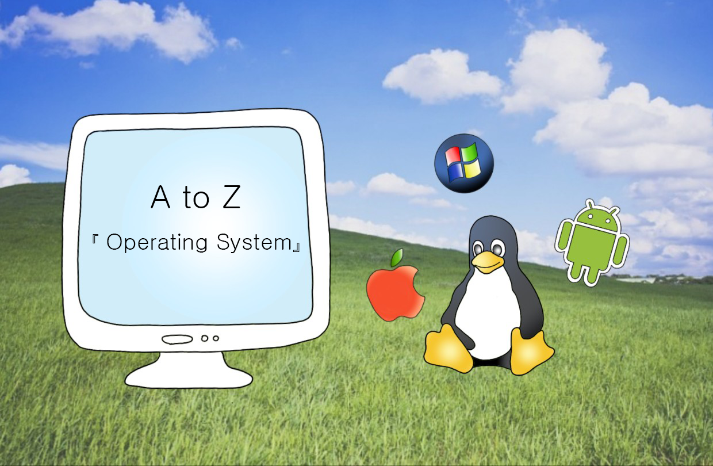

 

💡 [A to Z]는 작성한 포스팅을 순서대로 복습할 수 있도록 정리한 시리즈입니다.
{: .notice--danger}

## OS

1. [API와 REST API](https://mynamesieun.github.io/os/API%EC%99%80-REST-API/)
2. [OS란?](https://mynamesieun.github.io/os/OS%EB%9E%80/)
3. [컴퓨터 부팅 과정](https://mynamesieun.github.io/os/%EC%BB%B4%ED%93%A8%ED%84%B0-%EB%B6%80%ED%8C%85-%EA%B3%BC%EC%A0%95/)
4. [이중 동작 모드](https://mynamesieun.github.io/os/%EC%9D%B4%EC%A4%91-%EB%8F%99%EC%9E%91-%EB%AA%A8%EB%93%9C/)
5. [시스템 콜](https://mynamesieun.github.io/os/%EC%8B%9C%EC%8A%A4%ED%85%9C-%EC%BD%9C/)
6. [인터럽트](https://mynamesieun.github.io/os/%EC%9D%B8%ED%84%B0%EB%9F%BD%ED%8A%B8/)
7. [타이머와 watchdog](https://mynamesieun.github.io/os/%ED%83%80%EC%9D%B4%EB%A8%B8%EC%99%80-watchdog/)
8. [Process와 Context Switching](https://mynamesieun.github.io/os/Process%EC%99%80-Context-Switching/)
9. [IPC(프로세스간 통신)](<https://mynamesieun.github.io/os/IPC(%ED%94%84%EB%A1%9C%EC%84%B8%EC%8A%A4%EA%B0%84-%ED%86%B5%EC%8B%A0)/>)
10. [프로세스의 연산](https://mynamesieun.github.io/os/%ED%94%84%EB%A1%9C%EC%84%B8%EC%8A%A4%EC%9D%98-%EC%97%B0%EC%82%B0/)
11. [Thread](https://mynamesieun.github.io/os/Thread/)
12. [단일/다중 처리기 시스템](https://mynamesieun.github.io/os/%EB%8B%A8%EC%9D%BC,-%EB%8B%A4%EC%A4%91-%EC%B2%98%EB%A6%AC%EA%B8%B0-%EC%8B%9C%EC%8A%A4%ED%85%9C/)
13. [단일/다중 프로그래밍과 시분할](https://mynamesieun.github.io/os/%EB%8B%A8%EC%9D%BC,-%EB%8B%A4%EC%A4%91-%ED%94%84%EB%A1%9C%EA%B7%B8%EB%9E%98%EB%B0%8D%EA%B3%BC-%EC%8B%9C%EB%B6%84%ED%95%A0/)
14. [기억장치](https://mynamesieun.github.io/os/%EA%B8%B0%EC%96%B5%EC%9E%A5%EC%B9%98/)
15. [DMA](https://mynamesieun.github.io/os/DMA/)
16. [캐시, 버퍼, 스풀](https://mynamesieun.github.io/os/%EC%BA%90%EC%8B%9C,-%EB%B2%84%ED%8D%BC,-%EC%8A%A4%ED%92%80/)
17. [Mechanisms and Policies](https://mynamesieun.github.io/os/Mechanisms-and-Policies/)
18. [Microkernels](https://mynamesieun.github.io/os/Microkernels/)
19. [메모리 저장 방식(Byte order)](<https://mynamesieun.github.io/os/%EB%A9%94%EB%AA%A8%EB%A6%AC-%EC%A0%80%EC%9E%A5-%EB%B0%A9%EC%8B%9D(Byte-order)/>)
20. [kernel 자료구조](https://mynamesieun.github.io/os/Kernel-%EC%9E%90%EB%A3%8C%EA%B5%AC%EC%A1%B0/)
21. [암달의 법칙](https://mynamesieun.github.io/os/%EC%95%94%EB%8B%AC%EC%9D%98-%EB%B2%95%EC%B9%99/)
22. [CPU 스케줄링](https://mynamesieun.github.io/os/CPU-%EC%8A%A4%EC%BC%80%EC%A4%84%EB%A7%81/)
23. [다단계 큐](https://mynamesieun.github.io/os/%EB%8B%A4%EB%8B%A8%EA%B3%84-%ED%81%90/)
24. [Thread 스케줄링, 다중 프로세서 스케줄링](https://mynamesieun.github.io/os/Thread-%EC%8A%A4%EC%BC%80%EC%A4%84%EB%A7%81,-%EB%8B%A4%EC%A4%91-%ED%94%84%EB%A1%9C%EC%84%B8%EC%84%9C-%EC%8A%A4%EC%BC%80%EC%A4%84%EB%A7%81/)
25. [프로세스 동기화](https://mynamesieun.github.io/os/%ED%94%84%EB%A1%9C%EC%84%B8%EC%8A%A4-%EB%8F%99%EA%B8%B0%ED%99%94/)
26. [Deadlocks](https://mynamesieun.github.io/os/Deadlocks/)
27. [Main Memory](https://mynamesieun.github.io/os/Main-Memory/)

 
