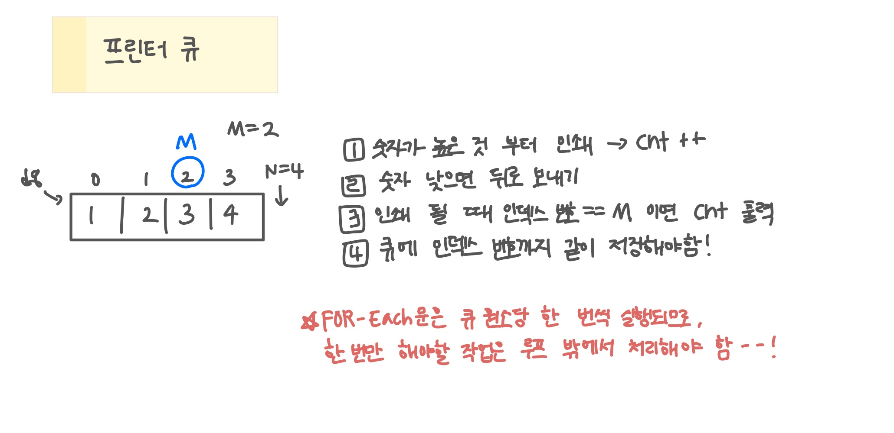

<br>

---

[https://www.acmicpc.net/problem/1966](https://www.acmicpc.net/problem/1966)

---

<br>

# 📌 문제

## 문제 도식화



<br><br>

# 💻 전체 코드

```java
import java.io.*;
import java.util.*;

public class Main {
    static int n, m;
    public static void main(String[] args) throws IOException {
        BufferedReader br = new BufferedReader(new InputStreamReader(System.in));

        int t = Integer.parseInt(br.readLine());
        while(t --> 0){
            StringTokenizer st = new StringTokenizer(br.readLine());
            n = Integer.parseInt(st.nextToken()); // 문서 수
            m = Integer.parseInt(st.nextToken()); // 찾는 문서 인덱스 번호

            Deque<int[]> dq = new ArrayDeque<>();

            st = new StringTokenizer(br.readLine());
            for(int i=0; i<n; i++) {
                int x = Integer.parseInt(st.nextToken());
                dq.offer(new int[]{x, i});
            }

            int ans = solve(dq);
            System.out.println(ans);
        }
    }

    static int solve(Deque<int[]> dq){
        int cnt = 0;
        while(!dq.isEmpty()) {
            int[] cur = dq.poll();

            // 중요도 높은 문서 존재하는지 확인
            boolean hasHigher = false;
            for (int[] d : dq) {
                if (cur[0] < d[0]) { // 중요도 높은 문서 발견
                    hasHigher = true;
                    break;
                }
            }

            if (hasHigher) { // 더 중요한 문서가 있으면
                dq.offer(cur); // 뒤로 보냄
            } else {
                cnt++;
                if (cur[1] == m) {
                    return cnt;
                }
            }
        }
        return 0;
    }
}
```

<br>
