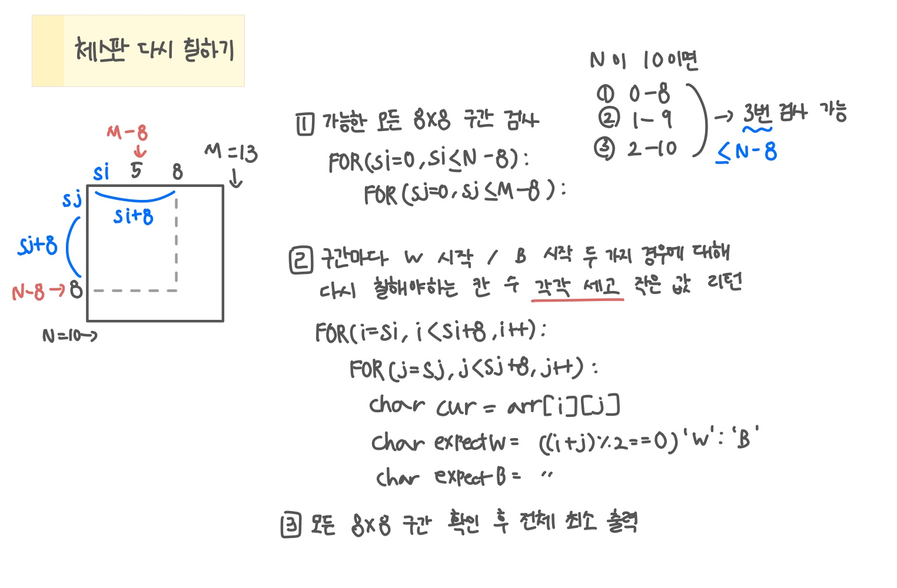

<br>

---

[https://www.acmicpc.net/problem/1018](https://www.acmicpc.net/problem/1018)

---

<br>

# 📌 문제

## 문제 도식화

좋은 문제인 것 같다



<br><br>

# 💻 전체 코드

```java
import java.io.*;
import java.util.*;

public class Main {
    static int n, m;
    static char[][] arr;
    public static void main(String[] args) throws IOException {
        BufferedReader br = new BufferedReader(new InputStreamReader(System.in));

        StringTokenizer st = new StringTokenizer(br.readLine());
        n = Integer.parseInt(st.nextToken());
        m = Integer.parseInt(st.nextToken());

        arr = new char[n][m];

        // 입력
        for (int i = 0; i < n; i++) {
            String line = br.readLine();
            for (int j = 0; j < m; j++) {
                arr[i][j] = line.charAt(j);
            }
        }

        int ans = Integer.MAX_VALUE;

        // 가능한 8x8 시작점 선택
        for (int si = 0; si <= n - 8; si++) {
            for (int sj = 0; sj <= m - 8; sj++) {
                int min = solve(si, sj);
                ans = Math.min(ans, min);
            }
        }

        System.out.println(ans);
    }

    static int solve(int si, int sj){
        int wCnt = 0, bCnt = 0;

        // 선택된 8x8 구간 하나씩 검사
        for(int i=si; i<si+8; i++){
            for(int j=sj; j<sj+8; j++){
                char cur = arr[i][j];

                char expectW = ((i + j) % 2 == 0) ? 'W' : 'B';
                char expectB = ((i + j) % 2 == 0) ? 'B' : 'W';

                if (cur != expectW) wCnt++;
                if (cur != expectB) bCnt++;
            }
        }

        return Math.min(wCnt, bCnt);
    }
}
```

<br>
