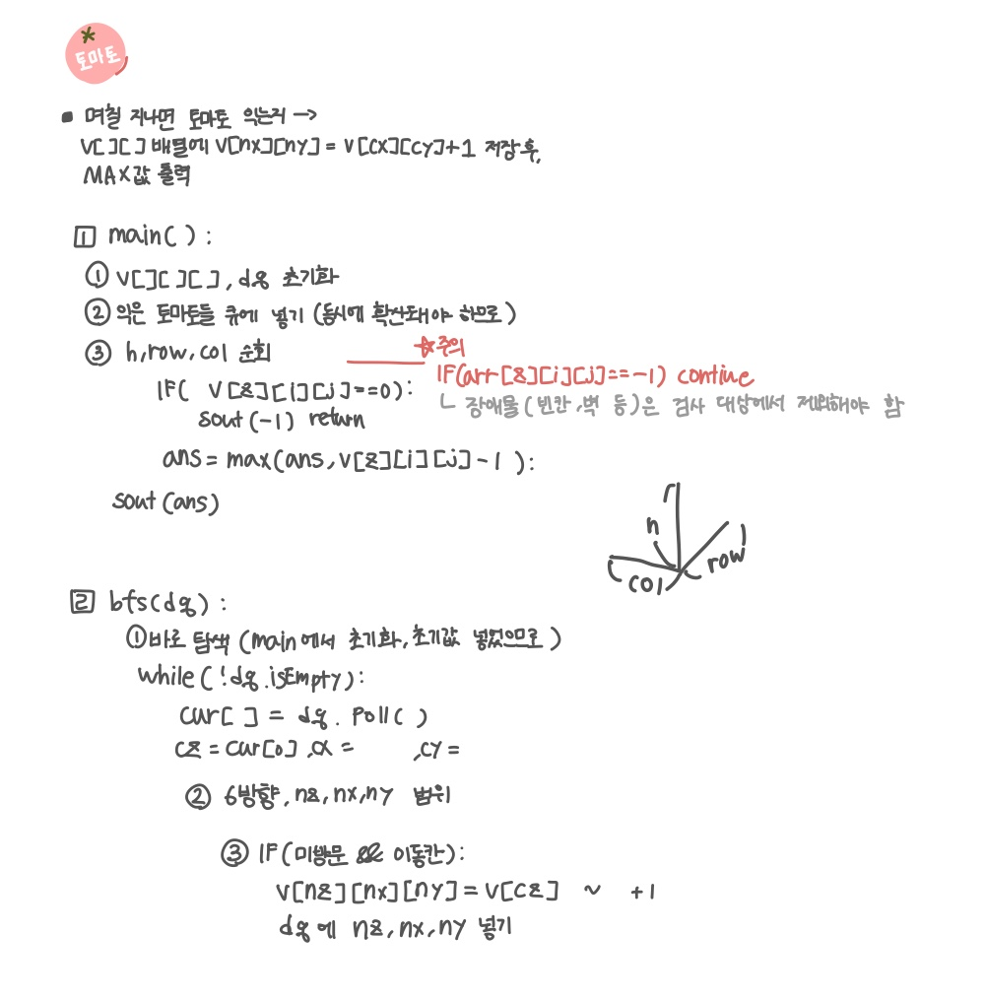

<br>

---

[https://www.acmicpc.net/problem/7569](https://www.acmicpc.net/problem/7569)

---

<br>

# 🔍 문제 풀이

## 문제 도식화



<br><br>

# 💻 코드

## 전체 코드

```java
import java.io.*;
import java.util.*;

public class Main {
    static int[][][] graph;
    static int[][][] visited;

    static int[] dz = {-1, 1, 0, 0, 0, 0};
    static int[] dx = {0, 0, -1, 1, 0, 0};
    static int[] dy = {0, 0, 0, 0, -1, 1};

    static int col, row, h;


    public static void main(String[] args) throws IOException {
        BufferedReader br = new BufferedReader(new InputStreamReader(System.in));

        StringTokenizer st = new StringTokenizer(br.readLine());
        col = Integer.parseInt(st.nextToken());
        row = Integer.parseInt(st.nextToken());
        h = Integer.parseInt(st.nextToken());

        graph = new int[h][row][col];
        visited = new int[h][row][col];
        Deque<int[]> dq = new ArrayDeque<>();

        for(int z = 0; z<h; z++){
            for(int i=0; i<row; i++){
                st = new StringTokenizer(br.readLine());
                for(int j = 0; j<col; j++){
                    graph[z][i][j] = Integer.parseInt(st.nextToken());
                    if(graph[z][i][j] == 1){
                        dq.offer(new int[]{z, i, j});
                        visited[z][i][j] = 1;
                    }
                }
            }
        }

        bfs(dq);

        int ans = Integer.MIN_VALUE;
        for(int z = 0; z<h; z++){
            for(int i=0; i<row; i++){
                for(int j = 0; j<col; j++){
                    if (graph[z][i][j] == -1) continue;

                    if(visited[z][i][j] == 0){
                        System.out.println(-1);
                        return;
                    }
                    ans = Math.max(ans, visited[z][i][j] - 1);
                }
            }
        }
        System.out.println(ans);
    }

    static void bfs(Deque<int[]> dq) {
        while(!dq.isEmpty()){
            int[] cur = dq.poll();
            int cz = cur[0];
            int cx = cur[1];
            int cy = cur[2];

            for(int d = 0; d<6; d++){
                int nz = cz + dz[d];
                int nx = cx + dx[d];
                int ny = cy + dy[d];

                if(nz < 0 || nz>= h || nx < 0 || nx>= row || ny < 0 || ny >= col) continue;

                if(graph[nz][nx][ny] == 0 && visited[nz][nx][ny] == 0){
                    visited[nz][nx][ny] = visited[cz][cx][cy] + 1;
                    dq.offer(new int[]{nz, nx, ny});
                }
            }
        }

    }
}
```

<br>

## 스켈레톤 코드

```java
import java.io.*;
import java.util.*;

public class Main {
    static int[][][] graph;
    static int[][][] visited;

    static int[] dz = {-1, 1, 0, 0, 0, 0};
    static int[] dx = {0, 0, -1, 1, 0, 0};
    static int[] dy = {0, 0, 0, 0, -1, 1};

    static int col, row, h;


    public static void main(String[] args) throws IOException {
        BufferedReader br = new BufferedReader(new InputStreamReader(System.in));

        StringTokenizer st = new StringTokenizer(br.readLine());
        col = Integer.parseInt(st.nextToken());
        row = Integer.parseInt(st.nextToken());
        h = Integer.parseInt(st.nextToken());

        graph = new int[h][row][col];
        visited = new int[h][row][col];
        Deque<int[]> dq = new ArrayDeque<>();

        for(int z = 0; z<h; z++){
            for(int i=0; i<row; i++){
                st = new StringTokenizer(br.readLine());
                for(int j = 0; j<col; j++){
                    graph[z][i][j] = Integer.parseInt(st.nextToken());
                    // 초기 데이터 삽입
                    if(graph[z][i][j] == 1){
                        dq.offer(new int[]{z, i, j});
                        visited[z][i][j] = 1;
                    }
                }
            }
        }

        bfs(dq);


    }

    static void bfs() {


    }
}
```

<br>
