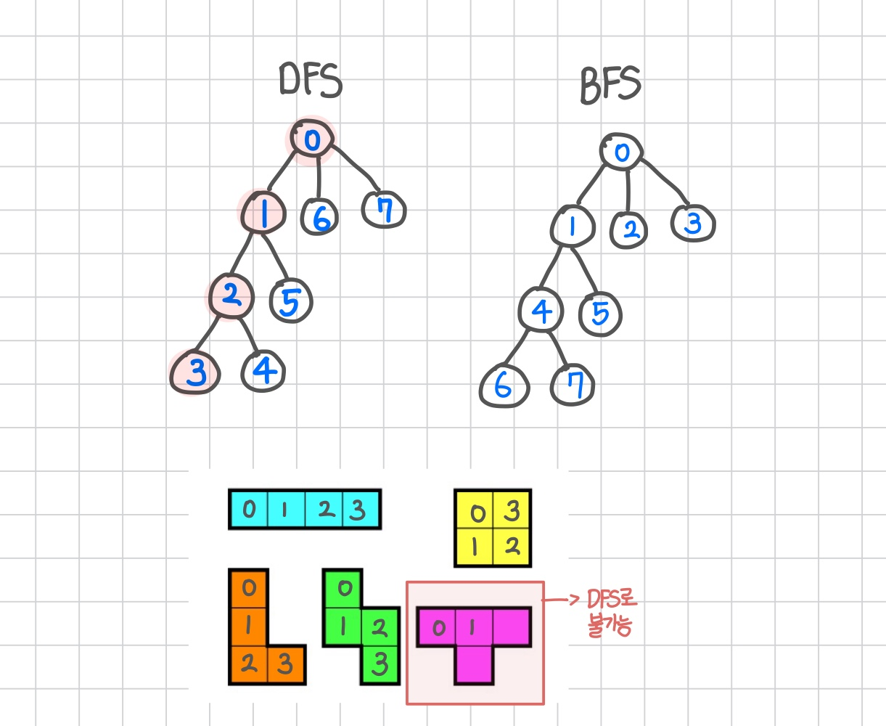
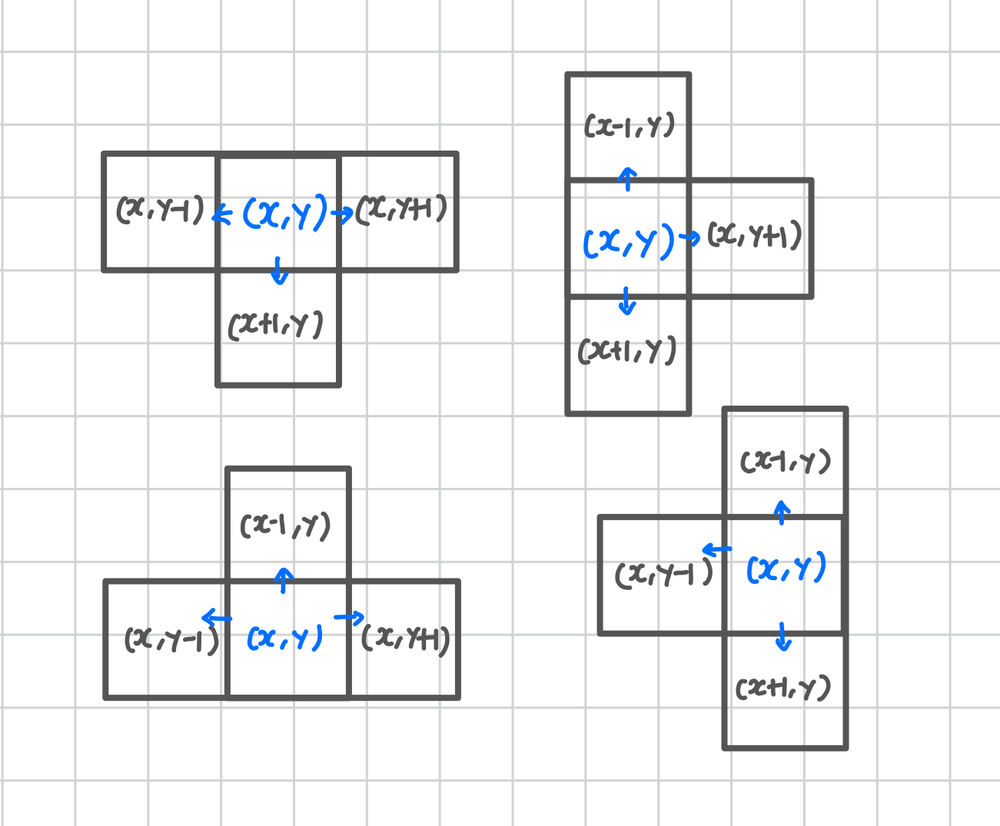

<br>

---

[https://www.acmicpc.net/problem/14500](https://www.acmicpc.net/problem/14500)

---

<br>

# 📌 문제

> 문제 유형

- 구현
- 브루트포스

<br>

> 📘 문제 설명


<br>

> 📥 입력

- 첫째 줄에 종이의 세로 크기 N과 가로 크기 M이 주어진다. (4 ≤ N, M ≤ 500)
- 둘째 줄부터 N개의 줄에 종이에 쓰여 있는 수가 주어진다.
- i번째 줄의 j번째 수는 위에서부터 i번째 칸, 왼쪽에서부터 j번째 칸에 쓰여 있는 수이다.
- 입력으로 주어지는 수는 1,000을 넘지 않는 자연수이다.

```
5 5
1 2 3 4 5
5 4 3 2 1
2 3 4 5 6
6 5 4 3 2
1 2 1 2 1
```

> 📥 출력

첫째 줄에 테트로미노가 놓인 칸에 쓰인 수들의 합의 최댓값을 출력한다.

```
19
```

<br><br>

# 🔍 문제 풀이

## 문제 해결 절차

1. DFS로 연속된 4칸을 탐색하며 최대값을 찾는다.
2. DFS로 만들 수 없는 ㅗ, ㅏ, ㅜ, ㅓ 모양은 별도로 시뮬레이션 처리를 하여 최대값을 찾는다.

<br>

## 어떤 알고리즘을 사용해야 할까?

> 이 문제에서는 모든 칸에서 시작해, 상하좌우로 4칸을 탐색해야 하므로 **DFS(깊이 우선 탐색) + 백트래킹**이 가장 적합하다.

- DFS (깊이 우선 탐색)

  - 한 방향으로 끝까지 들어간 뒤, 막히면 뒤로 돌아오는 방식 (Backtracking)
  - 재귀 기반 -> 백트래킹 가능

- BFS (너비 우선 탐색)
  - 현재에서 가까운 모든 위치를 먼저 탐색
  - 큐 기반 -> 레벨 단위 탐색 -> 중간 분기 어려움

<br>

> 아래 그림은 DFS와 BFS가 탐색하는 순서를 비교한 것이다.



위 그림을 통해 BFS는 가능하긴 하나, 큐 상태에서 깊이 추적이 어렵다는 것을 확인할 수 있다.

따라서 가까운 칸부터 넓게 탐색하는 BFS보다, 한 방향으로 깊게 탐색하는 **DFS가 더 적합**하다.

<br>

> 단, 'ㅗ', 'ㅜ', 'ㅏ', 'ㅓ' 모양 도형은 DFS로 만들 수 없다.

- DFS는 한 방향으로만 계속 탐색하기 때문에, 중간에서 양쪽으로 분기하는(3방향으로 퍼지는) 구조를 만들 수 없다.
- 그럼 어떻게 처리해야할까? 알아보자.

<br>

## 'ㅗ'모양은 어떻게 처리하지?

> 'ㅗ', 'ㅏ', 'ㅜ', 'ㅓ' 모양 도형은 상하좌우 탐색으로는 불가능하다.

따라서 `checkTShape(x, y)` 함수를 통해 현재 좌표 (x, y)를 중심으로 3방향을 더해 ㅗ 모양 도형을 만들 수 있도록 해줬다.

| 방향       | 좌표 변화  |
| ---------- | ---------- |
| **왼쪽**   | `x, y - 1` |
| **오른쪽** | `x, y + 1` |
| **위쪽**   | `x - 1, y` |
| **아래쪽** | `x + 1, y` |

```java
int[][] Tshapes = {
    {0, -1, -1, 0, 0, 1}, // ㅗ
    {-1, 0, 0, 1, 1, 0}, // ㅏ
    {0, -1, -1, 0, 1, 0}, // ㅓ
    {0, -1, 0, 1, -1, 0} // ㅜ
};
```



- 이처럼, 중심 좌표 `(x, y)`를 기준으로 양 방향으로 뻗어나가도록 해야 한다.
- 즉, 중심 좌표를 기준으로 3개의 방향으로 확장하여 총 4칸을 구성하는 방식이다.

<br>

> 예를 들어 ㅗ 모양의 경우:

- 중심: `(x, y)`
- 확장: 왼쪽 `(x, y - 1)`, 오른쪽 `(x, y + 1)`, 아래 `(x + 1, y)`

이러한 방식으로 ㅏ, ㅓ, ㅜ, ㅗ 총 4가지 모양을 구현할 수 있다.

이처럼 모든 칸에서 모든 방향의 도형을 직접 시도하여 누적 최대값을 찾는다.

<br><br>

# 📌 놓친 점

> dfs() 함수 내부에서 `visited[x][y] = true`를 바로 해줬는데,<br>
> 왜 굳이 main() 함수에서 시작 좌표에 대해 먼저 방문 처리를 해줘야 할까? 이해가 가지 않았다.

하지만,

- DFS는 재귀를 통해 "다음 위치"들을 탐색하는 함수이기 때문에,
- 시작 좌표 `(i, j)`는 DFS가 호출되기 전에 방문처리를 해줘야 해당 위치가 중복으로 사용되는 것을 방지할 수 있다.
- 즉, 하나의 경로가 끝나고 나면, 그 위치를 다시 쓸 수 있도록 `visited = false`로 풀어줘야 한다.

<br>

`dfs()` 내부에서 처리하는 잘못된 경우의 예시이다.

```java
static void dfs(int x, int y, int depth, int sum) {
    visited[x][y] = true; // 이미 dfs 호출됨. 너무 늦음
    ...
}
```

- 이 방식은 DFS 내부에 진입하고 나서야 방문 처리되므로,
- 이미 다른 경로에서도 `(x, y)`를 사용할 가능성이 생긴다.
- 즉, (i, j)에서 시작하는 다른 경로에서 이 좌표를 사용할 수도 있는 것이다.
- 특히 백트래킹 구조에서는 이게 중복 탐색의 원인이 된다.

<br>

따라서 아래와 같이 `main()` 함수에서 처리해야한다.

```java
visited[i][j] = true; // 시작점 직접 방문 처리
dfs(i, j, 1, graph[i][j]);
visited[i][j] = false;  // 탐색 후 백트래킹
```

- 위처럼 시작 지점은 DFS 진입 전에 방문 처리를 해야
- DFS 내부에서도, 다른 경로에서도 처음 좌표가 중복해서 사용되는 것을 방지할 수 있다.

<br>

정리하자면,

- 시작점을 `dfs()` 내부에서 방문처리를 하면 -> 진입 전에 중복 탐색 가능성이 생김
- `main()`에서 시작점 방문처리를 하면 -> 중복 없이 한 번만 탐색 가능

<br><br>

# 💻 전체 코드

```java
import java.io.*;
import java.util.*;

public class Main {
    static int  n, m;
    static int[][] graph;
    static boolean[][] visited;
    static int max = Integer.MIN_VALUE;

    static int[] dx = {-1, 1, 0, 0};
    static int[] dy = {0, 0, -1, 1};

    static void dfs(int x, int y, int depth, int sum){
        if(depth == 4){
            max = Math.max(max, sum);
            return;
        }

        for(int d=0; d<4; d++){
            int nx = x + dx[d];
            int ny = y + dy[d];

            if(nx<0 || ny<0 || nx>=n || ny>=m) continue;
            if(!visited[nx][ny]){
                visited[nx][ny] = true;
                dfs(nx, ny, depth+1, sum + graph[nx][ny]);
                visited[nx][ny] = false; // 백트래킹
            }
        }
    }

    // 'ㅗ'모양 처리 함수
    public static void checkTShape(int x, int y) {
        // x와 y는 중심좌표 여기에 3개를 더해서 ㅗ, ㅜ, ㅏ ,ㅓ 모양 만들기
        int[][] cases = {
                // 왼쪽 : (x,y-1)
                // 위쪽: (x-1, y)
                // 오른쪽: (x, y+1)
                // 아래: (x+1, y)

                // dx1 dy1   dx2 dy2   dx3 dy3  (중심(x,y) 기준 3칸의 상대 좌표)
                {  0, -1,   -1,  0,    0,  1 },   // ㅗ
                { -1,  0,    0,  1,    1,  0 },   // ㅏ
                {  0, -1,    1,  0,    0,  1 },   // ㅜ
                { -1,  0,    0, -1,    1,  0 }    // ㅓ

        };

        for (int[] c : cases) {
            int x1 = x + c[0], y1 = y + c[1];
            int x2 = x + c[2], y2 = y + c[3];
            int x3 = x + c[4], y3 = y + c[5];

            if (x1 < 0 || x1 >= n || y1 < 0 || y1 >= m) continue;
            if (x2 < 0 || x2 >= n || y2 < 0 || y2 >= m) continue;
            if (x3 < 0 || x3 >= n || y3 < 0 || y3 >= m) continue;

            int sum = graph[x][y] + graph[x1][y1] + graph[x2][y2] + graph[x3][y3];
            max = Math.max(max, sum);
        }
    }

    public static void main(String[] args) throws IOException {
        BufferedReader br = new BufferedReader(new InputStreamReader(System.in));

        StringTokenizer st = new StringTokenizer(br.readLine());
        n = Integer.parseInt(st.nextToken());
        m = Integer.parseInt(st.nextToken());

        graph = new int[n][m];
        visited = new boolean[n][m];

        // 입력
        for(int i=0; i<n; i++){
            st = new StringTokenizer(br.readLine());
            for(int j=0; j<m; j++){
                graph[i][j] = Integer.parseInt(st.nextToken());
            }
        }

        for(int i=0; i<n; i++){ // 모든 칸 탐색 시작
            for(int j=0; j<m; j++){
                visited[i][j] = true;
                // 현재 칸도 포함했기 때문에 depth = 1
                // graph[i][j]는 현재 칸의 숫자 합
                dfs(i, j, 1, graph[i][j]);
                visited[i][j] = false; // DFS 끝나고, 다음 위치에서 다시 쓸 수 있도록 방문 해제


                checkTShape(i, j); // 'ㅗ' 모양 처리
            }
        }
        System.out.println(max);
    }
}
```

<br>

이로써 class 3 문제 해결 완료! 🤗


<br>
