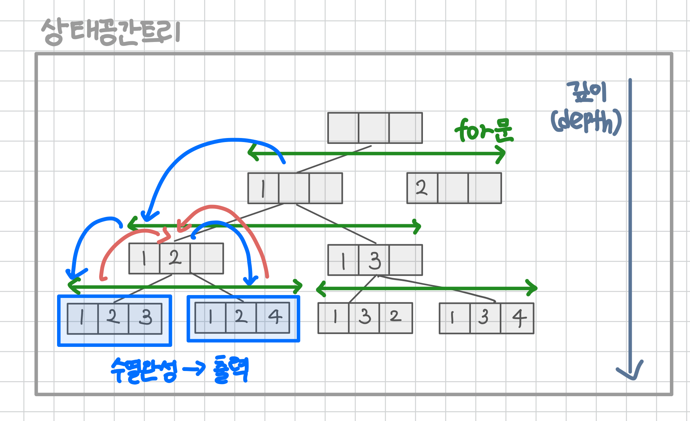

<br>

---

[문제집 N과 M](https://www.acmicpc.net/workbook/view/2052)

---

<br>

# 🧠 선행 지식

## 백트래킹이란?

> 현재 상태에서 가능한 모든 선택지를 따라가며 정답을 찾는 탐색 방법

- 완전탐색의 일종
- 모든 후보를 고려하되, **불필요한 탐색은 가지치기(Pruning)** 로 줄인다
- 모든 경우의 수를 고려해야 할 때 사용
- 예시
  - 미연시 게임: 모든 루트(선택지)를 탐색
  - 오목: 가능한 모든 수를 놓아보며 승리 여부 판단

<br>

> 백트래킹 구현 방식

- 빈 리스트에서 시작해서, 가능한 수를 하나씩 추가해 나간다.
- 이미 사용한 수는 제외한다.
- 조건을 만족하지 않으면 **되돌아가며(Backtrack)** 다른 선택지를 탐색한다.

즉, **상태**를 넘나드는 방식으로 탐색하는 방식이다.

<br>

> [참고] 상태공간 트리란?

문제를 풀기 위한 모든 경우의 수(상태)를 트리 형태로 나타낸 구조

- 루트: `[]` (초기 상태)
- 자식 노드: 어떤 수를 선택한 이후의 상태
- 리프 노드: 원하는 길이(M)를 만족하는 상태

<br><br>

# 📌 문제

## 1. N과 M (1) - 순열

> 자연수 N과 M이 주어졌을 때, 조건을 만족하는 길이가 M인 수열을 모두 구하는 프로그램을 작성하시오. [[문제 🔗]](https://www.acmicpc.net/problem/15649)



<br>

> 👩‍💻 전체 코드

```java
import java.io.*;
import java.util.*;

public class Main {
    static int n, m;
    static int[] arr; // 수열을 저장할 배열
    static boolean[] v; // 숫자 사용 여부 체크 배열

    public static void main(String[] args) throws IOException {
        BufferedReader br = new BufferedReader(new InputStreamReader(System.in));

        StringTokenizer st = new StringTokenizer(br.readLine());
        n = Integer.parseInt(st.nextToken());
        m = Integer.parseInt(st.nextToken());

        arr = new int[m];
        v = new boolean[n + 1];

        dfs(0);
    }

    static void dfs(int depth) {
        // 1. 종료 조건
        if (depth == m) {
            for (int val : arr) {
                System.out.print(val + " ");
            }
            System.out.println();
            return;
        }


        // 2. dfs 호출
        for(int j = 1; j <=n; j++){
            if(!v[j]){
                v[j] = true;

                arr[depth] = j; // 현재위치(depth)에 숫자 저장
                dfs(depth + 1); // 다음 단계로 이동 (재귀)

                v[j] = false; // 백트래킹
            }
        }
    }
}
```

<br>

## 2. N과 M (2) - 조합

> 📘 [문제 설명](https://www.acmicpc.net/problem/15650)

- 자연수 N과 M이 주어졌을 때, 아래 조건을 만족하는 길이가 M인 수열을 모두 구하는 프로그램을 작성하시오.
- 1부터 N까지 자연수 중에서 중복 없이 M개를 고른 수열
- 고른 수열은 오름차순이어야 한다.

<br>

> 📕 문제 해석

이 문제는 **순서가 중요하지 않은 조합(combination)** 문제이다.

- 중복 허용 X
  - 같은 수를 두 번 고르면 안 되므로 `i + 1`부터 탐색하여 중복 제거
  - 즉, `1 2`와 `2 1`은 같은 것으로 보기 때문에 한 번만 출력해야 한다.
  - visited[] 없이도 `start`만으로 충분히 처리 가능 -> 백트래킹 구조 자체로 오름차순 필터링 가능하기 때문
- 오름차순 조건 O
  - 현재 수보다 같거나 큰 수만 선택하도록 `start` 인덱스를 넘겨준다.
  - `for (int i = start; i <= n; i++)` 형식으로 구현
- 조합
  - 순서가 중요하지 않으므로, 앞에 선택한 수보다 크거나 같은 수만 선택


<br>

> 📙 예시 (N=4, M=2)

예를 들어, N=4, M=2일 때 가능한 수열은 다음과 같다.

- 입력<br><br>
  ```java
  4 2
  ```
- 출력<br><br>
  ```java
  1 2
  1 3
  1 4
  2 3
  2 4
  3 4
  ```

`2 1`, `3 1` 등은 아예 시도하지 않는다 -> 백트래킹 구조 자체로 오름차순 필터링이 된다!

<br>

> 👩‍💻 전체 코드

순열과 구조는 비슷하지만, **start 변수를 넘기면서** 오름차순 조합을 생성하는 것이 차이점이다.

```java
import java.io.*;
import java.util.*;

public class Main {
    static int[] arr;
    static int n, m;

    static void dfs(int start, int depth){
        if(depth == m){
            for(int val : arr){
                System.out.print(val + " ");
            }
            System.out.println();
            return;
        }

        for(int i = start; i <= n; i++){
            arr[depth] = i; // 현재 수를 수열에 넣기
            dfs(i + 1, depth + 1); // 다음 수는 i보다 큰 수부터 탐색 (오름차순 보장)
        }
    }

    public static void main(String[] args) throws IOException {
        BufferedReader br = new BufferedReader(new InputStreamReader(System.in));
        StringTokenizer st = new StringTokenizer(br.readLine());

        n = Integer.parseInt(st.nextToken());
        m = Integer.parseInt(st.nextToken());

        arr = new int[m];
        dfs(1, 0); // 1부터 시작
    }
}
```

<br>

## 3. N과 M (3) - 중복 순열

> 📘 [문제 설명](https://www.acmicpc.net/problem/15651)

자연수 N과 M이 주어졌을 때, 아래 조건을 만족하는 길이가 M인 수열을 모두 구하는 프로그램을 작성하시오.

- 1부터 N까지 자연수 중에서 M개를 고른 수열
- 같은 수를 여러 번 골라도 된다.

<br>

> 📕 문제 해석

이 문제는 중복을 허용하여 M개를 고른 순열 **(중복 순열)** 을 구하는 문제이다.

- 중복 허용 O
  - 같은 수를 여러 번 골라도 되므로 `visited[]`를 사용하지 않는다.
- 오름차순 조건 X
  - 수열이 오름차순일 필요가 없으므로 start 매개변수는 필요 없다.
  - `for (int i = 1; i <= n; i++)`로 모든 수를 탐색한다.
- 순열
  - 순서가 중요하므로 모든 위치에 대해 모든 수를 사용할 수 있다.

<br>

> 📙 예시 (N=4, M=2)

예를 들어, N=4, M=2일 때 가능한 수열은 다음과 같다. (4\*4 = 16개)

- 입력<br><br>
  ```java
  4 2
  ```
- 출력<br><br>
  ```java
  1 1
  1 2
  1 3
  1 4
  2 1
  2 2
  2 3
  2 4
  3 1
  3 2
  3 3
  3 4
  4 1
  4 2
  4 3
  4 4
  ```

<br>

> 👩‍💻 전체 코드

⚠️ `System.out.println`을 사용하면 시간초과가 나기 때문에, `StringBuilder`을 사용해서 풀어야한다.

(앞으로 StringBuilder를 활용해서 풀도록 하겠다-!)

```java
import java.io.*;
import java.util.*;

public class Main {
    static int n, m;
    static int[] arr;
    static StringBuilder sb = new StringBuilder();

    static void dfs(int depth){
        if(depth == m){
            for(int val:arr){
                sb.append(val).append(" ");
            }
            sb.append("\n");
            return;

        }

        for(int i=0; i<n; i++){
            arr[depth] = i+1;
            dfs(depth+1);
        }
    }

    public static void main(String[] args) throws IOException {
        BufferedReader br = new BufferedReader(new InputStreamReader(System.in));
        StringTokenizer st = new StringTokenizer(br.readLine());

        n = Integer.parseInt(st.nextToken()); // visited 크기
        m = Integer.parseInt(st.nextToken()); // arr 크기

        arr = new int[m];

        dfs(0);
        System.out.println(sb);
    }
}
```

<br>

## 4. N과 M (4) - 중복 조합

> 📘 [문제 설명](https://www.acmicpc.net/problem/15652)

자연수 N과 M이 주어졌을 때, 아래 조건을 만족하는 길이가 M인 수열을 모두 구하는 프로그램을 작성하시오.

- 1부터 N까지 자연수 중에서 M개를 고른 수열
- 같은 수를 여러 번 골라도 된다.
- 고른 수열은 비내림차순이어야 한다.
- 길이가 K인 수열 A가 A1 ≤ A2 ≤ ... ≤ AK-1 ≤ AK를 만족하면, 비내림차순이라고 한다.

<br>

> 📕 문제 해석

이 문제는 중복을 허용하여 M개를 고른 조합 (**중복 조합**) 을 구하는 문제이다.

- 중복 허용 O
  - 같은 수를 여러 번 골라도 되므로 visited[]를 사용하지 않는다.
- 오름차순 조건 O
  - 비내림차순(앞 ≤ 뒤)을 만족해야 하므로 `start` 인덱스를 넘겨준다.
  - `for (int i = start; i <= n; i++)`로 현재 수 이상부터 탐색한다.
- 조합
  - 순서가 중요하지 않으며, 이전보다 크거나 같은 수만 선택한다.

<br>

> 📙 예시 (N=4, M=2)

예를 들어, 아래와 같은 입력이 들어왔을 때 수열은 다음과 같다.

- 입력<br><br>
  ```java
  4 2
  ```
- 출력<br><br>
  ```java
  1 1
  1 2
  1 3
  1 4
  2 2
  2 3
  2 4
  3 3
  3 4
  4 4
  ```

<br>

> 👩‍💻 전체 코드

- 중복 허용이기 때문에 i를 그대로 넘겨도 된다.
- 현재 숫자(i)를 포함한 나머지 조합을 계속 탐색하는 구조이다.

```java
import java.io.*;
import java.util.*;

public class Main {
    static int n, m;
    static int[] arr;
    static StringBuilder sb = new StringBuilder();

    static void dfs(int start, int depth){
        if(depth == m){
            for(int val:arr){
                sb.append(val).append(" ");
            }
            sb.append("\n");
            return;

        }

        for(int i=start; i<=n; i++){
            arr[depth] = i;
            dfs(i, depth+1); // 중복 허용 → i 그대로 넘김

        }

    }

    public static void main(String[] args) throws IOException {
        BufferedReader br = new BufferedReader(new InputStreamReader(System.in));
        StringTokenizer st = new StringTokenizer(br.readLine());

        n = Integer.parseInt(st.nextToken()); // visited 크기
        m = Integer.parseInt(st.nextToken()); // arr 크기

        arr = new int[m];

        dfs(1, 0);
        System.out.println(sb);
    }
}
```

<br>

```java
import java.io.*;
import java.util.*;

public class Main {
    static int n, m;
    static int[] arr;
    static boolean[] visited;
    static int[] nums;

    static StringBuilder sb = new StringBuilder();

    static void dfs(int depth){
        if(depth == m){
            for(int val:arr){
                sb.append(val).append(" ");
            }
            sb.append("\n");
            return;

        }

        for(int i=0; i<n; i++){
            if(!visited[i]){
                visited[i] = true;
                arr[depth] = nums[i]; // 입력된 숫자 넣어주기
                dfs(depth+1);
                visited[i] = false;
            }
        }
    }

    public static void main(String[] args) throws IOException {
        BufferedReader br = new BufferedReader(new InputStreamReader(System.in));
        StringTokenizer st = new StringTokenizer(br.readLine());

        n = Integer.parseInt(st.nextToken()); // visited 크기
        m = Integer.parseInt(st.nextToken()); // arr 크기
        nums = new int[n];

        st = new StringTokenizer(br.readLine());
        for(int i=0; i<n; i++){
            nums[i] = Integer.parseInt(st.nextToken());
        }

        arr = new int[m];
        visited = new boolean[n];

        Arrays.sort(nums); // 정렬

        dfs(0);
        System.out.println(sb);
    }
}
```

<br>

## 9. N과 M (9) - 입력 수열 중복 없는 순열 (중복 제거)

> 📘 [문제 설명](https://www.acmicpc.net/problem/15663)

N개의 자연수와 자연수 M이 주어졌을 때, 아래 조건을 만족하는 길이가 M인 수열을 모두 구하는 프로그램을 작성하시오.

- N개의 자연수 중에서 M개를 고른 수열

<br>

> 📕 문제 해석

이 문제는 입력으로 주어진 수열에서 **중복 없이 M개**를 고른 순열 을 구하는 문제이다.

- 중복 허용 X
  - 같은 숫자를 두 번 고르면 안 되므로 `visited[]` 배열을 사용한다.
- 오름차순 조건 X
  - 수열이 오름차순일 필요가 없으므로 start 매개변수는 필요 없다.
  - 사전 순 출력을 위해 `Arrays.sort(nums)`를 먼저 해줘야한다.
- 입력 수열 사용
  - `nums[]` 배열에 주어진 수열을 저장한 뒤, 정렬하여 탐색한다.
- 중복 제거
  - 입력 수열에 중복된 숫자가 있을 수 있으므로, `LinkedHashSet`으로 결과 중복을 제거하였다.

<br>

> 헷갈린점

- ⚠️ 무조건 `LinkedHashSet`을 써야한다.
- 순서를 그대로 유지하면서 중복 제거하려면 LinkedHashSet이 적합하기 때문이다.
  - LinkedHashSet:
    - 입력한 순서 유지
    - `Arrays.sort()`로 만든 사전 순 그대로 출력됨
    - 수열이 숫자 오름차순처럼 보이게 하려면 LinkedHashSet을 사용하자
  - TreeSet:
    - 자동 오름차순 정렬 (기본은 String 기준)
    - 숫자 "135", "16" -> 출력: "135", "16" -> (사전 순 깨짐)
    - 즉, "1" vs "1" → 다음 "3" vs "6" → "3"이 작으므로 "135"가 앞에 옴

[참고 블로그 - 그냥 그냥 블로그](https://girawhale.tistory.com/72)

<br>

- 정렬 2번 하는 이유
  - 입력 수 정렬 `(Arrays.sort(nums))` -> 사전 순으로 탐색이 되도록 하기 위해 필요
  - 출력 순서 유지 (`LinkedHashSet`) -> 중복 수열 제거 + 삽입 순서대로 출력

<br>

- `StringBuilder`는 `Set<String>`에 직접 넣을 수 없다
  - 출력만 할 거면 `System.out.println(sb) `해도 상관없지만,
  - `Set<String>`에 넣으려면 반드시 `.toString()`으로 문자열로 변환해야 한다.
  - `sb`는 `StringBuilder` 타입이고, `Set<String>`은 `String`만 받기 때문이다.

<br>

> 📙 예시 (N=4, M=2)

예를 들어, 아래와 같은 입력이 들어왔을 때 수열은 다음과 같다.

- 입력<br><br>
  ```java
  4 2
  9 7 9 1
  ```
- 출력<br><br>
  ```java
  1 7
  1 9
  7 1
  7 9
  9 1
  9 7
  9 9
  ```

<br>

> 👩‍💻 전체 코드

```java
import java.io.*;
import java.util.*;

public class Main {
    static int n, m;
    static int[] arr;
    static int[] nums;
    static boolean[] visited;
    static Set<String> set = new LinkedHashSet<>(); // LinkedHashSet써주기

    static void dfs(int depth){
        StringBuilder sb = new StringBuilder();
        if(m==depth){
            for(int val:arr){
                sb.append(val).append(" ");
            }
            set.add(sb.toString());
            return;
        }


        for(int i=0; i<n; i++){
            if(!visited[i]){
                visited[i] = true;
                arr[depth] = nums[i]; // 입력된 숫자 넣어주기
                dfs(depth+1);
                visited[i] = false;
            }
        }

    }

    public static void main(String[] args) throws IOException {
        BufferedReader br = new BufferedReader(new InputStreamReader(System.in));
        StringTokenizer st = new StringTokenizer(br.readLine());

        n = Integer.parseInt(st.nextToken()); // visited 크기
        m = Integer.parseInt(st.nextToken()); // arr 크기

        nums = new int[n];
        arr = new int[m];
        visited = new boolean[n];

        st = new StringTokenizer(br.readLine());
        for(int i=0; i<n; i++){
            nums[i] = Integer.parseInt(st.nextToken());
        }
        Arrays.sort(nums);

        dfs(0);

        for(String s:set){
            System.out.println(s);
        }
    }
}
```

<br>
 
## 10. N과 M (10) - 입력 수열 조합 (중복 제거)

> 📘 [문제 설명](https://www.acmicpc.net/problem/15664)

N개의 자연수와 자연수 M이 주어졌을 때, 아래 조건을 만족하는 길이가 M인 수열을 모두 구하는 프로그램을 작성하시오.

- N개의 자연수 중에서 M개를 고른 수열
- 고른 수열은 비내림차순이어야 한다.
- 길이가 K인 수열 A가 A1 ≤ A2 ≤ ... ≤ AK-1 ≤ AK를 만족하면, 비내림차순이라고 한다.

<br>

> 📕 문제 해석

이 문제는 입력으로 주어진 수열에서 **중복 없이 M개를 고른 조합** 을 구하는 문제이다.<br>
이쯤 되면 입력 수열 + 중복 허용 + 중복 제거 패턴이 눈에 익을 것이다.

- 중복 허용 X
  - visited[] 없이도 `start`만으로 충분히 처리 가능 -> 백트래킹 구조 자체로 오름차순 필터링 가능하기 때문
- 오름차순 조건 O
  - 비내림차순(앞 ≤ 뒤)을 만족해야 하므로 start 인덱스를 넘겨준다.
  - `for (int i = start; i <= n; i++)`로 현재 수 이상부터 탐색
- 입력 수열 사용
  - `nums[]` 배열에 주어진 수열을 저장한 뒤, 정렬하여 탐색
- 중복 제거
  - 입력 수열에 중복된 숫자가 있을 수 있으므로, `LinkedHashSet`으로 결과 중복을 제거하였다.

<br>

> 📙 예시 (N=4, M=2)

예를 들어, N=4, M=2일 때 가능한 수열은 다음과 같다.

- 입력<br><br>
  ```java
  4 2
  9 7 9 1
  ```
- 출력<br><br>
  ```java
  1 7
  1 9
  7 9
  9 9
  ```

<br>

> 👩‍💻 전체 코드

```java
import java.io.*;
import java.util.*;

public class Main {
    static int n, m;
    static int[] arr;
    static int[] nums;
    static Set<String> set = new LinkedHashSet<>(); // LinkedHashSet써주기

    static void dfs(int start, int depth){
        StringBuilder sb = new StringBuilder();
        if(m==depth){
            for(int val:arr){
                sb.append(val).append(" ");
            }
            set.add(sb.toString());
            return;
        }

        for(int i=start; i<n; i++){
            arr[depth] = nums[i]; // 입력된 숫자 넣어주기
            dfs(i+1,depth+1);
        }
    }

    public static void main(String[] args) throws IOException {
        BufferedReader br = new BufferedReader(new InputStreamReader(System.in));
        StringTokenizer st = new StringTokenizer(br.readLine());

        n = Integer.parseInt(st.nextToken()); // visited 크기
        m = Integer.parseInt(st.nextToken()); // arr 크기

        nums = new int[n];
        arr = new int[m];

        st = new StringTokenizer(br.readLine());
        for(int i=0; i<n; i++){
            nums[i] = Integer.parseInt(st.nextToken());
        }
        Arrays.sort(nums);

        dfs(0, 0); // nums 배열은 0부터 시작하므로 start=0

        for(String s:set){
            System.out.println(s);
        }
    }
}
```

<br>

## 11. N과 M (11) - 입력 수열 중복 순열 (중복 제거 없음)

> 📘 [문제 설명](https://www.acmicpc.net/problem/15665)

N개의 자연수와 자연수 M이 주어졌을 때, 아래 조건을 만족하는 길이가 M인 수열을 모두 구하는 프로그램을 작성하시오.

- N개의 자연수 중에서 M개를 고른 수열
- 같은 수를 여러 번 골라도 된다.

<br>

> 📕 문제 해석

이 문제는 입력으로 주어진 수열에서 **중복을 허용하며 M개를 고른 순열**을 구하는 문제이다.

- 중복 허용 O
  - 같은 수를 여러 번 고를 수 있으므로 visited[]는 사용하지 않는다.
- 오름차순 조건 X
  - 오름차순일 필요는 없기 때문에 start 인덱스도 사용하지 않는다.
  - 단순히 `i = 0`부터 반복하여 모든 경우의 수를 탐색한다.
- 입력 수열 사용
  - `nums[]` 배열에 주어진 수열을 저장한 뒤, 정렬하여 탐색
- 중복 제거
  - 입력 수열에 중복된 숫자가 있을 수 있으므로, `LinkedHashSet`으로 결과 중복을 제거하였다.

<br>

> 📙 예시 (N=4, M=2)

예를 들어, N=4, M=2일 때 가능한 수열은 다음과 같다.

- 입력<br><br>
  ```java
  4 2
  9 7 9 1
  ```
- 출력<br><br>
  ```java
  1 1
  1 7
  1 9
  7 1
  7 7
  7 9
  9 1
  9 7
  9 9
  ```

<br>

> 👩‍💻 전체 코드

```java
import java.io.*;
import java.util.*;

public class Main {
    static int n, m;
    static int[] arr;
    static int[] nums;
    static Set<String> set = new LinkedHashSet<>(); // LinkedHashSet 써주기

    static void dfs(int depth){
        StringBuilder sb = new StringBuilder();
        if(m==depth){
            for(int val:arr){
                sb.append(val).append(" ");
            }
            set.add(sb.toString());
            return;
        }

        for(int i=0; i<n; i++){
            arr[depth] = nums[i]; // 입력된 숫자 넣어주기
            dfs(depth+1);
        }
    }

    public static void main(String[] args) throws IOException {
        BufferedReader br = new BufferedReader(new InputStreamReader(System.in));
        StringTokenizer st = new StringTokenizer(br.readLine());

        n = Integer.parseInt(st.nextToken()); // visited 크기
        m = Integer.parseInt(st.nextToken()); // arr 크기

        nums = new int[n];
        arr = new int[m];

        st = new StringTokenizer(br.readLine());
        for(int i=0; i<n; i++){
            nums[i] = Integer.parseInt(st.nextToken());
        }
        Arrays.sort(nums);

        dfs(0);

        for(String s:set){
            System.out.println(s);
        }
    }
}
```

<br>

## 12. N과 M (12) - 입력 수열 중복 조합

> 📘 [문제 설명](https://www.acmicpc.net/problem/15666)

N개의 자연수와 자연수 M이 주어졌을 때, 아래 조건을 만족하는 길이가 M인 수열을 모두 구하는 프로그램을 작성하시오.

- N개의 자연수 중에서 M개를 고른 수열
- 같은 수를 여러 번 골라도 된다.
- 고른 수열은 비내림차순이어야 한다.
- 길이가 K인 수열 A가 A1 ≤ A2 ≤ ... ≤ AK-1 ≤ AK를 만족하면, 비내림차순이라고 한다.

<br>

> 📕 문제 해석

- 중복 허용 O
  - 같은 수를 여러 번 고를 수 있으므로 visited[]는 사용하지 않는다.
- 오름차순 조건 O
  - 비내림차순(앞 ≤ 뒤)을 만족해야 하므로 start 인덱스를 넘겨준다. (dfs(i, depth + 1))
  - `for (int i = start; i < n; i++) `형태 현재 수 이상만 탐색
- 입력 수열 사용
  - `nums[]` 배열에 주어진 수열을 저장한 뒤, 정렬하여 탐색
- 중복 제거
  - 입력 수열에 중복된 숫자가 있을 수 있으므로, `LinkedHashSet`으로 결과 중복을 제거하였다.

<br>

> 📙 예시 (N=4, M=2)

예를 들어, N=4, M=2일 때 가능한 수열은 다음과 같다.

- 입력<br><br>
  ```java
  4 2
  9 7 9 1
  ```
- 출력<br><br>
  ```java
  1 1
  1 7
  1 9
  7 7
  7 9
  9 9
  ```

<br>

> 👩‍💻 전체 코드

```java
import java.io.*;
import java.util.*;

public class Main {
    static int n, m;
    static int[] arr;
    static int[] nums;
    static Set<String> set = new LinkedHashSet<>(); // LinkedHashSet 써주기

    static void dfs(int start, int depth){
        StringBuilder sb = new StringBuilder();
        if(m==depth){
            for(int val:arr){
                sb.append(val).append(" ");
            }
            set.add(sb.toString());
            return;
        }

        for(int i=start; i<n; i++){
            arr[depth] = nums[i]; // 입력된 숫자 넣어주기
            dfs(i, depth+1);
        }
    }

    public static void main(String[] args) throws IOException {
        BufferedReader br = new BufferedReader(new InputStreamReader(System.in));
        StringTokenizer st = new StringTokenizer(br.readLine());

        n = Integer.parseInt(st.nextToken()); // visited 크기
        m = Integer.parseInt(st.nextToken()); // arr 크기

        nums = new int[n];
        arr = new int[m];

        st = new StringTokenizer(br.readLine());
        for(int i=0; i<n; i++){
            nums[i] = Integer.parseInt(st.nextToken());
        }
        Arrays.sort(nums);

        dfs(0, 0); // nums 배열은 0부터 시작하므로 start=0

        for(String s:set){
            System.out.println(s);
        }
    }
}
```

<br>
