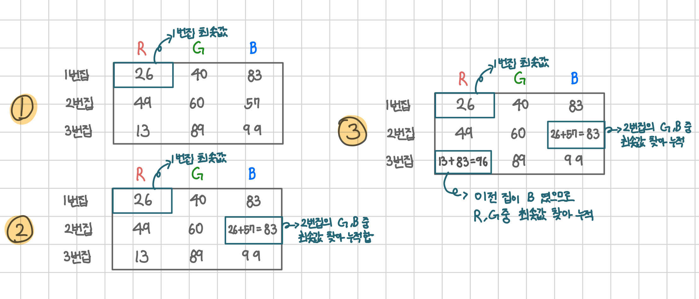

<br>

---

[https://www.acmicpc.net/problem/1149](https://www.acmicpc.net/problem/1149)

---

<br>

# 📌 문제

> 문제 유형

- DP

<br>

> 📘 문제 설명

RGB거리에는 집이 N개 있다. 거리는 선분으로 나타낼 수 있고, 1번 집부터 N번 집이 순서대로 있다.

집은 빨강, 초록, 파랑 중 하나의 색으로 칠해야 한다.

각각의 집을 빨강, 초록, 파랑으로 칠하는 비용이 주어졌을 때, 아래 규칙을 만족하면서 모든 집을 칠하는 비용의 최솟값을 구해보자.

- 1번 집의 색은 2번 집의 색과 같지 않아야 한다.
- N번 집의 색은 N-1번 집의 색과 같지 않아야 한다.
- i(2 ≤ i ≤ N-1)번 집의 색은 i-1번, i+1번 집의 색과 같지 않아야 한다.

<br>

> 📥 입력

```
3
26 40 83
49 60 57
13 89 99
```

> 📥 출력

```
96
```

<br><br>

# 🔍 문제 풀이

## 어떤 알고리즘을 사용해야할까?

각 집은 이전 집과 같은 색을 선택할 수 없기 때문에, 단순히 각 줄에서 가장 싼 색만 고르면 전체 최소 비용을 보장할 수 없다.

따라서, 이전 집의 선택 결과를 기억해두고 조건에 맞는 최소 비용을 누적해 나가기 위해 **DP**를 사용한다.

<br>

## 문제 이해하기

문제 이해가 어려웠는데 [Stranger's LAB](https://st-lab.tistory.com/128) 님 블로그를 보고 힌트를 얻었다.



1. 1번집 R, G, B 중 최솟값 찾기 -> R이 최솟값 (26)
2. 2번집은 1번 집에서 선택한 R을 제외한 G, B중 최솟값 찾기 -> B가 최솟값 (26 + 57 = 83)
3. 3번 집은 2번 집에서 선택한 B를 제외한 R, G 중 최솟값 찾기 -> R이 최솟값 (13 + 83 = 96)

이렇게 1번 집의 R, G, B 중 최솟값을 선택한다고 가정하면,
이후 집들은 이전 집에서 선택한 색을 제외한 두 색 중 최소 비용을 선택해 누적해 나갈 수 있다.

<br>

> 하지만 이 방식은 하나의 경로만 따라가는 방식이기 때문에, 전체 색 조합 중에서 **최적의 해를 보장하지 않는다.**

예를 들어 아래와 같이 R이 최솟값 26임에도 선택되지 않은 경우를 볼 수 있다.


따라서, 모든 집, 모든 색에 대해 이전 집에서 자신과 다른 두 색 중 최소 비용을 누적하는 방식으로 전체 경우를 고려해야 정답을 구해야 한다.

<br>

> 다음과 같이 각 집마다 R, G, B 각각을 선택했을 때의 누적 최소 비용을 계산해서 **DP 테이블**에 저장한다.

| 집 번호 | 빨강(dp\[i]\[0])                               | 초록(dp\[i]\[1])                               | 파랑(dp\[i]\[2])                               |
| ------- | ---------------------------------------------- | ---------------------------------------------- | ---------------------------------------------- |
| 0번 집  | cost\[0]\[0]                                   | cost\[0]\[1]                                   | cost\[0]\[2]                                   |
| 1번 집  | min(dp\[0]\[1], dp\[0]\[2]) + cost\[1]\[0]     | min(dp\[0]\[0], dp\[0]\[2]) + cost\[1]\[1]     | min(dp\[0]\[0], dp\[0]\[1]) + cost\[1]\[2]     |
| 2번 집  | min(dp\[1]\[1], dp\[1]\[2]) + cost\[2]\[0]     | min(dp\[1]\[0], dp\[1]\[2]) + cost\[2]\[1]     | min(dp\[1]\[0], dp\[1]\[1]) + cost\[2]\[2]     |
| ...     | ...                                            | ...                                            | ...                                            |
| N번 집  | min(dp\[N-1]\[1], dp\[N-1]\[2]) + cost\[N]\[0] | min(dp\[N-1]\[0], dp\[N-1]\[2]) + cost\[N]\[1] | min(dp\[N-1]\[0], dp\[N-1]\[1]) + cost\[N]\[2] |

<br>

마지막 집(n번)까지 칠한 뒤, 마지막 집에서 min(R, G, B) 중 가장 작은 값을 정답으로 선택한다.

```java
Math.min(Math.min(dp[n - 1][0], dp[n - 1][1]), dp[n - 1][2]); // 세 수를 비교하기 위해 두 번 호출
```

<br><br>

# 💻 전체 코드

```java
import java.io.*;
import java.util.*;

public class Main {
    public static void main(String[] args) throws IOException {
        BufferedReader br = new BufferedReader(new InputStreamReader(System.in));

        int n = Integer.parseInt(br.readLine());
        int[][] cost = new int[n+1][3];
        int[][] dp = new int[n+1][3];

        // 입력
        for(int i=1; i<=n; i++){
            StringTokenizer st = new StringTokenizer(br.readLine());
            for(int j=0;j<3; j++){
                cost[i][j] = Integer.parseInt(st.nextToken());
            }
        }

        // 초기화
        dp[1][0] = cost[1][0]; // r
        dp[1][1] = cost[1][1]; // g
        dp[1][2] = cost[1][2]; // b

        // 두번째 집부터 DP 계산
        for(int i=2; i<=n; i++){
            dp[i][0] = Math.min(dp[i-1][1], dp[i-1][2]) + cost[i][0];
            dp[i][1] = Math.min(dp[i-1][0], dp[i-1][2]) + cost[i][1];
            dp[i][2] = Math.min(dp[i-1][0], dp[i-1][1]) + cost[i][2];
        }

        // 최소비용 출력
        int result = Math.min(Math.min(dp[n][0], dp[n][1]), dp[n][2]); // 세 수를 비교하기 위해 두 번 호출
        System.out.println(result);
    }
}
```

<br>
