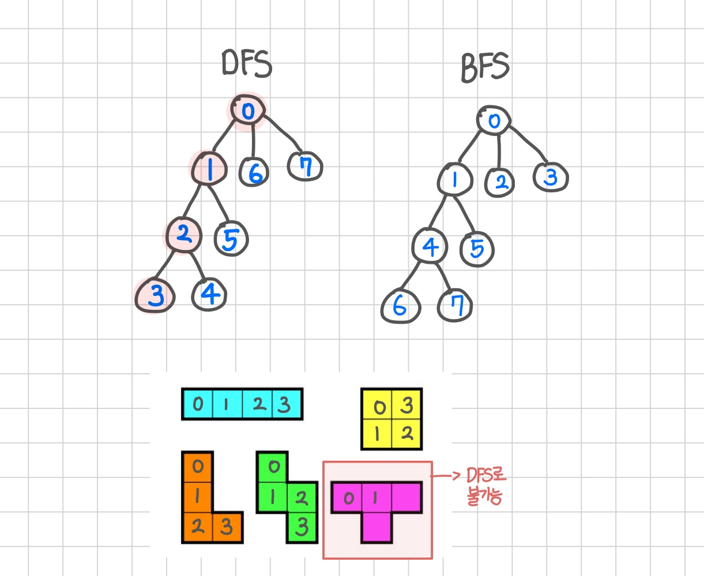
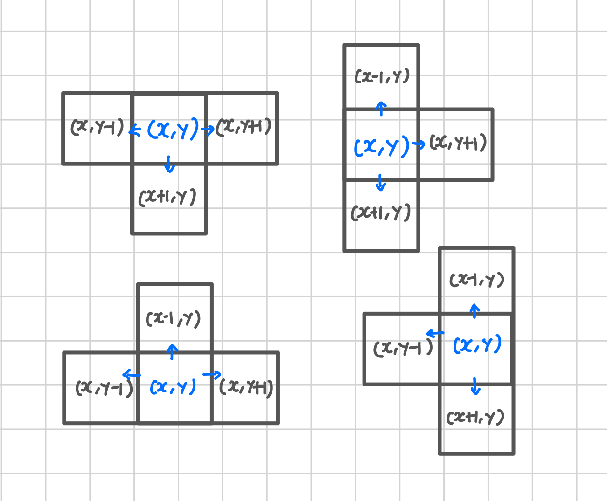

<br>

---

[https://www.acmicpc.net/problem/14500](https://www.acmicpc.net/problem/14500)

---

<br>

# 🔍 문제 풀이

## 문제 도식화

1. DFS로 연속된 4칸을 탐색하며 최대값을 찾는다.
2. DFS로 만들 수 없는 ㅗ, ㅏ, ㅜ, ㅓ 모양은 별도로 시뮬레이션 처리를 하여 최대값을 찾는다.
   - 'ㅗ' 모양은 중심점에서 세 방향으로 뻗는 구조
   - DFS로는 깊이 4까지 가는 도중 가지 하나가 끊기게 되므로 별도 처리 필요


<br>

## 알고리즘 선택

> 이 문제에서는 모든 칸에서 시작해, 상하좌우로 4칸을 탐색해야 하므로 **DFS(깊이 우선 탐색) + 백트래킹**이 가장 적합하다.

- DFS (깊이 우선 탐색)

  - 한 방향으로 끝까지 들어간 뒤, 막히면 뒤로 돌아오는 방식 (Backtracking)
  - 재귀 기반 -> 백트래킹 가능

- BFS (너비 우선 탐색)
  - 현재에서 가까운 모든 위치를 먼저 탐색
  - 큐 기반 -> 레벨 단위 탐색 -> 중간 분기 어려움

<br>

> 아래 그림은 DFS와 BFS가 탐색하는 순서를 비교한 것이다.



위 그림을 통해 BFS는 가능하긴 하나, 큐 상태에서 깊이 추적이 어렵다는 것을 확인할 수 있다.

따라서 가까운 칸부터 넓게 탐색하는 BFS보다, 한 방향으로 깊게 탐색하는 **DFS가 더 적합**하다.

<br>

> 단, 'ㅗ', 'ㅜ', 'ㅏ', 'ㅓ' 모양 도형은 DFS로 만들 수 없다.

- DFS는 한 방향으로만 계속 탐색하기 때문에, 중간에서 양쪽으로 분기하는(3방향으로 퍼지는) 구조를 만들 수 없다.
- 그럼 어떻게 처리해야할까? 알아보자.

<br>

## 'ㅗ'모양은 어떻게 처리하지?

> 'ㅗ', 'ㅏ', 'ㅜ', 'ㅓ' 모양 도형은 상하좌우 탐색으로는 불가능하다.

따라서 `checkTShape(x, y)` 함수를 통해 현재 좌표 (x, y)를 중심으로 3방향을 더해 ㅗ 모양 도형을 만들 수 있도록 해줬다.

| 방향       | 좌표 변화  |
| ---------- | ---------- |
| **왼쪽**   | `x, y - 1` |
| **오른쪽** | `x, y + 1` |
| **위쪽**   | `x - 1, y` |
| **아래쪽** | `x + 1, y` |

```java
int[][] Tshapes = {
    {0, -1, -1, 0, 0, 1}, // ㅗ
    {-1, 0, 0, 1, 1, 0}, // ㅏ
    {0, -1, -1, 0, 1, 0}, // ㅓ
    {0, -1, 0, 1, -1, 0} // ㅜ
};
```



- 이처럼, 중심 좌표 `(x, y)`를 기준으로 양 방향으로 뻗어나가도록 해야 한다.
- 즉, 중심 좌표를 기준으로 3개의 방향으로 확장하여 총 4칸을 구성하는 방식이다.

<br>

> 예를 들어 ㅗ 모양의 경우:

- 중심: `(x, y)`
- 확장: 왼쪽 `(x, y - 1)`, 오른쪽 `(x, y + 1)`, 아래 `(x + 1, y)`

이러한 방식으로 ㅏ, ㅓ, ㅜ, ㅗ 총 4가지 모양을 구현할 수 있다.

이처럼 모든 칸에서 모든 방향의 도형을 직접 시도하여 누적 최대값을 찾는다.

<br>

## 💥 메모리를 줄여보자

테트로미노 문제를 풀었을 때, 정답은 맞췄지만 **메모리 사용량이 무려 283080KB**가 나와서 깜짝 놀랐다.

다른 사람들은 보통 3~8만 KB 정도였는데, 나는 왜 이렇게 많이 나왔을까?

<br>

> 원인 분석

처음에는 `dfs()` 함수 안에 다음과 같은 방향 벡터를 매번 선언했다.

```java
public void dfs(...) {
    int[] dx = {-1, 1, 0, 0};
    int[] dy = {0, 0, -1, 1};
}
```

- 이 코드는 DFS가 호출될 때마다 새로운 `int[]` 배열을 생성한다.
- 테트로미노 문제에서는 DFS가 수만 번 이상 호출되므로 결과적으로 `int[]` 객체 수천~수만 개가 힙에 쌓이게 된다.
- 이게 JVM 메모리 폭증의 주범이었다.

<br>

> 해결

문제의 방향 벡터를 함수 내부에서 선언하지 않고,<br>
전역으로 빼주기만 해도 메모리 사용량이 눈에 띄게 줄어든다.

이렇게 고정된 배열은 한 번만 생성되고 모든 DFS 호출에서 재사용되기 때문에<br>
힙 메모리 누적을 방지할 수 있다.

```java
static int[] dx = {-1, 1, 0, 0};
static int[] dy = {0, 0, -1, 1};
```

확실히 개선된 것을 알 수 있다.


<br><br>

# 💻 전체 코드

```java
import java.io.*;
import java.util.*;

public class Main {
    static int[][] paper;
    static boolean[][] visited;

    static int n, m;
    static int maxSum = 0;

    static int[] dx = {-1, 1, 0, 0};
    static int[] dy = {0, 0, -1, 1};

    public static void main(String[] args) throws IOException {
        BufferedReader br = new BufferedReader(new InputStreamReader(System.in));

        // 입력
        StringTokenizer st = new StringTokenizer(br.readLine());
        n = Integer.parseInt(st.nextToken()); // 행
        m = Integer.parseInt(st.nextToken()); // 열

        paper = new int[n][m];
        visited = new boolean[n][m];

        // 초기화
        for(int i = 0; i < n; i++){
            st = new StringTokenizer(br.readLine());
            for(int j = 0; j < m ; j++){
                paper[i][j] = Integer.parseInt(st.nextToken());
            }
        }

        // buildBlock, Tshape 호출
        for(int i = 0; i < n; i++){
            for(int j = 0; j< m ; j++){
                visited[i][j] = true;

                // i,j 현재 블록의 좌표 (시작점이자 첫 번째 칸)
                // depth=1부터 시작(시작 좌표 포함),
                buildBlock(i, j, 1, paper[i][j]); // 시작 좌표에서 DFS 시작
                visited[i][j] = false; // 시작점 탐색 후 백트래킹

                Tshape(i, j);
            }
        }

        System.out.println(maxSum);
    }

    // 연속된 4칸 블록 놓기 (ㅗ 모양 제외)
    public static void buildBlock(int x, int y, int depth, int total) {
        if (depth == 4) {
            maxSum = Math.max(maxSum, total);
            return;
        }

        // 상하좌우로만 이동 가능
        for (int i = 0; i < 4; i++) {
            int nx = x + dx[i];
            int ny = y + dy[i];

            if(nx < 0 || nx >= n || ny < 0 || ny >= m) continue;
            if (!visited[nx][ny]) {
                visited[nx][ny] = true;
                buildBlock(nx, ny, depth + 1, total + paper[nx][ny]);
                visited[nx][ny] = false; // 새로운 경로 탐색 후 백트래킹
            }
        }
    }

    // ㅗ 모양 탐색
    public static void Tshape(int x, int y){
        // 방향백터 정의
        int[][] cases = {
                // dx1 dy1   dx2 dy2   dx3 dy3  (중심(x,y) 기준 3칸의 상대 좌표)
                {  0, -1,   -1,  0,    0,  1 },   // ㅗ
                { -1,  0,    0,  1,    1,  0 },   // ㅏ
                {  0, -1,    1,  0,    0,  1 },   // ㅜ
                { -1,  0,    0, -1,    1,  0 }    // ㅓ
        };

        int sum = 0;
        for(int[] c : cases){
            // 한 모양에 대한 양쪽 3개 날개
            int nx1 = x + c[0], ny1 = y + c[1];
            int nx2 = x + c[2], ny2 = y + c[3];
            int nx3 = x + c[4], ny3 = y + c[5];

            if(nx1 < 0 || nx1 >= n || ny1 < 0 || ny1 >= m) continue;
            if(nx2 < 0 || nx2 >= n || ny2 < 0 || ny2 >= m) continue;
            if(nx3 < 0 || nx3 >= n || ny3 < 0 || ny3 >= m) continue;

            sum = paper[x][y] + paper[nx1][ny1] + paper[nx2][ny2] + paper[nx3][ny3];
            maxSum = Math.max(maxSum, sum);
        }
    }
}
```

<br>

이로써 class 3 문제 해결 완료! 🤗


<br>
