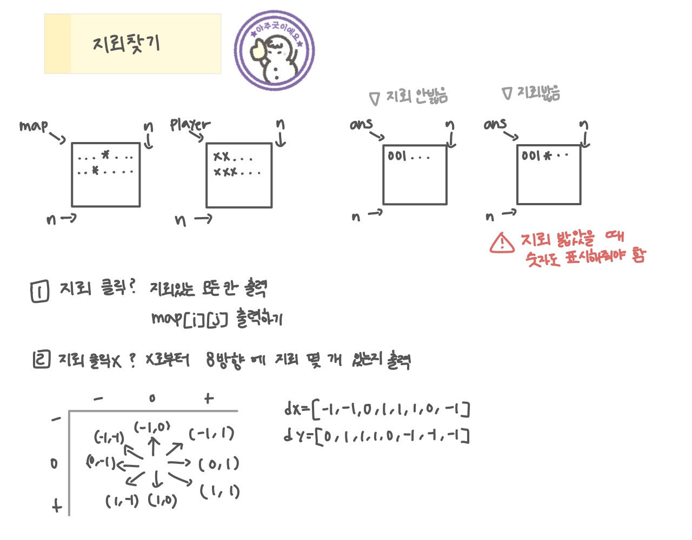

<br>

---

[https://www.acmicpc.net/problem/4396](https://www.acmicpc.net/problem/4396)

---

<br>

# 🔍 문제 풀이

## 문제 도식화

**[ 문제를 잘 읽자! ]**
지뢰를 밟았을 때 숫자도 같이 표시해줘야한다.



1. 지뢰를 클릭했는지 확인 (`player[i][j] == 'x'`)
2. 지뢰 클릭 -> 모든 지뢰 칸출력
3. 지뢰 클릭 x -> 주변 지뢰 개수 세서 `ans[x][y]`에 문자로 저장

<br><br>

# 💻 전체 코드

```java
import java.io.*;

public class Main {
    static int[] dx = {-1, -1, 0, 1, 1, 1, 0, -1};
    static int[] dy = {0, 1, 1, 1, 0, -1, -1, -1};

    static char[][] map;
    static char[][] player;
    static char[][] ans;

    static int n;
    public static void main(String[] args) throws Exception {
        BufferedReader br = new BufferedReader(new InputStreamReader(System.in));

        // 입력 및 초기화
        n = Integer.parseInt(br.readLine());
        map = new char[n][n];
        player = new char[n][n];
        ans = new char[n][n];

        // 지뢰 위치 입력
        for(int i=0; i<n; i++){
            String line = br.readLine();
            for(int j=0; j<n; j++){
                map[i][j] = line.charAt(j);
            }
        }

        // 플레이어 클릭 위치 입력
        for(int i=0; i<n; i++){
            String line = br.readLine();
            for(int j=0; j<n; j++){
                player[i][j] = line.charAt(j);
            }
        }

        solve();
    }

    static void solve(){
        boolean isGameOver = false;
        for(int i=0; i<n; i++){
            for(int j=0; j<n; j++){
                // 지뢰 클릭 o
                if(map[i][j] == '*' && player[i][j] =='x'){
                    isGameOver = true;
                }
                // 지뢰 클릭 x
                else {
                    if(player[i][j] == 'x'){
                        ans[i][j] = distCnt(i, j);
                    }else{
                        ans[i][j] = '.';
                    }
                }
            }
        }

        if(isGameOver) gameOver();
        else print();
    }

    // 게임오버 -> 모든 지뢰 표시
    static void gameOver(){
        for(int i=0; i<n; i++){
            for(int j=0; j<n; j++){
                if(map[i][j] == '*')
                    ans[i][j] = '*';
            }
        }
        print();
    }

    // 8방향 지뢰 수 계산
    static char distCnt(int x, int y){
        int cnt = 0;
        for(int d = 0; d<8; d++){
            //  x, y 좌표의 주변 8칸 중 하나인 nx, ny에 지뢰(*)가 있으면 cnt를 1 증가
            int nx = x + dx[d];
            int ny = y + dy[d];

            if(nx < 0 || nx >= n || ny < 0 || ny >= n) continue;
            if(map[nx][ny] == '*') cnt++;
        }

        return (char) (cnt + '0');
    }

    static void print(){
        for(int i=0; i<n; i++){
            for(int j=0; j<n; j++){
                System.out.print(ans[i][j]);
            }
            System.out.println();
        }
    }
}
```

<br>
