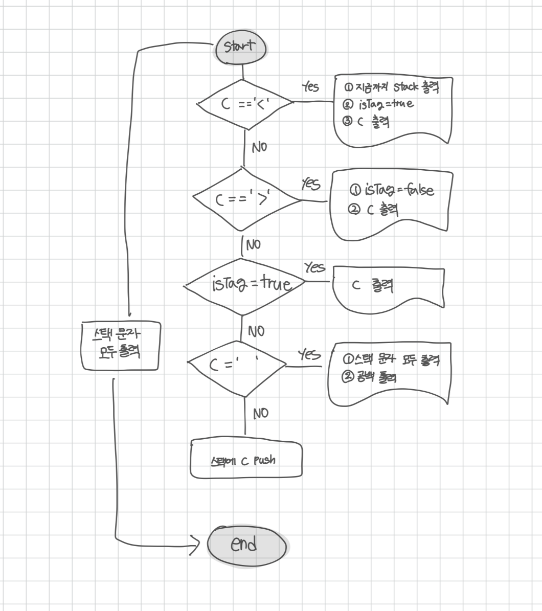

<br>

---

[https://www.acmicpc.net/problem/17413](https://www.acmicpc.net/problem/17413)

---

<br>

# 🔍 문제 풀이

## Flowchart



- `<`를 만나면: 스택에 쌓인 단어 먼저 출력하고 `isTag = true`
- `>` 를 만나면: `isTag = false`로 변경하고 그대로 출력
- `isTag == true`면: 태그 내부 문자 그대로 출력
- `' '` 공백을 만나면: 단어를 뒤집어 출력하고 공백 출력
- 나머지 -> 스택에 push

<br>

## 헷갈린 점(isTag 위치)

문자열에서 `<tag>`는 그대로 출력하고, 나머지 단어는 뒤집어서 출력하는 문제에서 아래와 같이 `isTag` 조건을 제일 위에 두면 된다고 착각했다.

```java
if (isTag) {
    System.out.print(c);
} else if (c == '<') {
    ...
}
```

- 하지만 이렇게 하면 `c == '<'`나 `c == '>`' 조건이 아예 실행되지 않는다.
- 왜냐하면 isTag가 true일 때는 다른 조건을 건너뛰기 때문이다.

<br>

> `<`와 `>` 먼저 검사해서 `isTag` 상태를 바꿔야 그다음 문자를 올바르게 처리할 수 있다.

순서가 중요하다!

```java
if (c == '<') {
    isTag = true;
    ...
} else if (c == '>') {
    isTag = false;
    ...
} else if (isTag) {
    ...
}
```

<br><br>

## 흐름 제어의 핵심, 플래그

> 조건 제일 마지막에 출력하거나 유지해야 할 상태가 있다면 `boolean`으로 명시적으로 관리하자.

처음엔 `isTag` 조건을 위에 두고 싶었지만, 실제로는 `<`, `>` 조건을 먼저 처리해야 했다.

이 문제를 통해 단순한 boolean 값 하나가 전체 로직의 흐름을 어떻게 통제하는지 확실히 이해할 수 있었다!

<br><br>

# 💻 전체 코드

```java
import java.io.*;
import java.util.*;

public class Main {
    public static void main(String[] args) throws IOException {
        BufferedReader br = new BufferedReader(new InputStreamReader(System.in));

        Stack<Character> stack = new Stack<>();
        String str = br.readLine();
        boolean isFlag = false; // 태그 안인지 여부

        for(int i=0; i<str.length(); i++){
            char ch = str.charAt(i);

            // 단어가 끝나고 태그가 시작되므로, 스택에 쌓인 문자 먼저 뒤집어서 출력
            if(ch == '<'){
                while(!stack.isEmpty()){
                    System.out.print(stack.pop());
                }
                isFlag = true; // 태그 시작 상태로 설정
                System.out.print(ch); // '<' 출력
            }
            else if(ch == '>'){
                isFlag = false; // 태그 종료
                System.out.print(ch); // '출력'
            }
            // 태그 내부는 그대로 출력
            else if(isFlag){
                System.out.print(ch);
            }
            // 공백을 만나면 지금까지 쌓인 단어를 역순으로 출력
            else if(ch == ' '){
                while(!stack.isEmpty()){
                    System.out.print(stack.pop());
                }
                System.out.print(' '); // 공백도 출력(주의)
            }
            // 일반 평문이면 스택에 넣기
            else{
                stack.push(ch);
            }
        }

        // 마지막에 남은 문자 처리
        while(!stack.isEmpty()){
            System.out.print(stack.pop());
        }
    }
}
```

<br>
