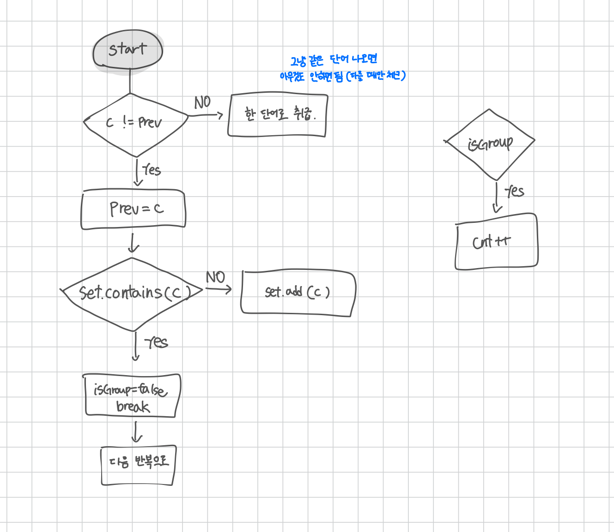

<br>

---

[https://www.acmicpc.net/problem/1316](https://www.acmicpc.net/problem/1316)

---

<br>

# 🔍 문제 풀이

## Flowchart



<br>

## 풀이 과정

> 이 문제는 두 가지 방식으로 풀 수 있다.

1. boolean[] 사용
   - 알파벳 26개를 `boolean[26]` 배열로 표현하여 각 문자의 등장 여부를 기록한다.
   - 이전 문자와 현재 문자가 다를 때만 이미 등장한 문자인지 확인한다.
2. set 사용
   - HashSet을 사용하여 등장한 문자를 저장한다.
   - 이전 문자와 다를 때만 Set에 이미 있는지 확인하고, 없으면 추가한다.

<br>

> **이 문제의 핵심은 이전 문자와 현재 문자가 동일한 경우(문자가 연속되는 경우)는 무시하고, 다를 경우에만 체크하면 된다는 것이다.**

- 어떤 문자가 여러 번 나오는 건 상관 X -> 연속해서만 나오면 됨
- 문제는 "나왔다가 다시 나오는" 경우 -> 중간에 다른 문자가 끼었는지가 중요함
- 그래서 매번 현재 문자와 이전 문자가 다를 때만 확인하는 것
- 그때 이미 등장한 문자면 그룹 단어 X

<br><br>

# 💻 전체 코드

## visited 배열 사용

```java
import java.io.*;

public class Main {
    static int cnt = 0;

    public static void main(String[] args) throws IOException {
        BufferedReader br = new BufferedReader(new InputStreamReader(System.in));

        int t = Integer.parseInt(br.readLine());

        while (t-- > 0) {
            String str = br.readLine();
            check(str);
        }

        System.out.println(cnt);
    }

    static void check(String str) {
        boolean[] visited = new boolean[26]; // a-z
        char prev = 0;
        boolean isGroup = true;

        for (int i = 0; i < str.length(); i++) {
            char ch = str.charAt(i);

            // 이전 문자와 다를 때만 검사
            if (ch != prev) {
                // 이전에 이미 현재 문자 등장했다면 그룹단어 x
                if (visited[ch - 'a']) {
                    isGroup = false;
                    break; // 중단
                }

                // 처음 등장한 문자면 방문체크
                visited[ch - 'a'] = true;
            }

            // 이전 문자를 현재 문자로
            prev = ch;
        }

        if (isGroup) cnt++;
    }
}
```

<br>

## Set 사용

```java
import java.io.*;
import java.util.*;

public class Main {
    static int cnt = 0;

    public static void main(String[] args) throws IOException {
        BufferedReader br = new BufferedReader(new InputStreamReader(System.in));

        int t = Integer.parseInt(br.readLine());

        while (t-- > 0) {
            String str = br.readLine();
            check(str);
        }

        System.out.println(cnt);
    }

    static void check(String str) {
        Set<Character> set = new HashSet<>();
        char prev = 0;
        boolean isGroup = true;

        for (int i = 0; i < str.length(); i++) {
            char ch = str.charAt(i);

            if (ch != prev) {
                if (set.contains(ch)) {
                    isGroup = false;
                    break;
                }
                set.add(ch);
            }

            prev = ch;
        }

        if (isGroup) cnt++;
    }
}
```

<br>
