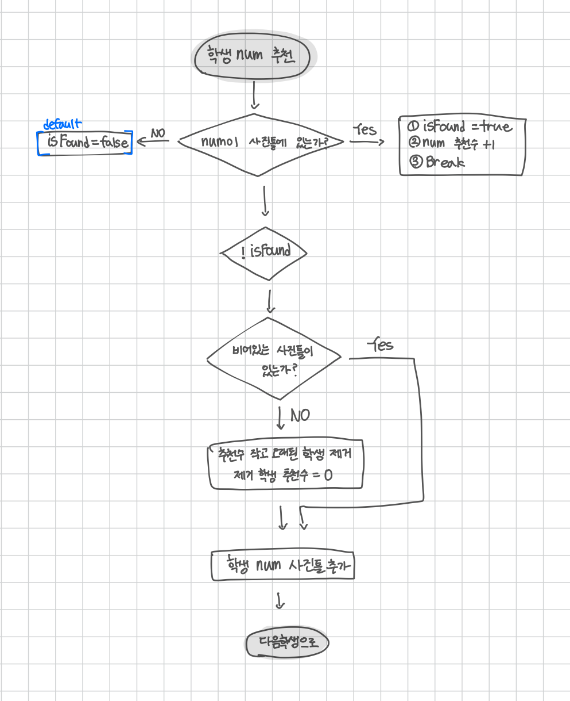

<br>

---

[https://www.acmicpc.net/problem/1713](https://www.acmicpc.net/problem/1713)

---

<br>

# 🔍 문제 풀이

## Flowchart



<br><br>

## 배운 점

### class를 만들어야 하는 조건

1. 정보가 2개 이상 묶여 움직일 때
   - 배열/Map은 각각 따로 관리해야 하지만, 클래스는 한 덩어리로 관리 가능
2. 정렬 기준이 여러 개일 때
   - 클래스를 써야 sort()에서 Comparator로 정렬이 쉬움
3. 찾기, 수정, 삭제가 자주 필요할 때
   - 클래스를 써야 객체 단위로 비교/수정/삭제가 쉬움
   - e.g., 같은 학생을 찾아서 추천 수 증가, 리스트에서 조건에 맞는 항목만 제거

<br>

> ❓ 클래스를 꼭 처음부터 만들어야 하나?

일단 간단하게 구현해 보고, 복잡해질 때 클래스 도입하자

예시를 들어보겠다.

1. 처음엔 `List<Integer>` 혹은 `Map<Integer, Integer>`로 시작
2. 그런데 추천 수도 저장해야 함
   - `Map<Integer, Integer> recommendMap`
3. 시간도 저장해야 함
   - `Map<Integer, Integer> timeMap`
4. 근데 이걸 기준으로 정렬까지 해야 함 -> 🌀 복잡해진다...

<br>

💡 이럴 거면 그냥 Student 클래스 하나 만들자!

<br>

### class 사용의 필요성

> 처음에는 복잡해 보였지만, 클래스를 쓰니 오히려 더 깔끔하고 이해하기 쉬운 코드를 만들 수 있었다.

이 문제에서는 학생마다 다음과 같은 정보를 관리해야 한다.

- 번호 (num)
- 추천 횟수 (recommend)
- 게시된 시간 (time)

이 세 가지 정보를 동시에 다뤄야 하기 때문에, 하나의 객체로 묶어 관리하는 것이 효율적이다.

따라서 Student 클래스로 구조화하는 것이 적절하다.

<br>

> 배열이나 Map만으로는 이걸 한꺼번에 다루기가 어렵다.

만약 클래스를 쓰지 않고 코딩하면, 이런 식으로 3개의 배열을 따로 둬야 한다.

```java
int[] nums = new int[N]; // 번호
int[] recommends = new int[N]; // 추천수
int[] times = new int[N]; // 시간
```

이렇게 여러 배열을 각각 관리하면

추천 수가 가장 적고, 오래된 학생을 찾기 위해 세 배열을 동기화해서 탐색해야 하기 때문에, 리스트 정렬도 어렵고 비효율적이다.

<br>

> 클래스를 사용하면?

```java
class Student {
int num; // 학생 번호
int recommend; // 추천 수
int time; // 게시된 시간

    Student(int num, int recommend, int time) {
        this.num = num;
        this.recommend = recommend;
        this.time = time;
    }
}
```

이렇게 만들면 `List<Student>`로 관리하면서 `sort()`도 편하게 쓸 수 있고, 특정 학생을 찾거나 수정하기도 쉬워진다.

정렬도 매우 간단하다.

```java
frame.sort((a, b) -> {
    if (a.recommend == b.recommend) return a.time - b.time;
    return a.recommend - b.recommend;
});
```

<br>

### List<Student> 구조

> `List<Student>` 란, Student 객체를 담는 리스트를 의미한다.

리스트에는 Student 객체들이 들어 있다. 예를 들어, 아래와 같은 코드가 있다고 가정하면,

```java
List<Student> frame = new ArrayList<>();
frame.add(new Student(2, 1, 0));
frame.add(new Student(5, 3, 1));
```

<br>

위 상태에서 frame은 이렇게 생긴 구조이다.

```java
frame = [
    Student(num=2, recommend=1, time=0),
    Student(num=5, recommend=3, time=1)
]
```

즉, frame 리스트의 각 요소는 Student라는 객체이고,<br>
그 객체는 내부에 다음과 같은 **변수(필드)** 들을 가지고 있다.

| 필드명      | 값 (예시) |
| ----------- | --------- |
| `num`       | 2         |
| `recommend` | 1         |
| `time`      | 0         |

> 그래서 `s.num`, `s.recommend` 이런 식으로 접근이 가능한 것이다.

```java
for (Student s : frame) {
    System.out.println(s.num); // 학생 번호 출력
    System.out.println(s.recommend); // 추천 수 출력
    System.out.println(s.time); // 게시된 시간 출력
}
```

<br><br>

# 💻 전체 코드

```java
import java.io.*;
import java.util.*;

public class Main {
    static class Student {
        int num; // 학생 번호
        int recommend; // 추천 수
        int time; // 게시 시간

        public Student(int num, int recommend, int time){
            this.num = num;
            this.recommend = recommend;
            this.time = time;
        }
    }


    public static void main(String[] args) throws IOException {
        BufferedReader br = new BufferedReader(new InputStreamReader(System.in));

        int n = Integer.parseInt(br.readLine()); // 사진틀 개수
        int total = Integer.parseInt(br.readLine()); // 총 추천 횟수
        int time = 0;

        List<Student> frame = new ArrayList<>();

        StringTokenizer st = new StringTokenizer(br.readLine());
        for(int i=0; i<total; i++) {
            int num = Integer.parseInt(st.nextToken());

            boolean isFound = false;

            // 1. 학생 num이 사진 틀에 있는가?
            for (Student s : frame) {
                // yes -> 추천수 증가
                if (num == s.num) {
                    isFound = true;
                    s.recommend++;
                    break;
                }
            }

            // no -> 추가 로직 실행
            if(!isFound){
                // 2. 사진들이 꽉 찼는가?
                if (frame.size() >= n) {
                    // yes -> 추천 수 오름차순, 같으면 시간 오름차순 정렬
                    frame.sort((a, b) -> {
                        if (a.recommend == b.recommend) return a.time - b.time;
                        else return a.recommend - b.recommend;
                    });
                    frame.remove(0);
                }
                // 삭제 여부와 관계없이 새 학생은 추가
                frame.add(new Student(num, 1, time++));
            }
        }

        // 최종 학생 번호 정렬 후 출력
        List<Integer> result = new ArrayList<>();

        for (Student s : frame) {
            result.add(s.num);
        }
        Collections.sort(result);

        for (int val : result) {
            System.out.print(val + " ");
        }
    }
}
```

<br>
