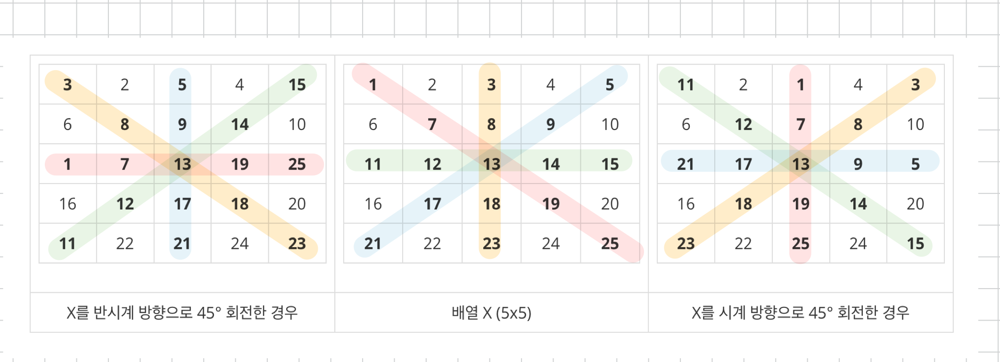

<br>

---

[https://www.acmicpc.net/problem/17276](https://www.acmicpc.net/problem/17276)

---

<br>

# 🔍 문제 풀이

## 풀이

> N x N 크기의 2차원 배열이 주어졌을 때, 배열을 45도 단위로 시계 또는 반시계 방향으로 회전하는 문제이다.

1. d값이 음수면 `+360`으로 보정하여 시계 방향 회전으로 통일한다.
2. `d / 45`를 통해 회전 횟수를 계산한다.
3. 각 회전마다 대각선과 중앙 행·열을 따라 원소들을 이동시킨다.
4. arr -> copy -> 다시 arr로 값들을 덮어쓰며 다음 회전을 준비한다.



<br>

## 느낀 점

처음엔 시계 방향과 반시계 방향을 따로 구현해야 한다고 생각했지만,<br>
반시계 방향도 +360으로 보정하면 시계 방향 회전으로 통일할 수 있어 더 간단하게 해결할 수 있었다.

또한 처음에는 빙고 문제처럼 j까지 이중 반복문으로 순회해야 할 줄 알았는데,<br>
실제로는 회전 대상이 대각선, 중앙 행/열 등 i로 접근 가능한 정해진 위치에만 국한되기 때문에<br>
i만 순회하는 단일 반복문으로도 충분하다는 걸 알게 되었다.

<br><br>

# 💻 전체 코드

```java
import java.io.*;
import java.util.*;

public class Main {
    static int arr[][];
    static int copy[][];

    static int n, d;

    public static void main(String[] args) throws IOException {
        BufferedReader br = new BufferedReader(new InputStreamReader(System.in));
        int t = Integer.parseInt(br.readLine());
        StringBuilder sb = new StringBuilder();

        while(t --> 0){
            // 입력
            StringTokenizer st = new StringTokenizer(br.readLine());
            n = Integer.parseInt(st.nextToken()); // 배열의 크기
            d = Integer.parseInt(st.nextToken()); // 각도

            arr = new int[n][n];
            copy = new int[n][n];

            for(int i=0; i<n; i++){
                st = new StringTokenizer(br.readLine());
                for(int j=0; j<n; j++){
                    arr[i][j] = Integer.parseInt(st.nextToken());
                    copy[i][j] = arr[i][j]; // 배열 복사
                }
            }

            // 각도 조정
            if(d < 0) d += 360; // 음수(반시계 회전)를 시계방향으로 변환 (예: -45 → 315)
            // if(d >= 360) d -= 360; // 360도 이상은 한 바퀴 회전과 동일하므로 생략 가능 (예: 405 → 45)

            // 회전 횟수 계산
            int cnt = d/45;

            // 45도 단위로 cnt번 회전 수행
            while(cnt --> 0){
                rotate();
            }

            // 출력
            for(int i=0; i<n; i++){
                for(int j=0; j<n; j++){
                    sb.append(arr[i][j]).append(" ");
                }
                sb.append("\n");
            }
        }
        System.out.println(sb);
    }

    // 45도 회전
    static void rotate(){
        int mid = n / 2;

        for (int i = 0; i < n; i++) {
            copy[i][i] = arr[mid][i]; // ㄱ
            copy[i][mid] = arr[i][i]; // ㄴ
            copy[i][n - 1 - i] = arr[i][mid]; // ㄷ
            copy[mid][n - 1 - i] = arr[i][n - 1 - i]; // ㄹ
        }

        // 원본 배열에 반영 (주의!!)
        for(int i=0; i<n; i++){
            for(int j=0; j<n; j++){
                arr[i][j] = copy[i][j];
            }
        }

    }
}
```

<br>
