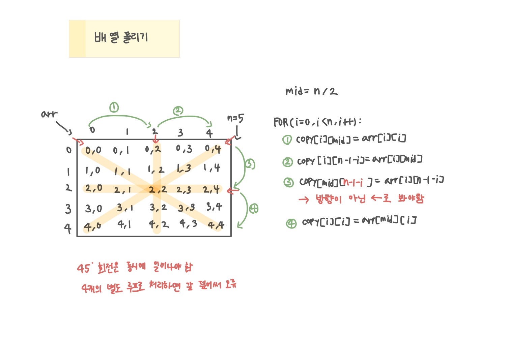

<br>

---

[https://www.acmicpc.net/problem/17276](https://www.acmicpc.net/problem/17276)

---

<br>

# 🔍 문제 풀이

## 풀이

> N x N 크기의 2차원 배열이 주어졌을 때, 배열을 45도 단위로 시계 또는 반시계 방향으로 회전하는 문제이다.

1. d값이 음수면 `+360`으로 보정하여 시계 방향 회전으로 통일한다.
2. `d / 45`를 통해 회전 횟수를 계산한다.
3. 각 회전마다 대각선과 중앙 행·열을 따라 원소들을 이동시킨다.
4. arr -> copy -> 다시 arr로 값들을 덮어쓰며 다음 회전을 준비한다.



<br>

> 배열 갱신에 대한 오해

이 문제처럼 회전을 여러 번 반복한다면 이전 회전 결과를 기준으로 다음 회전이 가능해야 하므로,<br>
결과 배열을 다시 원본 배열에 반영해야한다.

- 회전 전마다 `arr -> copyArr` 복사 (내가 사용한 방법)
- 또는, `rotate()`가 새 배열 만들어서 `arr = rotate(arr)`로 덮어쓰기

<br><br>

# 💻 전체 코드

```java
import java.io.*;
import java.util.*;

public class Main {
    static int[][] arr;
    static int[][] copy;

    static int n;
    public static void main(String[] args) throws IOException {
        BufferedReader br = new BufferedReader(new InputStreamReader(System.in));

        int t = Integer.parseInt(br.readLine());

        while(t --> 0){
            // 입력 및 초기화
            StringTokenizer st = new StringTokenizer(br.readLine());
            n = Integer.parseInt(st.nextToken());
            int d = Integer.parseInt(st.nextToken());

            arr = new int[n][n];
            copy = new int[n][n];

            for(int i=0; i<n; i++){
                st = new StringTokenizer(br.readLine());
                for(int j=0; j<n; j++){
                    arr[i][j] = Integer.parseInt(st.nextToken());
                    copy[i][j] = arr[i][j];
                }
            }

            if(d < 0) d += 360; // 각도 조정 (반시계(음수)를 시계방향(양수)으로)
            int cnt = d / 45; // 회전 횟수 계산

            while(cnt --> 0){
                rotate45();
            }

            // 출력
            for(int i=0; i<n; i++){
                for(int j=0; j<n; j++){
                    System.out.print(copy[i][j] + " "); // arr 출력해도 가능
                }
                System.out.println();
            }
        }
    }

    // 45도 회전
    static void rotate45(){
        int mid = n / 2;

        for(int i=0; i<n; i++) {
            copy[i][mid] = arr[i][i];
            copy[i][n-1-i] = arr[i][mid];
            copy[mid][n-1-i] = arr[i][n-1-i];
            copy[i][i] = arr[mid][i];
        }

        // 원본 배열에 반영 (주의)
        for(int i=0; i<n; i++){
            for(int j=0; j<n; j++){
                arr[i][j] = copy[i][j];
            }
        }
    }
}
```

<br>
