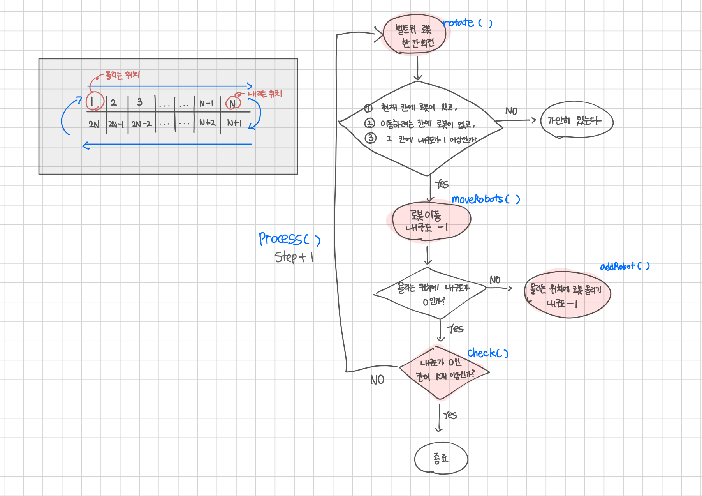

<br>

---

[https://www.acmicpc.net/problem/20055](https://www.acmicpc.net/problem/20055)

---

<br>

# 🔍 문제 풀이

## Flowchart



<br>

## 배운 점

> 배열을 오른쪽으로 어떻게 밀까?

- 배열을 오른쪽으로 한 칸씩 회전시키기 위해서는 뒤에서부터 복사해야 한다.
- 처음에는 0번 인덱스부터 순서대로 복사하려 했지만, 이렇게 하면 앞쪽 값들이 먼저 덮여져서 원본이 손상된다.
- 예를 들어, `belt[i + 1] = belt[i]`를 `i = 0`부터 실행하면, `belt[1]`, `belt[2]` 가 모두 `belt[0]`의 값으로 덮여버리는 현상이 발생한다.

<br>

```
💡 따라서 반드시 i = 끝 → 1 순으로 반복문을 돌려야 한다.
```

마지막 값(`belt[2N - 1]`)은 복사 전에 미리 따로 저장해 두고,<br>
회전 후 맨 앞에 넣어줌으로써 원형 회전을 완성할 수 있다.

```m
인덱스          :   0   1   2   3   4   5
초기 상태       :   A   B   C   D   E   F
회전            :   A   A   B   C   D   E  <-  맨 마지막 F 사라짐
마지막 값 넣기  :   F   A   B   C   D   E
```

<br><br>

# 💻 전체 코드

```java
import java.io.*;
import java.util.*;

public class Main {

    static int[] belt;
    static boolean[] robots;
    static int n, k;

    public static void main(String[] args) throws IOException {
        BufferedReader br = new BufferedReader(new InputStreamReader(System.in));

        StringTokenizer st = new StringTokenizer(br.readLine());

        n = Integer.parseInt(st.nextToken()); // 길이
        k = Integer.parseInt(st.nextToken()); // 내구도

        belt = new int[2 * n]; // 벨트의 내구도
        robots = new boolean[n]; // 로봇 존재 여부

        // 입력
        st = new StringTokenizer(br.readLine());
        for (int i = 0; i < 2 * n; i++) {
            belt[i] = Integer.parseInt(st.nextToken());
        }

        process();
    }
    static void process(){
        int step = 0;

        while (true) {
            step++;

            rotate(); // 벨트 위 로봇 회전
            moveRobots(); // 로봇 이동
            addRobot(); // 로봇 올리기

            // 내구도가 0인 칸의 개수가 K개 이상 -> 종료
            if (check()) {
                System.out.println(step);
                break;
            }
        }
    }

    // 벨트 한 칸 회전
    static void rotate(){
        // 내구도 배열 회전
        int last = belt[2 * n - 1]; // 벨트의 마지막 칸
        for (int i = 2 * n - 1; i > 0; i--){
            belt[i] = belt[i - 1];
        }
        belt[0] = last;

        // 로봇 배열 회전 (위쪽칸만)
        for (int i = n - 1; i > 0; i--){
            robots[i] = robots[i - 1];
        }

        robots[n - 1] = false; // 회전 후 내리는 로봇 내려줌
        robots[0] = false; // 올리는 위치 초기화
    }

    // 로봇 이동
    static void moveRobots(){
        for (int i = n - 2; i >= 0; i--) { // n-1은 내리는 칸이라 이동 x -> 그 직전 칸 n-2부터 확인
            // 현재 칸에 로봇 있고, 이동하려는 칸에 로봇이 없고, 그 칸에 내구도가 1 이상인가?
            if (robots[i] && !robots[i + 1] && belt[i + 1] > 0) {
                robots[i] = false;
                robots[i + 1] = true;
                belt[i + 1]--;
            }
        }
        robots[n - 1] = false; // 이동 후 내리는 위치 로봇 내려줌
    }

    // 로봇 올리기
    static void addRobot(){
        if (belt[0] > 0) { // 내구도가 0 이상이면
            belt[0]--;
            robots[0] = true; // 로봇 올리기
        }
    }

    // 내구도가 0인 칸의 개수가 K개 이상 -> 종료
    static boolean check() {
        int zero = 0;
        for (int i = 0; i < 2 * n; i++) {
            if (belt[i] == 0)
                zero++;
        }
        return zero >= k;
    }
}
```

<br><br>

# 📎 참조

- [https://minsu20.tistory.com/86](https://minsu20.tistory.com/86)

<br>
