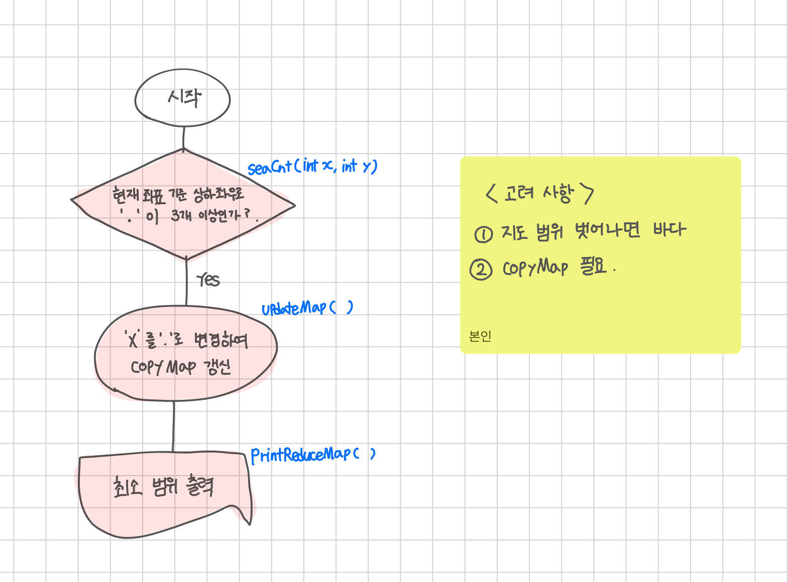

<br>

---

[https://www.acmicpc.net/problem/5212](https://www.acmicpc.net/problem/5212)

---

<br>

# 🔍 문제 풀이

## Flowchart



<br><br>

# 💻 전체 코드

```java
import java.io.*;
import java.util.*;

public class Main {
    static int[] dx = {-1, 1, 0, 0};
    static int[] dy = {0, 0, -1, 1};

    static int r, c;
    static char[][] map;
    static char[][] copyMap;
    static int maxCol, maxRow, minCol, minRow;

    public static void main(String[] args) throws IOException {
        BufferedReader br = new BufferedReader(new InputStreamReader(System.in));
        StringTokenizer st = new StringTokenizer(br.readLine());

        r = Integer.parseInt(st.nextToken()); // 행
        c = Integer.parseInt(st.nextToken()); // 열

        map = new char[r][c];
        copyMap = new char[r][c];

        // 입력
        for (int i = 0; i < r; i++) {
            String line = br.readLine();
            for (int j = 0; j < c; j++) {
                map[i][j] = line.charAt(j);
                copyMap[i][j] = line.charAt(j);
            }
        }

        updateMap();
        printReducedMap();
    }

    // 현재 좌표 기준으로 주변 바다('.')가 3개 이상인지 확인
    static boolean seaCnt(int x, int y) {
        int cnt = 0; // 현재땅 기준 . 개수 체크

        for (int i = 0; i < 4; i++) {
            int nx = x + dx[i];
            int ny = y + dy[i];

            // 이 조건이 헷갈렷음
            // 범위를 벗어나거나 바다('.')인 경우 count
            if (nx < 0 || nx >= r || ny < 0 || ny >= c || map[nx][ny] == '.') {
                cnt++;
            }
        }
        return cnt >= 3;
    }

    // 지도 갱신
    static void updateMap() {
        for (int i = 0; i < r; i++) {
            for (int j = 0; j < c; j++) {
                if (map[i][j] == 'X' && seaCnt(i, j)) {
                    copyMap[i][j] = '.';
                }
            }
        }
    }

    // 최소 범위 출력
    static void printReducedMap(){
        StringBuilder sb = new StringBuilder();

        // 최소 범위 계산
        minRow = Integer.MAX_VALUE;
        maxRow = Integer.MIN_VALUE;
        minCol = Integer.MAX_VALUE;
        maxCol = Integer.MIN_VALUE;

        for (int i = 0; i < r; i++) {
            for (int j = 0; j < c; j++) {
                if (copyMap[i][j] == 'X') {
                    minRow = Math.min(minRow, i);
                    maxRow = Math.max(maxRow, i);
                    minCol = Math.min(minCol, j);
                    maxCol = Math.max(maxCol, j);
                }
            }
        }

        // 출력
        for (int i = minRow; i <= maxRow; i++) {
            for (int j = minCol; j <= maxCol; j++) {
                sb.append(copyMap[i][j]);
            }
            sb.append("\n");
        }

        System.out.println(sb);
    }
}
```

<br>
