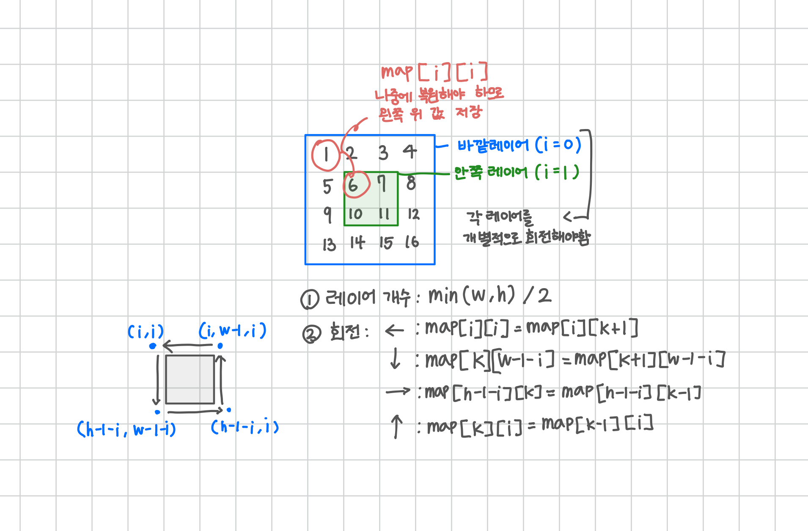

<br>

---

[https://www.acmicpc.net/problem/16926](https://www.acmicpc.net/problem/16926)

---

<br>

# 🔍 문제 풀이

## 문제 도식화



<br>

## 반시계 vs 시계 회전 비교

| 구분              | 🕐 시계 방향 회전 (→)                                   | ⬅️ 반시계 방향 회전 (←)            |
| ----------------- | ------------------------------------------------------- | ---------------------------------- |
| 순회 방향         | ↙ 아래 → 오른쪽 → 위 → 왼쪽                             | ↖ 왼쪽 → 위 → 오른쪽 → 아래        |
| 덮어쓰기 순서     | 반대 방향으로 순회하며 값 끌어옴                        | 반대 방향으로 순회하며 값 끌어옴   |
| temp 저장 위치 ⭐ | **오른쪽 위** (맨 끝 값)                                | **왼쪽 위** (맨 처음 값)           |
| 복원 위치         | 왼쪽 아래로 돌아와 마지막에 넣기                        | 오른쪽 아래로 돌아와 마지막에 넣기 |
| 회전 예시 (1D)    | `1 2 3 4 5` → `5 1 2 3 4`                               | `1 2 3 4 5` → `2 3 4 5 1`          |
| 구현 포인트       | **순회는 회전방향과 반대로** 순회해야 값 손실 없이 당김 | 동일하게 **반대 방향으로 순회**    |

<br>

## 예시

> 반시계 방향(←) / 시계 방향(→) 한 한 칸 회전 예시

초기: `1 2 3 4`

- **반시계 방향(←) 한 칸 회전**
  - temp 저장: 1 (왼쪽 첫 값)
  - 최종 결과: 2 3 4 5 1<br><br>
  ```scss
  1 2 3 4 5
  ↓ ↓ ↓ ↓
  2 3 4 5 5    ← 1이 사라지기 전에 temp로 저장
  ↓
  2 3 4 5 1    ← temp(1)을 마지막에 넣음
  ```

<br>

- **시계 방향(→) 한 칸 회전**
  - temp 저장: 5 (오른쪽 끝 값)
  - 최종 결과: 5 1 2 3 4<br><br>
  ```scss
  1 2 3 4 5
  ↑ ↑ ↑ ↑
  1 1 2 3 4    ← 5를 temp로 저장
  ↑
  5 1 2 3 4    ← temp(5)를 맨 앞에 넣음
  ```

<br>

## 회전 알고리즘 전략

> 덮어쓰기 문제는 복사 방향을 거꾸로 순회하면 해결된다.

앞으로 회전 알고리즘을 풀 때,

시계방향이든 반시계방향이든, 실제 구현은 회전 방향의 역방향으로 순회하면서<br>
현재 위치에 다음 위치의 값을 넣는 방식으로 처리하자

이때, 처음 시작 위치의 값은 미리 저장 해두었다가<br>
회전이 끝난 후 마지막 위치에 복원해야 한다.

정방향 순회 시 `현재 위치 = 다음 위치`로 복사할 때 <br>
다음 위치의 값이 아직 필요하지만 이미 덮어써버려서 손실되므로<br>
반드시 역순으로 복사해야 안전하게 회전이 가능하다.

<br><br>

# 💻 전체 코드

```java
import java.io.*;
import java.util.*;

public class Main {
    static int h;
    static int w;
    static int r;
    static int[][] map;

    public static void main(String[] args) throws IOException {
        BufferedReader br = new BufferedReader(new InputStreamReader(System.in));

        // 입력
        StringTokenizer st = new StringTokenizer(br.readLine());
        h = Integer.parseInt(st.nextToken());
        w = Integer.parseInt(st.nextToken());
        r = Integer.parseInt(st.nextToken());
        map = new int[h][w];

        // 초기화
        for(int i=0; i<h; i++){
            st = new StringTokenizer(br.readLine());
            for(int j = 0; j< w; j++){
                map[i][j] = Integer.parseInt(st.nextToken());
            }
        }

        // r번 회전
        while(r -- > 0){
            rotate();
        }
        printArr();
    }


    // 배열 반시계 방향으로 한 칸 회전
    static void rotate() {
        // i: 현재 돌고 있는 레이어 번호 (0부터 시작)
        // k: 그 레이어 내부에서 반복 순회할(고정적이지 않은) 인덱스 (열 또는 행)

        int layer = Math.min(w, h) / 2;
        for (int i = 0; i < layer; i++) {
            // 왼쪽 위 값 저장
            int temp = map[i][i];

            // 좌(←)
            for (int k = i; k < w - i - 1; k++) {
                map[i][k] = map[i][k + 1];
            }

            // 하(↓)
            for (int k = i; k < h - i - 1; k++) {
                map[k][w - 1 - i] = map[k + 1][w - 1 - i];
            }

            // 우(→)
            for (int k = w - 1 - i; k > i; k--) {
                map[h - 1 - i][k] = map[h - 1 - i][k - 1];
            }

            // 상(↑)
            for (int k = h - 1 - i; k > i; k--) {
                map[k][i] = map[k - 1][i];
            }

            // 저장해둔 값 복원
            map[i + 1][i] = temp;
        }
    }

    // 출력
    static void printArr(){
        StringBuilder sb = new StringBuilder();

        for(int i=0; i<h; i++){
            for(int j = 0; j< w; j++){
                sb.append(map[i][j]).append(" ");
            }
            sb.append("\n");
        }
        System.out.println(sb);
    }
}
```

<br>
