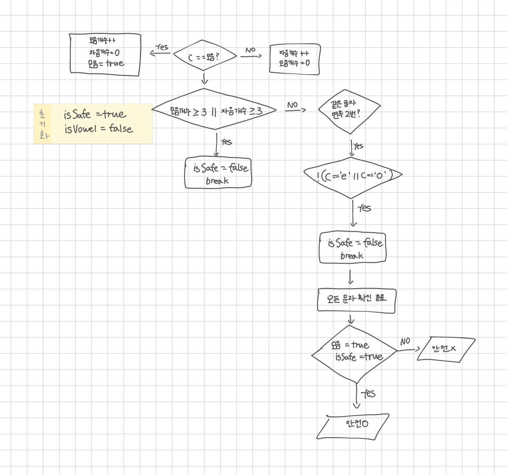

<br>

---

[https://www.acmicpc.net/problem/4659](https://www.acmicpc.net/problem/4659)

---

<br>

# 🔍 문제 풀이

## Flowchart



<br><br>

# Boolean 조건 처리 전략

> 초기값의 반대 조건만 분기 처리하자

- boolean의 초기값이 `true`이면 -> `false` 되는 조건만 처리
- 초기값이 `false`이면 -> `true` 되는 조건만 처리
- Flowchart에서도 변화가 생기는 조건만 그리고 나머지는 생략하자 (초기값 유지 의미)

<br>

> 이유

Boolean은 상태가 한 번 바뀌면 끝이다.

따라서 처음 상태에서 반대 조건만 명시적으로 작성하고, 그 외의 경우는 '초기 상태를 그대로 유지한다'는 철학으로<br>
다이어그램과 코드 구조를 설계해도 된다고 판단하였다.

<br>

> 예시

```java
if (문제 조건 발생) {
    flag = false; // 변경만 처리
}
// else에서 다시 flag = true 하지 않음

```

이렇게 하면 코드는 간결, 의도는 명확, 오류는 줄어든다.

다이어그램도 변화 조건만 표시하면 된다.

<br><br>

# 💻 전체 코드

```java
import java.io.*;

public class Main {
    public static void main(String[] args) throws IOException {
        BufferedReader br = new BufferedReader(new InputStreamReader(System.in));

        while (true) {
            int vowelCnt = 0;
            int consonantCnt = 0;
            boolean isSafe = true;
            boolean isVowel = false;

            String str = br.readLine();
            if (str.equals("end")) break;

            for (int i = 0; i < str.length(); i++) {
                char c = str.charAt(i);

                // 현재 문자가 모음인 경우
                if (c == 'a' || c == 'e' || c == 'i' || c == 'o' || c == 'u') {
                    vowelCnt++;
                    consonantCnt = 0;
                    isVowel = true;
                } else { // 자음인 경우
                    consonantCnt++;
                    vowelCnt = 0;
                }

                // [조건2] 모음 또는 자음이 3개 연속되면 false
                if (vowelCnt >= 3 || consonantCnt >= 3) {
                    isSafe = false;
                    break;
                }

                // [조건3] 같은 문자가 두 번 연속되면 false
                // 단, 'ee'나 'oo'는 허용
                if(i>0 && str.charAt(i-1) == str.charAt(i)){
                    if(!(c=='e' || c=='o')){
                        isSafe = false;
                        break;
                    }
                }
            }

            // [조건1] 모음이 하나도 없는 경우 false
            if(!isVowel) isSafe = false;

            // 출력
            if(isSafe){
                System.out.println("<" + str + ">" + " is acceptable.");
            }else{
                System.out.println("<" + str + ">" + " is not acceptable.");
            }
        }
    }
}
```

<br>
