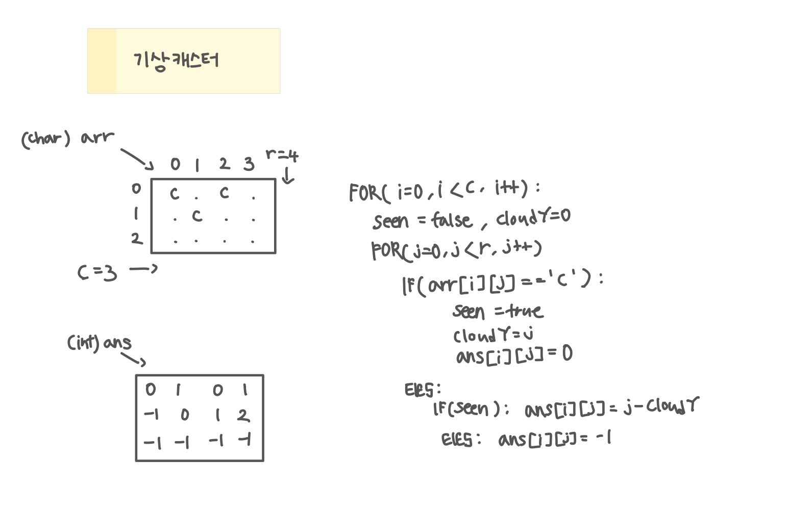

<br>

---

[https://www.acmicpc.net/problem/10709](https://www.acmicpc.net/problem/10709)

---

<br>

# 🔍 문제 풀이

## 문제 도식화



<br><br>

# 💻 전체 코드

```java
import java.io.*;
import java.util.*;

public class Main {
    public static void main(String[] args) throws IOException {
        BufferedReader br = new BufferedReader(new InputStreamReader(System.in));

        // 입력
        StringTokenizer st = new StringTokenizer(br.readLine());
        int c = Integer.parseInt(st.nextToken());
        int r = Integer.parseInt(st.nextToken());

        char[][] arr = new char[c][r];
        int[][] ans = new int[c][r];

        for(int i=0; i<c; i++){
            String line = br.readLine();
            for(int j=0; j<r; j++){
                arr[i][j] = line.charAt(j);
            }
        }


        // 로직
        for(int i=0; i<c; i++){
            boolean seen = false;
            int cloudY = 0;

            for(int j=0; j<r; j++){
                if(arr[i][j] == 'c'){
                    seen = true;
                    cloudY = j;
                    ans[i][j] = 0;
                }else{
                    if(seen) ans[i][j] = j-cloudY;
                    else ans[i][j] = -1;
                }
            }
        }

        // 출력
        for(int i=0; i<c; i++){
            for(int j=0; j<r; j++){
                System.out.print(ans[i][j] + " ");
            }
            System.out.println();
        }
    }
}
```

<br>
