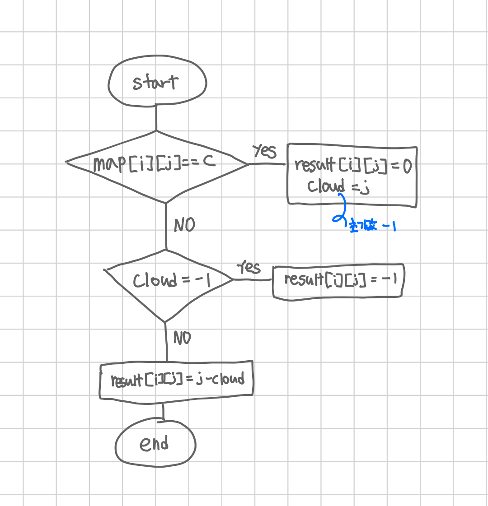

<br>

---

[https://www.acmicpc.net/problem/10709](https://www.acmicpc.net/problem/10709)

---

<br>

# 🔍 문제 풀이

## Flowchart



<br><br>

# 💻 전체 코드

```java
import java.io.*;
import java.util.*;

public class Main {
    static int h, w;
    static char[][] map;
    static int[][] result;

    public static void main(String[] args) throws IOException {
        BufferedReader br = new BufferedReader(new InputStreamReader(System.in));

        // 입력
        StringTokenizer st = new StringTokenizer(br.readLine());
        h = Integer.parseInt(st.nextToken());
        w = Integer.parseInt(st.nextToken());

        map = new char[h][w];
        result = new int[h][w];


        for(int i=0; i<h; i++){
            String line = br.readLine();
            for(int j=0; j<w; j++){
                map[i][j] = line.charAt(j);
            }
        }

        // 계산
        for(int i=0; i<h; i++){
            int cloud = -1;

            for(int j=0; j<w; j++){

                // c위치 알기
                if(map[i][j] == 'c'){
                    cloud = j;
                    result[i][j] = 0;
                }else {
                    if (cloud == -1) {
                        result[i][j] = -1;
                    } else {
                        result[i][j] = j - cloud;
                    }
                }

            }

        }


        // 출력
        for(int i=0; i<h; i++){
            for(int j=0; j<w; j++){
                System.out.print(result[i][j] + " ");
            }
            System.out.println();
        }
    }
}
```

<br>
