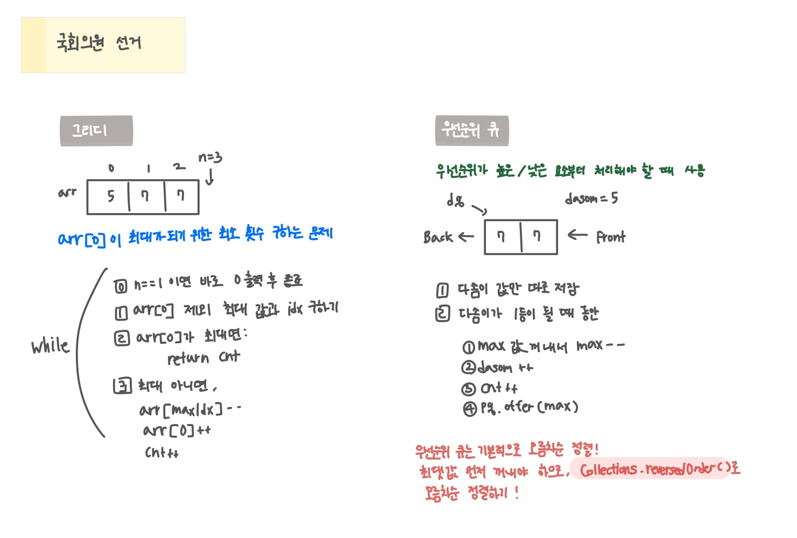

<br>

---

[https://www.acmicpc.net/problem/1417](https://www.acmicpc.net/problem/1417)

---

<br>

# 🔍 문제 풀이

## 문제 도식화



<br><br>

## 알고리즘 선택

- 다솜이가 1등이 될 때까지, 현재 가장 많은 표를 가진 후보에게서 표를 하나씩 빼서 다솜이에게 준다.
- 가장 많은 표를 가진 후보를 효율적으로 찾기 위해 `우선순위 큐를 사용한다.
- 우선순위 큐는 기본적으로 오름차순 정렬이므로, `Collections.reverseOrder()`로 내림차순 설정 필요.
- 후보 수가 1명인 경우에는 표를 줄 필요가 없으므로 `0` 출력.

<br>

## 배운 점

> 최댓값이나 최솟값을 순차적으로 처리해야 할 경우, 우선순위 큐를 사용하자

- `PriorityQueue<>(Collections.reverseOrder())` → 최대 힙
- `PriorityQueue<>()` → 최소 힙 (기본)

<br><br>

# 💻 전체 코드

## PQ (우선순위 큐) 사용

```java
import java.io.*;
import java.util.*;

public class Main {
    public static void main(String[] args) throws IOException {
        BufferedReader br = new BufferedReader(new InputStreamReader(System.in));

        // Collections.reverseOrder() 로도 내림차순 가능
        PriorityQueue<Integer> pq = new PriorityQueue<>((o1, o2) -> o2-o1); // pq 사용

        int n = Integer.parseInt(br.readLine());
        int dasom = Integer.parseInt(br.readLine());

        int cnt = 0;
        for(int i=1; i<n; i++) {
            pq.offer(Integer.parseInt(br.readLine()));
        }

        // n이 1인 경우 예외 처리
        if(n == 1){
            System.out.println(0);
            return;
        }

        // 다솜의 표가 다른 후보의 최대 표보다 작거나 같을 때만 반복
        while(pq.peek() >= dasom){
            int max = pq.poll(); // 현재 1등 꺼냄
            max--; // 값 줄이고
            dasom++;
            pq.offer(max); // 다시 넣음
            cnt ++;
        }

        System.out.println(cnt);

    }
}
```

<br>

## 그리디 알고리즘

```java
import java.io.*;
import java.util.*;

public class Main {
    public static void main(String[] args) throws IOException {
        BufferedReader br = new BufferedReader(new InputStreamReader(System.in));

        int n = Integer.parseInt(br.readLine());

        int dasom = Integer.parseInt(br.readLine());
        Integer[] arr = new Integer[n - 1];
        for(int i=0; i<n - 1; i++){
            arr[i] = Integer.parseInt(br.readLine());
        }

        if(n == 1){
            System.out.println(0);
            return;
        }

        int cnt = 0;
        while(true){
            Arrays.sort(arr, (o1, o2) -> o2 - o1);
            if (arr[0] < dasom) break;
            dasom ++;
            cnt ++;
            arr[0] --;
        }

        System.out.println(cnt);
    }
}
```

<br>
