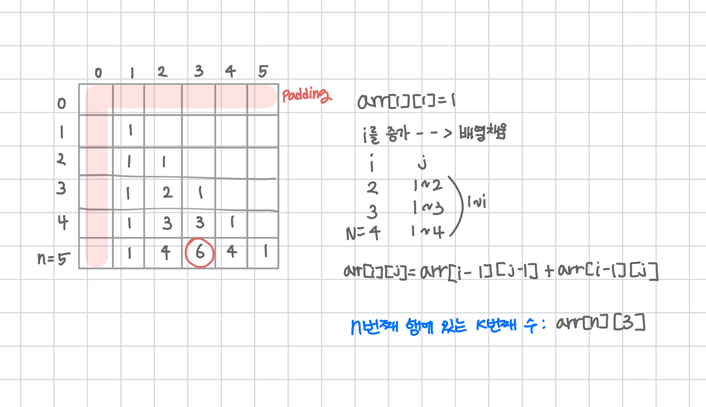

<br>

---

[https://www.acmicpc.net/problem/16395](https://www.acmicpc.net/problem/16395)

---

<br>

# 🔍 문제 풀이

## 문제 도식화

패딩으로 배열 크기를 넉넉히 잡아 경계 조건 없이 깔끔하게 계산할 수 있다.



<br><br>

# 💻 전체 코드

```java
import java.io.*;
import java.util.*;

public class Main {
    public static void main(String[] args) throws IOException {
        BufferedReader br = new BufferedReader(new InputStreamReader(System.in));

        StringTokenizer st = new StringTokenizer(br.readLine());
        int n = Integer.parseInt(st.nextToken()); // n번쨰 행에서
        int k = Integer.parseInt(st.nextToken()); // k번쨰 수 출력

        int arr[][] = new int[n+1][n+1];

        arr[1][1] = 1;
        for(int i=2; i<=n; i++){
            for(int j=1; j<=i; j++){
                arr[i][j] = arr[i-1][j] + arr[i-1][j-1];
            }
        }

        System.out.println(arr[n][k]);
    }
}
```

<br>
