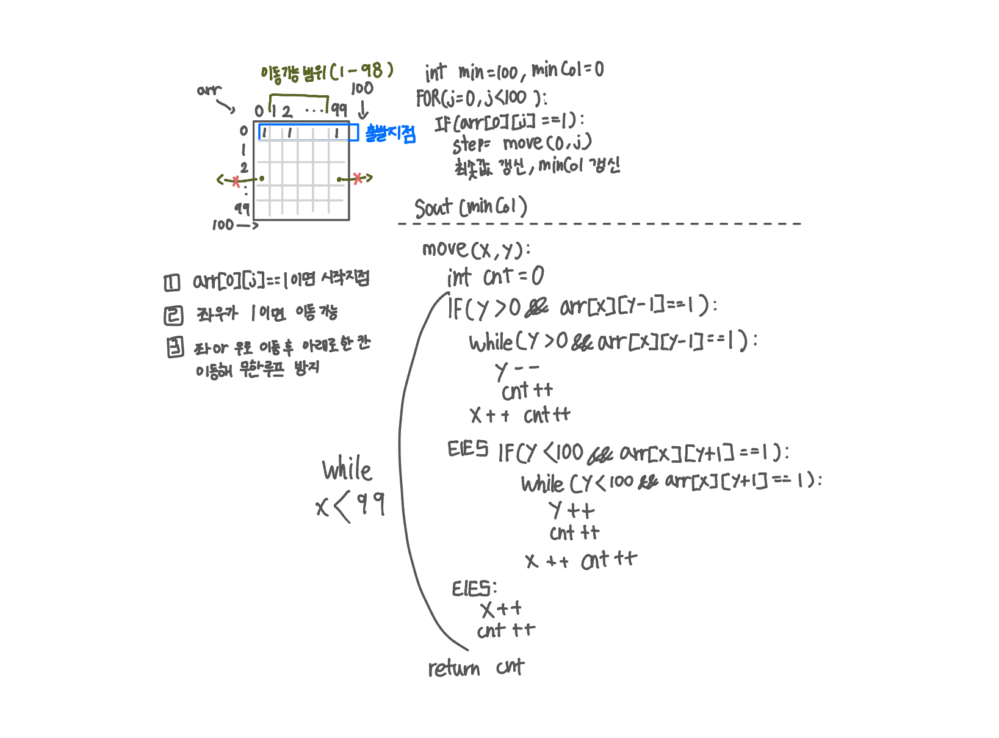

<br>

---

[1211. Ladder2](https://swexpertacademy.com/main/code/problem/problemDetail.do?contestProbId=AV14BgD6AEECFAYh)

---

<br>

# 🔍 문제 풀이

## 문제 도식화



<br><br>

# 💻 전체 코드

```java
import java.io.*;
import java.util.*;

public class Solution {
    static int[][] arr;
    public static void main(String[] args) throws IOException {
        BufferedReader br = new BufferedReader(new InputStreamReader(System.in));

        int tc = 10;
        while(tc --> 0){
            int t = Integer.parseInt(br.readLine());

            // 배열 입력 및 초기화
            arr = new int[100][100];
            for (int i = 0; i < 100; i++) {
                StringTokenizer st = new StringTokenizer(br.readLine());
                for (int j = 0; j < 100; j++) {
                    arr[i][j] = Integer.parseInt(st.nextToken());
                }
            }

            // 최단 거리 탐색
            int min = Integer.MAX_VALUE;
            int ansCol = 0;
            for(int j=0; j<100; j++){
                if(arr[0][j] == 1){
                    int steps = move(0, j);
                    if(steps < min){
                        min = steps;
                        ansCol = j;
                    }

                }
            }
            System.out.println("#" + t + " " + ansCol);

        }
    }

    static int move(int x, int y){
        int cnt = 0;
        while(x<99){ // 99행에서 루프 종료
            if(y>0 && arr[x][y-1] == 1){
                // 왼쪽
                while(y>0 && arr[x][y-1] == 1){
                    y--;
                    cnt++;
                }
                x++; cnt++;
            }

            // 오른쪽
            else if(y<99 && arr[x][y+1] == 1){
                while(y<99 && arr[x][y+1] == 1){
                    y++;
                    cnt++;
                }
                x ++; cnt++;
            }

            // 위
            else{
                x++;
                cnt++;
            }
        }
        return cnt;
    }
}
```

<br>
