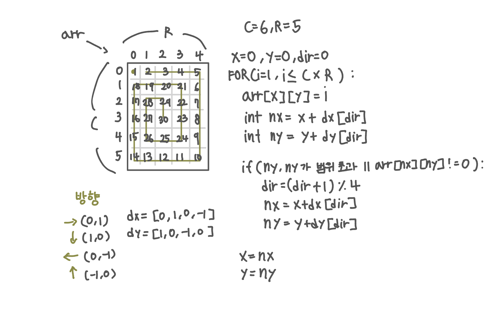

<br>

---

[https://www.acmicpc.net/problem/번호](https://www.acmicpc.net/problem/번호)

---

<br>

# 🔍 문제 풀이

## 문제 도식화

SWEA [1954. 달팽이 숫자](https://swexpertacademy.com/main/code/problem/problemDetail.do?contestProbId=AV5PobmqAPoDFAUq&categoryId=AV5PobmqAPoDFAUq&categoryType=CODE&&&) 와 매우 유사해 쉽게 풀 수 있었다.

다만 좌표 출력 시 (열, 행) 순으로 출력해야 하는 점과 좌표가 1부터 시작한다는 점이 기존 문제와는 다르므로 주의가 필요하다.



<br><br>

# 💻 전체 코드

```java
import java.io.*;
import java.util.*;

public class Main {
    static int[] dx = {0, 1, 0, -1};
    static int[] dy = {1, 0, -1, 0};

    static int[][] arr;
    static int c, r, k;

    public static void main(String[] args) throws IOException {
        BufferedReader br = new BufferedReader(new InputStreamReader(System.in));

        // 입력 및 초기화
        StringTokenizer st =  new StringTokenizer(br.readLine());
        c = Integer.parseInt(st.nextToken());
        r = Integer.parseInt(st.nextToken());
        k = Integer.parseInt(br.readLine());

        arr = new int[c][r];

        // 함수 호출
        fillSeats();
        print();

    }
    static void fillSeats(){
        int x = 0, y = 0, dir = 0;

        for(int num=1; num <= c * r; num++){
            arr[x][y] = num;
            int nx = x + dx[dir];
            int ny = y + dy[dir];
            if(nx < 0 || nx >= c || ny < 0 || ny >= r  || arr[nx][ny] != 0){
                dir = (dir+1) % 4;
                nx = x + dx[dir];
                ny = y + dy[dir];
            }
            x = nx;
            y = ny;
        }

    }

    static void print(){
        int row = 0;
        int col = 0;
        boolean found = false;
        for(int i=0; i<c; i++){
            for(int j=0; j<r; j++){
                if(arr[i][j] == k) {
                    row = i;
                    col = j;
                    found = true;
                }
            }
        }

        System.out.println(found? (row+1) + " " + (col+1) : 0);
    }
}
```

<br>
