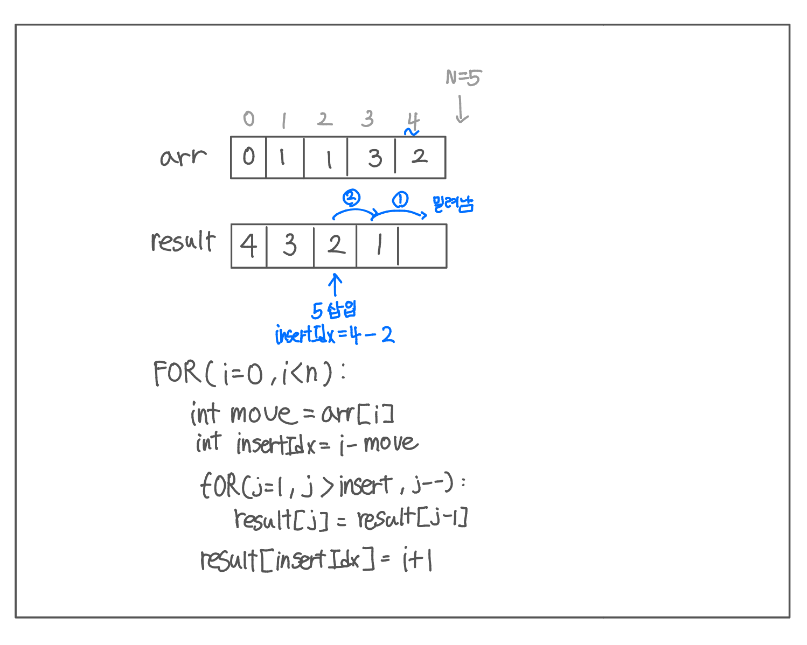

<br>

---

[https://www.acmicpc.net/problem/2605](https://www.acmicpc.net/problem/2605)

---

<br>

# 🔍 문제 풀이

## 풀이 방법

> 두 가지 방식으로 풀 수 있다.

- List 삽입 방식 (ArrayList 활용)
  - `ArrayList.add(index, value)`를 이용해 앞으로 갈 칸 수만큼 밀어 넣음
  - 코드 간결, 쉬움

<br>

- 배열 수동 삽입
  - `result[]`배열을 직접 한 칸씩 밀어가며 삽입
  - 좀 더 복잡하지만, 어려운 시뮬레이션 문제에 적용 가능

<br>

## 문제 도식화

아래는 배열 수동 삽입 방식의 과정을 그림으로 나타낸 것이다.



<br><br>

# 💻 전체 코드

## List.add(index, value) 사용

```java
import java.io.*;
import java.util.*;

public class Main {
    public static void main(String[] args) throws IOException {
        BufferedReader br = new BufferedReader(new InputStreamReader(System.in));

        int n = Integer.parseInt(br.readLine());

        // 번호표
        List<Integer> order = new ArrayList<>();

        StringTokenizer st = new StringTokenizer(br.readLine());
        for(int i=0; i<n; i++){
            order.add(Integer.parseInt(st.nextToken()));
        }

        // 학생 번호
        List<Integer> students = new ArrayList<>();
        for(int i=1; i<=n; i++){
            students.add(i);
        }


        List<Integer>result = new ArrayList<>();

        // 순서대로 줄 세우기
        for(int i=0; i<n; i++){
            result.add(i - order.get(i), students.get(i));
        }

        // 출력
        for(int val:result){
            System.out.print(val + " ");
        }

    }
}
```

<br>

## 배열 수동 삽입

```java
import java.io.*;
import java.util.*;

public class Main {
    public static void main(String[] args) throws IOException {
        BufferedReader br = new BufferedReader(new InputStreamReader(System.in));

        // 입력 및 배열 초기화
        int n = Integer.parseInt(br.readLine());
        int[] order = new int[n];
        int[] result = new int[n];

        StringTokenizer st = new StringTokenizer(br.readLine());
        for (int i = 0; i < n; i++) {
            order[i] = Integer.parseInt(st.nextToken());
        }

        // 로직
        for(int i=0; i<n; i++){
            int temp = i+1; // 삽입할 위치
            int k = order[i]; // 앞으로 갈 칸 수

            // 오른쪽으로 한 칸씩 밀기
            for(int j=i; j>i-k; j--){
                result[j] = result[j-1];
            }
            result[i-k] = temp;
        }

        // 출력
        for (int num : result) {
            System.out.print(num + " ");
        }
    }
}
```

<br>
