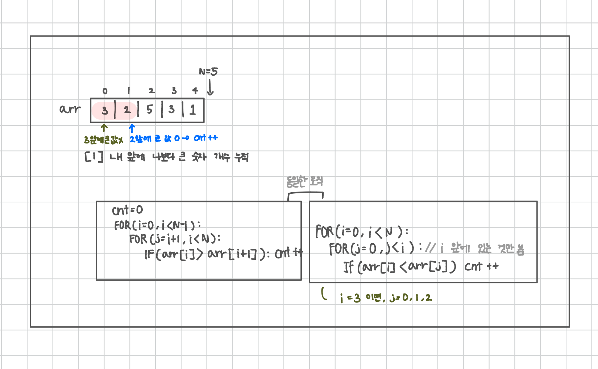

<br>

---

[https://www.acmicpc.net/problem/10431](https://www.acmicpc.net/problem/10431)

---

<br>

# 🔍 문제 풀이

## 풀이 방법

> 두 가지 방식으로 풀 수 있다.

- 방법 1: cnt만 증가시키기
  - 현재 값이 앞에 있는 값보다 작다면, 앞의 큰 수만큼 앞으로 가야 하므로 `cnt++`
  - 실제 배열을 정렬하지 않아도 가능
  - 백준 2605번 줄 세우기와 유사한 방식

<br>

- 방법 2: 버블 정렬
  - 실제로 정렬을 수행하면서 인접한 두 값을 비교해 큰 값을 뒤로 보냄
  - 값이 교환될 때마다 `cnt++`

<br>

## 문제 도식화



<br><br>

# 💻 전체 코드

## [방법 1] 앞에 있는 큰 수만 카운트

```java
import java.io.*;
import java.util.*;

public class Main {
    public static void main(String[] args) throws IOException {
        BufferedReader br = new BufferedReader(new InputStreamReader(System.in));

        int p = Integer.parseInt(br.readLine());

        while(p --> 0){
            int[] arr = new int[20];

            StringTokenizer st = new StringTokenizer(br.readLine());
            int tc = Integer.parseInt(st.nextToken());

            for(int i=0; i<20; i++){
                arr[i] = Integer.parseInt(st.nextToken());
            }


            int cnt = 0;
            for(int i=0; i<20; i++){
                for(int j=0; j<i; j++){
                    if(arr[i] < arr[j]) cnt++;
                }
            }

            //    for(int i=0; i<19; i++){
            //     for(int j=i+1; j<20; j++){
            //         if(arr[i] > arr[j]) cnt++;
            //     }
            // }

            System.out.println(tc +" "+ cnt);
        }

    }
}
```

<br>

## [방법 2] 버블 정렬 (자리 바꿀 때마다 카운트)

버블 정렬은 앞만 보는 것이 아닌 전체를 보며,<br>
인접한 쌍을 끝까지 비교하며 필요하면 교환

```java
import java.io.*;
import java.util.*;

public class Main {
    public static void main(String[] args) throws IOException {
        BufferedReader br = new BufferedReader(new InputStreamReader(System.in));

        int p = Integer.parseInt(br.readLine());

        while (p-- > 0) {
            int[] arr = new int[20];
            int tc = 0, cnt = 0;

            StringTokenizer st = new StringTokenizer(br.readLine());
            tc = Integer.parseInt(st.nextToken());

            for (int i = 0; i < 20; i++) {
                arr[i] = Integer.parseInt(st.nextToken());
            }

            // 버블 정렬로 자리 바꿀 때마다 cnt++
            for (int i = 0; i < 19; i++) {
                for (int j = 0; j < 19 - i; j++) { // 비교횟수 감소
                    if (arr[j] > arr[j + 1]) {
                        int temp = arr[j];
                        arr[j] = arr[j + 1];
                        arr[j + 1] = temp;
                        cnt++;
                    }
                }
            }

            System.out.println(tc + " " + cnt);
        }
    }
}
```

<br>
