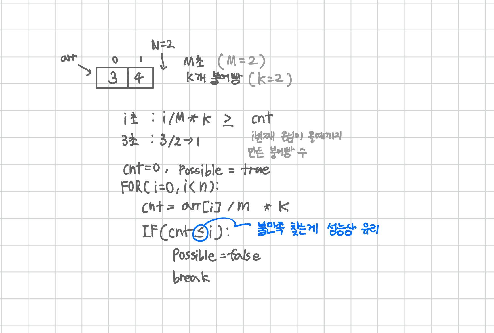

<br>

---

[1860. 진기의 최고급 붕어빵](https://swexpertacademy.com/main/code/problem/problemDetail.do?contestProbId=AV5LsaaqDzYDFAXc)

---

<br>

# 🔍 문제 풀이

## 문제 도식화



<br>

## 알고리즘 선택

<br>

## 배운 점

테스트케이스 일부만 맞을 때 반례 떠올리기

1. 입력 모두 0
2. 음수
3. 같은 값
4. 최솟값, 최댓값
5. 정렬x
6. 경계

이번 문제에서는 5번을 고려해야한다.

<br><br>

# 💻 전체 코드

```java
import java.io.*;
import java.util.*;

public class Solution {
    public static void main(String[] args) throws IOException {
        BufferedReader br = new BufferedReader(new InputStreamReader(System.in));

        int t = Integer.parseInt(br.readLine());
        for(int tc=1; tc<=t; tc++) {
            // 입력 및 초기화
            StringTokenizer st = new StringTokenizer(br.readLine());
            int n = Integer.parseInt(st.nextToken());
            int m = Integer.parseInt(st.nextToken());
            int k = Integer.parseInt(st.nextToken());

            int[] arr = new int[n];
            st = new StringTokenizer(br.readLine());
            for (int i = 0; i < n; i++) {
                arr[i] = Integer.parseInt(st.nextToken());
            }

            Arrays.sort(arr); // 주의 -> 도착시간 오름차순 정렬

            // 시뮬레이션
            int cnt = 0;
            boolean possible = true;

            for(int i = 0; i <n; i++){
                cnt = (arr[i] / m) * k; // i번째 손님이 도착할 때까지 만들어진 붕어빵의 개수
                if(cnt <= i){
                    possible = false;
                    break;
                }
            }

            // 출력
            System.out.print("#" + tc + " ");
            System.out.println(possible ? "Possible" : "Impossible");
        }
    }
}
```

<br>
