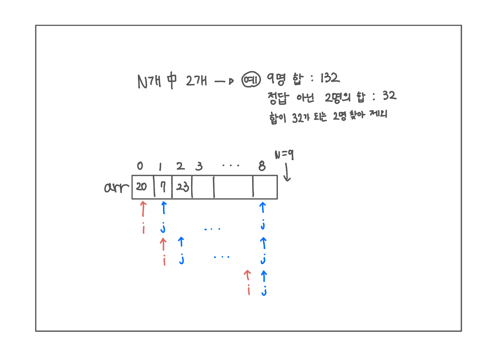

<br>

---

[https://www.acmicpc.net/problem/2309](https://www.acmicpc.net/problem/2309)

---

<br>

# 🔍 문제 풀이

## 문제 도식화

> 이 문제는 n개 중 2개를 찾는 문제

n개 중 7개의 합이 100이 되는 것을 찾는 것 보다, (`nC7`)<br>
n개 중 2개의 합을 제외한 나머지 7개의 합이 100이 되는 것을 찾는 게 빠름 (`nC2`)

```
💡
9명 키 합이 sum일 때
sum - 100이 되는 2명의 키 합을 찾아서
그 2명을 제외하고 나머지 7명을 출력하자!
```



<br><br>

# 💻 전체 코드

중첩 루프 안에서 조건 만족 시 여러 번 탈출해야 하는 경우엔,<br>
함수로 빼서 return으로 종료하는 방식이 훨씬 깔끔하다.

```java
import java.io.*;
import java.util.*;

public class Main {
    static int[] arr;
    static int sum;
    public static void main(String[] args) throws IOException {
        BufferedReader br = new BufferedReader(new InputStreamReader(System.in));

        arr = new int[9];

        sum = 0;
        for(int i=0; i<9; i++){
            arr[i] = Integer.parseInt(br.readLine());
            sum += arr[i];
        }

        solve();
        Arrays.sort(arr);
        for(int i=0; i<9; i++){
            if(arr[i] != 0){
                System.out.println(arr[i]);
            }
        }
    }
    static void solve(){
        for(int i=0; i<8; i++) {
            for (int j = i + 1; j < 9; j++) {
                int temp = arr[i] + arr[j];
                if (sum - temp == 100) {
                    arr[i] = 0;
                    arr[j] = 0;
                    return;
                }
            }
        }
    }
}
```

<br>
