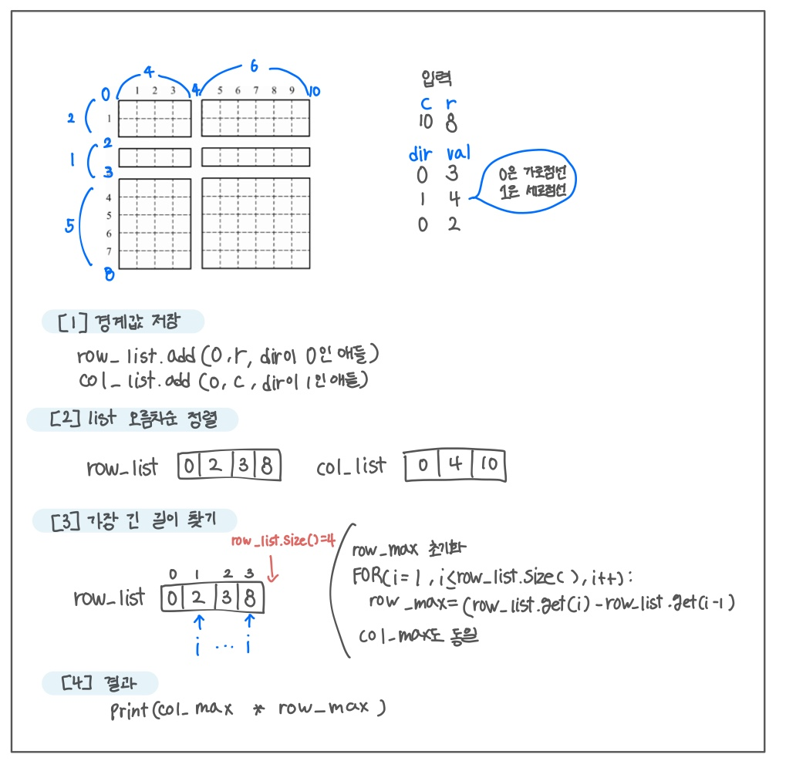

<br>

---

[https://www.acmicpc.net/problem/2628](https://www.acmicpc.net/problem/2628)

---

<br>

# 🔍 문제 풀이

## 문제 도식화



<br><br>

# 💻 전체 코드

```java
import java.io.*;
import java.util.*;

public class Main {
    public static void main(String[] args) throws IOException {
        BufferedReader br = new BufferedReader(new InputStreamReader(System.in));

        StringTokenizer st = new StringTokenizer(br.readLine());
        int c = Integer.parseInt(st.nextToken());
        int r = Integer.parseInt(st.nextToken());

        int n = Integer.parseInt(br.readLine());

        // [1] 경계 값 저장
        List<Integer> row_list  = new ArrayList<>();
        List<Integer> col_list  = new ArrayList<>();

        row_list.add(0);
        row_list.add(r);
        col_list.add(0);
        col_list.add(c);

        for(int i=0; i<n; i++){
            st = new StringTokenizer(br.readLine());
            int dir = Integer.parseInt(st.nextToken()); // 0은 가로, 1은 세로
            int val = Integer.parseInt(st.nextToken());

            if(dir == 0) row_list.add(val);
            else col_list.add(val);
        }

        // [2] list 오름차순 정렬
        Collections.sort(row_list);
        Collections.sort(col_list);

        // [3] 가장 긴 길이 찾기
        int row_max = Integer.MIN_VALUE, col_max = Integer.MIN_VALUE;

        for(int i=1; i < row_list.size(); i++){
            row_max = Math.max(row_max, row_list.get(i) - row_list.get(i - 1));
        }
        for(int i=1; i < col_list.size(); i++){
            col_max = Math.max(col_max, col_list.get(i) - col_list.get(i - 1));
        }

        // [4] 결과 출력 (가장 큰 직사각형 넓이)
        System.out.println(row_max * col_max);
    }
}
```

<br>
