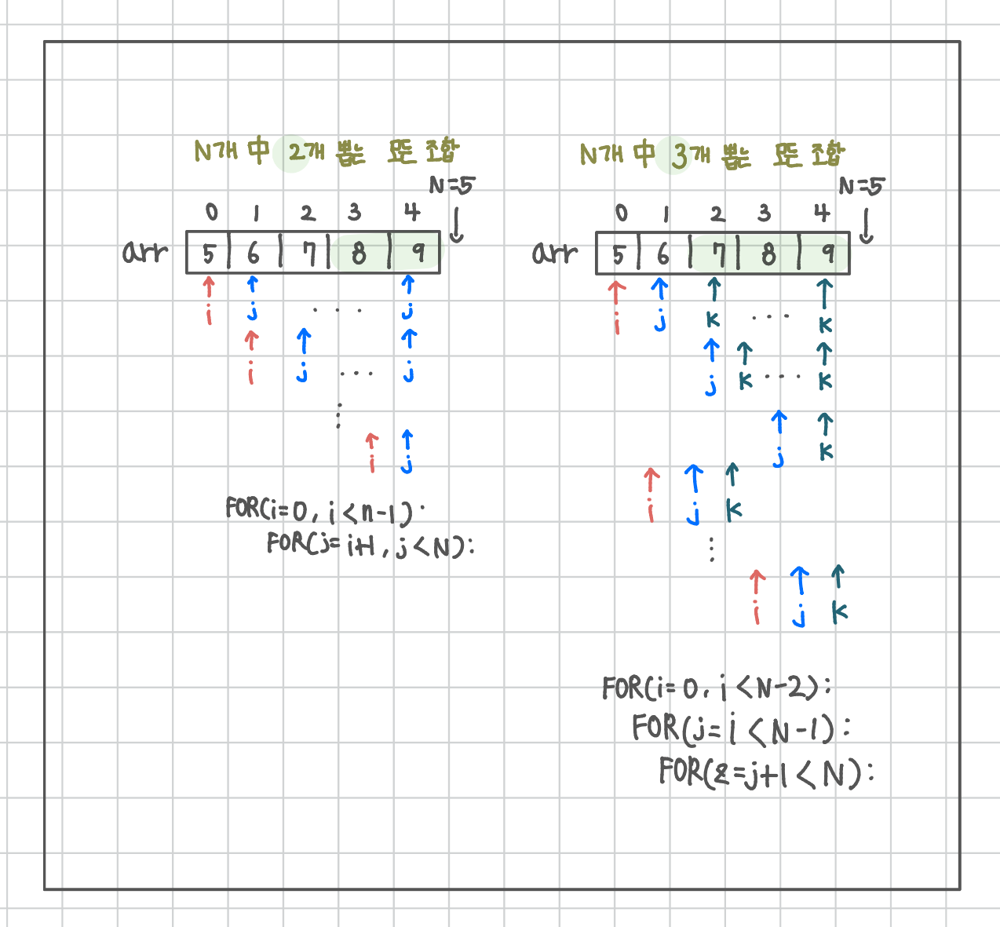

<br>

---

[https://www.acmicpc.net/problem/2798](https://www.acmicpc.net/problem/2798)

---

<br>

# 🔍 문제 풀이

## 문제 도식화

> N개 中 3개를 뽑는 모든 조합을 구한 후, 조건에 맞는 최댓값을 출력하면 되는 문제이다.



<br><br>

# 💻 전체 코드

```java
import java.io.*;
import java.util.*;

public class Main {
    public static void main(String[] args) throws IOException {
        BufferedReader br = new BufferedReader(new InputStreamReader(System.in));

        StringTokenizer st = new StringTokenizer(br.readLine());
        int n = Integer.parseInt(st.nextToken());
        int m = Integer.parseInt(st.nextToken());

        int[] arr = new int[n];
        st = new StringTokenizer(br.readLine());
        for(int i=0; i<n; i++){
            arr[i] = Integer.parseInt(st.nextToken());
        }

        int max = Integer.MIN_VALUE;
        for(int i=0; i<n-2; i++){
            for(int j=i+1; j<n-1; j++){
                for(int k = j+1; k<n; k++){
                    int sum = arr[i]+arr[j] + arr[k];

                    if(sum <= m){
                        max = Math.max(max, sum);
                    }
                }
            }
        }

        System.out.println(max);

    }
}
```

<br>
