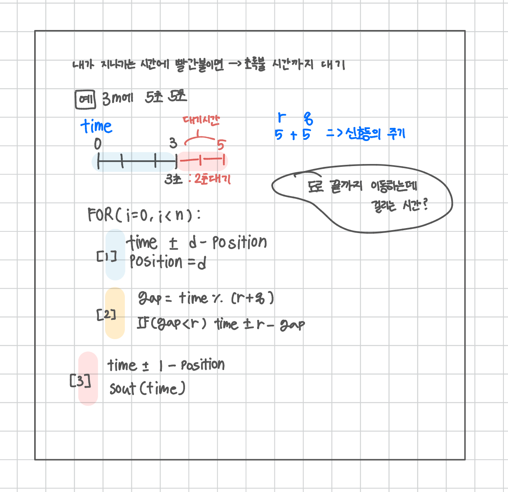

<br>

---

[https://www.acmicpc.net/problem/2980](https://www.acmicpc.net/problem/2980)

---

<br>

# 🔍 문제 풀이

## 문제 도식화



<br>

## 이런 아이디어는 어떻게 떠올릴까?

> with. claude\_문제를 처음 마주했을 때의 고민 과정 🤖

1단계: 직관적인 접근 (하지만 복잡함)<br>
처음에는 이렇게 생각했을 거예요:

```
"신호등이 언제 빨간불이고 언제 파란불인지 어떻게 알지?"
"시간 0초부터 하나하나 따져봐야 하나?"
```

2단계: 패턴 발견<br>
신호등을 자세히 관찰해보니:

```r=3, g=2인 경우:
시간: 0 1 2 3 4 5 6 7 8 9 10 11 12 ...
상태: 빨빨빨파파빨빨빨파파빨 빨 빨 ...
"어? 5초마다 똑같은 패턴이 반복되네!"
```

3단계: 수학적 통찰 - 모듈로 연산!<br>
"반복되는 패턴이면... 나머지 연산을 쓸 수 있지 않을까?"

```java
시간 % 사이클길이 = 사이클 내에서의 위치
```

4단계: 아하! 모멘트<br>

```java
javaint cycle = r + g;        // 전체 사이클 길이
int gap = time % cycle;   // 현재 사이클에서의 위치

// gap이 0~(r-1)이면 빨간불
// gap이 r~(r+g-1)이면 파란불
```

<br>

> 이런 아이디어는 어떻게 떠올릴까?

- 반복 패턴 인식 능력: "어? 이게 주기적으로 반복되네?"
- 수학적 도구 연결: "반복 패턴 → 나머지 연산!"
- 경험과 훈련: 비슷한 문제들을 많이 풀어보면서 "주기적 문제는 모듈로!"라는 패턴을 학습
- 추상화 사고: 복잡한 시간 흐름을 단순한 수식으로 변환

<br>

> 다른 비슷한 예시들

- 이런 "모듈로 사고"는 여러 곳에서 나타납니다:
  - 시계: 25시 = 1시 (24로 나눈 나머지)
  - 요일: 100일 후 무슨 요일? (7로 나눈 나머지)
  - 원형 배열: 배열 크기를 넘어서면 처음으로 돌아감

<br><br>

# 💻 전체 코드

```java
import java.io.*;
import java.util.*;

public class Main {
    public static void main(String[] args) throws IOException {
        BufferedReader br = new BufferedReader(new InputStreamReader(System.in));

        StringTokenizer st = new StringTokenizer(br.readLine());
        int n = Integer.parseInt(st.nextToken());
        int l = Integer.parseInt(st.nextToken());

        int time = 0;
        int position = 0;

        for (int i = 0; i < n; i++) {
            st = new StringTokenizer(br.readLine());
            int d = Integer.parseInt(st.nextToken());
            int r = Integer.parseInt(st.nextToken());
            int g = Integer.parseInt(st.nextToken());

            // [1] 신호등까지 걸린 시간
            time += d - position;
            position = d;

            // [2] 신호등 사이클 계산
            int gap = time % (r + g); // 신호등 전체 사이클에서 현재 시점
            if (gap < r) time += r - gap; // 빨간불이면 대기, 파란불이면 통과
        }

        // [3] 마지막 구간 이동
        time += l - position;
        System.out.println(time);

    }
}
```

<br>
