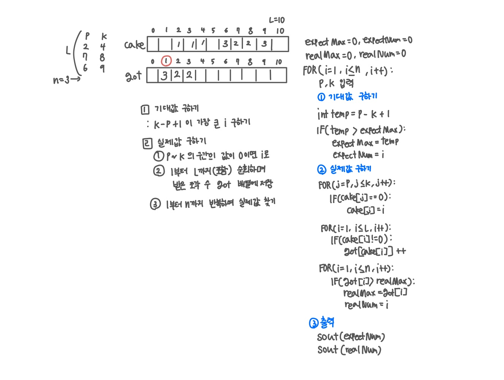

<br>

---

[https://www.acmicpc.net/problem/3985](https://www.acmicpc.net/problem/3985)

---

<br>

# 🔍 문제 풀이

## 문제 도식화



<br><br>

# 💻 전체 코드

```java
import java.io.*;
import java.util.*;

public class Main {
    public static void main(String[] args) throws IOException {
        BufferedReader br = new BufferedReader(new InputStreamReader(System.in));

        int l = Integer.parseInt(br.readLine());
        int n = Integer.parseInt(br.readLine());

        int[] cake= new int[l + 1];
        int[] got  = new int[n + 1];

        int expectMax = 0, expectNum = 0;
        int realMax = 0, realNum = 0;

        for(int i=1; i<=n; i++) {
            StringTokenizer st = new StringTokenizer(br.readLine());
            int p = Integer.parseInt(st.nextToken());
            int k = Integer.parseInt(st.nextToken());

            // 기대값
            int temp = k - p + 1;
            if (temp > expectMax) {
                expectMax = temp;
                expectNum = i;
            }

            // 케이크 배정
            for (int j = p; j <= k; j++) {
                if (cake[j] == 0) {
                    cake[j] = i;
                }
            }
        }

        // 배정 조각 수 확인
        for (int j = 1; j <= l; j++) {
            if (cake[j] != 0) {
                got[cake[j]]++;
            }
        }

        // 실제값 찾기
        for (int i = 1; i <= n; i++) {
            if (got[i] > realMax) {
                realMax = got[i];
                realNum = i;
            }
        }

        System.out.println(expectNum);
        System.out.println(realNum);
    }
}
```

<br>
