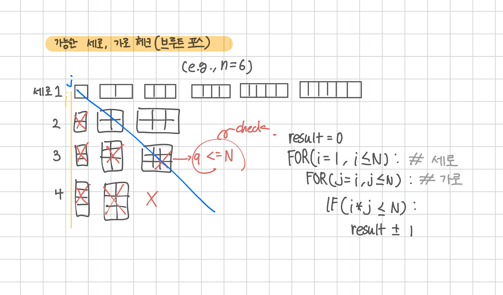

<br>

---

[https://www.acmicpc.net/problem/8320](https://www.acmicpc.net/problem/8320)

---

<br>

# 🔍 문제 풀이

## 문제 도식화



<br>

## 알고리즘 선택

<br>

## 배운 점

<br><br>

# 💻 전체 코드

```java
import java.io.*;
import java.util.*;

public class Main {
    public static void main(String[] args) throws IOException {
        BufferedReader br = new BufferedReader(new InputStreamReader(System.in));

        int n = Integer.parseInt(br.readLine());
        int result = 0;

        for(int i=1; i<=n; i++){ // 세로
            for(int j=i; j<=n; j++){ // 가로
                if(i*j <= n){
                    result += 1;
                }
            }
        }
        System.out.println(result);
    }
}
```

<br>
