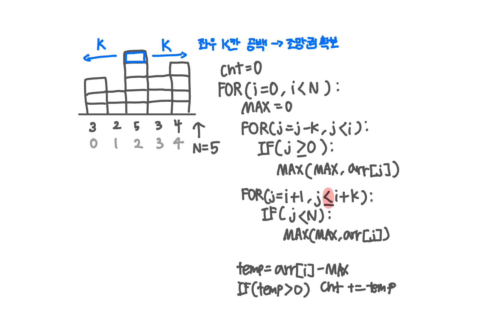

<br>

---

[1206. [S/W 문제해결 기본] 1일차 - View](https://swexpertacademy.com/main/code/problem/problemDetail.do?contestProbId=AV134DPqAA8CFAYh)

---

<br>

# 🔍 문제 풀이

## 문제 설명 (문제 변형)

강변에 빌딩들이 옆으로 밀집해 있다.

이 지역에서는 **왼쪽과 오른쪽으로 창문을 열었을 때, 양쪽 모두 거리 `k` 이상의 공간이 확보**될 때 조망권이 확보된다고 한다.

빌딩들의 높이가 주어질 때, 조망권이 확보된 세대(층)의 수를 구하라.

단, 범위를 벗어난 칸의 높이는 0으로 취급한다.

<br>

> 입력

- 첫째 줄: 테스트 케이스 개수 `T`
- 각 테스트 케이스에 대해
  - 둘째 줄: 건물 수 `n`(1 ≤ n ≤ 1000), 거리 `k`(1 ≤ k ≤ n)
  - 셋째 줄: `n`개의 건물 높이(0 ≤ 높이 ≤ 255)

```
3
6 2
254 185 76 227 84 175
6 2
251 199 176 27 184 75
7 3
118 90 243 178 99 100 200
```

<br>

> 출력

```java
111
60
87
```

<br>

## 문제 도식화

빨간색 표시 범위 주의하기!



<br><br>

# 💻 전체 코드

```java
import java.io.*;
import java.util.StringTokenizer;

public class Solution {
    public static void main(String[] args) throws IOException {
        BufferedReader br = new BufferedReader(new InputStreamReader(System.in));

        int t = Integer.parseInt(br.readLine());

        for (int tc = 1; tc <= t; tc++) {
            // 입력 및 초기화
            StringTokenizer st = new StringTokenizer(br.readLine());
            int n = Integer.parseInt(st.nextToken());
            int k = Integer.parseInt(st.nextToken());

            int[] arr = new int[n];
            st = new StringTokenizer(br.readLine());
            for (int i = 0; i < n; i++) arr[i] = Integer.parseInt(st.nextToken());

            // 조망 세대 수 구하기
            int cnt = 0;
            for (int i = 0; i < n; i++) {
                int max = 0;

                // 왼쪽 최댓값
                for (int j = i - k; j < i; j++) {
                    if (j >= 0) max = Math.max(max, arr[j]);
                }

                // 오른쪽 최댓값
                for (int j = i + 1; j <= i + k; j++) {
                    if (j < n) max = Math.max(max, arr[j]);
                }

                // 높이 차
                int diff = arr[i] - max;
                if (diff > 0) cnt += diff;
            }
            System.out.println(cnt);
        }
    }
}
```

<br>
