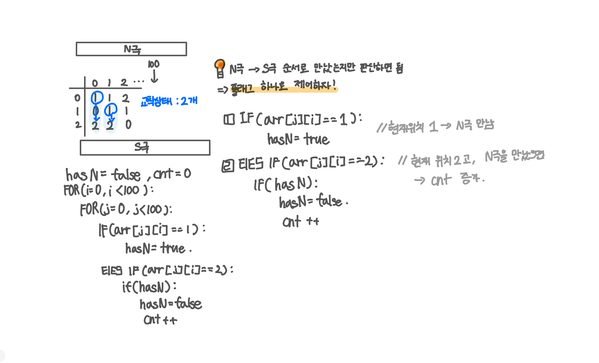

<br>

---

[1220. [S/W 문제해결 기본] 5일차 - Magnetic](https://swexpertacademy.com/main/code/problem/problemDetail.do?contestProbId=AV14hwZqABsCFAYD)

---

<br>

# 🔍 문제 풀이

## 문제 도식화

한 열에 교착상태가 2개 이상일 수도 있기 때문에 flag를 사용하는 것



<br><br>

# 💻 전체 코드

```java
import java.io.*;
import java.util.*;

public class Solution {
    public static void main(String[] args) throws IOException {
        BufferedReader br = new BufferedReader(new InputStreamReader(System.in));

        int t = 10;
        for(int tc=1; tc<=t; tc++) {
            int n = Integer.parseInt(br.readLine());

            int[][] arr = new int[n][n];
            for(int i=0; i<n; i++){
                StringTokenizer st = new StringTokenizer(br.readLine());
                for(int j=0; j<n; j++){
                    arr[i][j] = Integer.parseInt(st.nextToken());
                }
            }

            int cnt = 0;

            for(int i=0; i<n; i++){
                boolean hasN = false;

                for(int j=0; j<n; j++){
                    if(arr[j][i] == 1){ // 아래로 (N극 성질)
                        hasN = true;
                    }
                    else if(arr[j][i] == 2){// 위로 (S극 성질)
                        if(hasN){
                            hasN = false;
                            cnt++;
                        }
                    }
                }
            }

            System.out.print("#" + tc + " ");
            System.out.println(cnt);

        }
    }

}
```

<br>
