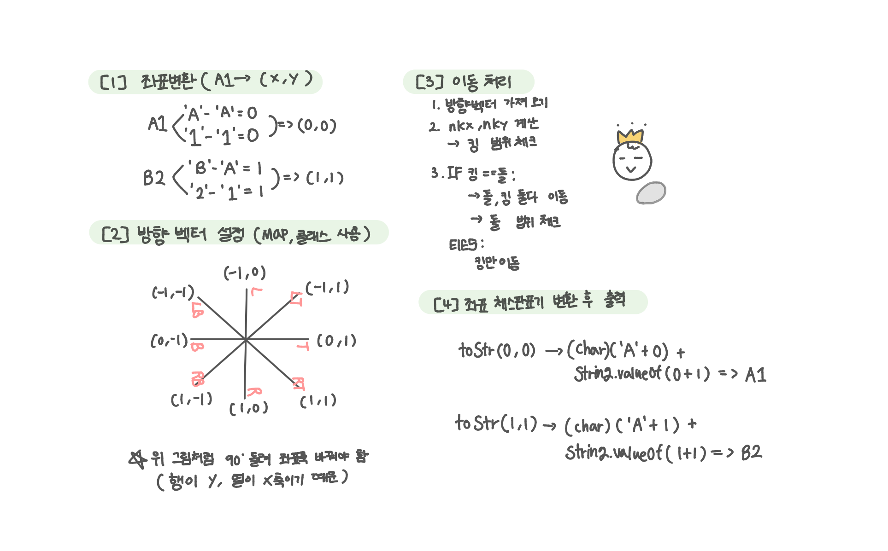

<br>

---

[https://www.acmicpc.net/problem/1063](https://www.acmicpc.net/problem/1063)

---

<br>

# 🔍 문제 풀이

## 문제 도식화

체스판 좌표계는 우리가 흔히 쓰는 배열 좌표계와 달리 y축이 위로 증가하므로, 방향 벡터를 정의할 때는 좌표축을 90도 돌린 듯이 생각해야 한다. (오른쪽은 (1,0 ), 위쪽은 (0, 1))



<br><br>

# 💻 전체 코드

특정 문자의 좌표는 **map**으로, 좌표는 x, y 값을 편하게 관리하기 위해 **클래스**로 처리하자.

```java
import java.io.*;
import java.util.*;

public class Main {
    static Map<String, Pos> dir = new HashMap<>();
    static Pos k, s;

    public static void main(String[] args) throws IOException {
        BufferedReader br = new BufferedReader(new InputStreamReader(System.in));

        StringTokenizer st = new StringTokenizer(br.readLine());
        String king = st.nextToken();
        String stone = st.nextToken();
        int n = Integer.parseInt(st.nextToken());

        initDir();

        // 좌표 변환
        k = toPos(king);
        s = toPos(stone);

        for(int i=0; i<n; i++){
            String cmd = br.readLine();
            move(cmd);
        }

        // 체스판 표기로 변환
        System.out.println(toStr(k));
        System.out.println(toStr(s));
    }

    static void move(String cmd){
        Pos d = dir.get(cmd);

        int nkx = k.x + d.x;
        int nky = k.y + d.y;

        // 킹과 돌의 좌표가 같으면 -> 돌도 같은 방향으로 밀기
        if(nkx < 0 || nkx >= 8 || nky < 0 || nky >= 8) return;
        if(nkx == s.x && nky == s.y){
            int nsx = s.x + d.x;
            int nsy = s.y + d.y;

            if(nsx < 0 || nsx >= 8 || nsy < 0 || nsy >= 8) return;

            // 둘 다 이동
            k.x = nkx;
            k.y = nky;
            s.x = nsx;
            s.y = nsy;
        }else{
            // 킹만 이동
            k.x = nkx;
            k.y = nky;
        }
    }

    static Pos toPos(String s){
        int x = s.charAt(0) - 'A';
        int y = s.charAt(1) - '1';
        return new Pos(x, y);
    }

    static String toStr(Pos p){
        return (char)(p.x + 'A') + String.valueOf(p.y + 1) ;
    }

    // 방향 벡터 설정
    static void initDir(){
        dir.put("R",  new Pos( 1,  0));
        dir.put("L",  new Pos(-1,  0));
        dir.put("B",  new Pos( 0, -1));
        dir.put("T",  new Pos( 0,  1));
        dir.put("RT", new Pos( 1,  1));
        dir.put("LT", new Pos(-1,  1));
        dir.put("RB", new Pos( 1, -1));
        dir.put("LB", new Pos(-1, -1));
    }

    static class Pos{
        int x, y;

        Pos(int x, int y){
            this.x = x;
            this.y = y;
        }
    }
}
```

<br>
