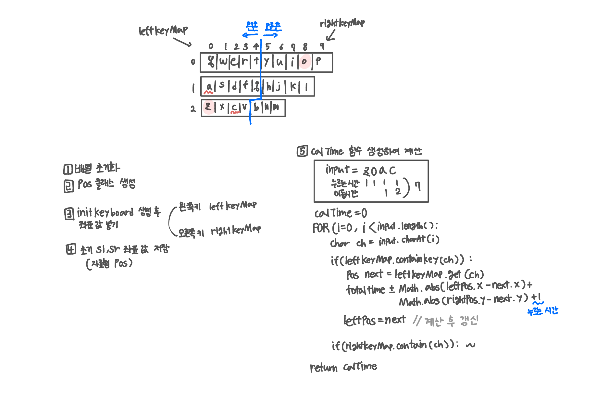

<br>

---

[https://www.acmicpc.net/problem/20436](https://www.acmicpc.net/problem/20436)

---

<br>

# 🔍 문제 풀이

## 문제 도식화



<br><br>

# 💻 전체 코드

```java
import java.io.*;
import java.util.*;

public class Main {
    static Map<Character, Pos> leftKeyMap = new HashMap<>();
    static Map<Character, Pos> rightKeyMap = new HashMap<>();
    static Pos leftPos, rightPos;

    public static void main(String[] args) throws IOException {
        BufferedReader br = new BufferedReader(new InputStreamReader(System.in));

        StringTokenizer st = new StringTokenizer(br.readLine());
        char sl = st.nextToken().charAt(0); // 왼손 시작 키
        char sr = st.nextToken().charAt(0); // 오른손 시작 키

        String input = br.readLine();

        initKeyboard();

        // 시작 위치 지정
        leftPos = leftKeyMap.get(sl);
        rightPos = rightKeyMap.get(sr);

        int result = calTime(input);
        System.out.println(result);
    }


    static int calTime(String s){
        int totalTime = 0;

        for(int i=0; i<s.length(); i++){
            char ch = s.charAt(i);

            if (leftKeyMap.containsKey(ch)) {
                Pos next = leftKeyMap.get(ch);
                totalTime += Math.abs(leftPos.x - next.x) + Math.abs(leftPos.y - next.y) + 1;
                leftPos = next;
            } else {
                Pos next = rightKeyMap.get(ch);
                totalTime += Math.abs(rightPos.x - next.x) + Math.abs(rightPos.y - next.y) + 1;
                rightPos = next;
            }
        }
        return totalTime;
    }

    static void initKeyboard(){
        // 왼손 키
        leftKeyMap.put('q', new Pos(0, 0));
        leftKeyMap.put('w', new Pos(0, 1));
        leftKeyMap.put('e', new Pos(0, 2));
        leftKeyMap.put('r', new Pos(0, 3));
        leftKeyMap.put('t', new Pos(0, 4));
        leftKeyMap.put('a', new Pos(1, 0));
        leftKeyMap.put('s', new Pos(1, 1));
        leftKeyMap.put('d', new Pos(1, 2));
        leftKeyMap.put('f', new Pos(1, 3));
        leftKeyMap.put('g', new Pos(1, 4));
        leftKeyMap.put('z', new Pos(2, 0));
        leftKeyMap.put('x', new Pos(2, 1));
        leftKeyMap.put('c', new Pos(2, 2));
        leftKeyMap.put('v', new Pos(2, 3));

        // 오른손 키
        rightKeyMap.put('y', new Pos(0, 5));
        rightKeyMap.put('u', new Pos(0, 6));
        rightKeyMap.put('i', new Pos(0, 7));
        rightKeyMap.put('o', new Pos(0, 8));
        rightKeyMap.put('p', new Pos(0, 9));
        rightKeyMap.put('h', new Pos(1, 5));
        rightKeyMap.put('j', new Pos(1, 6));
        rightKeyMap.put('k', new Pos(1, 7));
        rightKeyMap.put('l', new Pos(1, 8));
        rightKeyMap.put('b', new Pos(2, 4));
        rightKeyMap.put('n', new Pos(2, 5));
        rightKeyMap.put('m', new Pos(2, 6));
    }

    static class Pos{
        int x;
        int y;

        public Pos(int x, int y){
            this.x = x;
            this.y = y;
        }
    }
}
```

<br>
