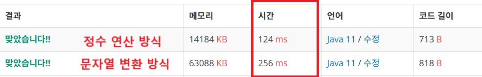

<br>

---

[https://www.acmicpc.net/problem/2231](https://www.acmicpc.net/problem/2231)

---

<br>

# 🔍 문제 풀이

## 풀이 방법

> 자릿수의 합 구하는 두 가지 방법

1. **문자열 변환 방식**
   - 숫자를 문자열로 바꿔 각 문자를 더함
2. **정수 연산 방식**
   - 나머지(%)와 나눗셈(/)으로 자릿수를 더함

<br>

처음엔 문자열 방식으로 풀었지만, 정수 연산 방식이 더 빠르고 다른 문제에도 활용하기 좋으니 숙지하는 게 좋을 것 같다.



<br><br>

# 💻 전체 코드

## 문자열 방식

```java
import java.io.*;
import java.util.*;

public class Main {
    static int n;

    public static void main(String[] args) throws IOException {
        BufferedReader br = new BufferedReader(new InputStreamReader(System.in));

        n = Integer.parseInt(br.readLine());
        System.out.println(found());
    }

    static int found(){
        int ans = 0;
        for(int k=0; k<n; k++){
            int sum = k;

            String s = String.valueOf(k);
            for(int i=0; i<s.length(); i++){
                char ch = s.charAt(i);
                sum += ch - '0';
            }
            // 자리수 합 모두 더한 후에 비교해야함!
            // 예) k=19인 경우 19+1 = 20이 되어 19 반환하지만 생성자 없음
            if(sum == n) return k;
        }
        return 0;
    }
}
```

<br>

## 정수 연산 방식

```java
static int found() {
    for (int k = 0; k < n; k++) {
        int sum = k;
        int temp = k;
        // t의 각 자릿수를 sum에 더하기
        while (temp > 0) {
            sum += temp % 10; // 1의자리 더하기
            temp /= 10;       // 자리수 줄이기
        }
        if (sum == n) return k;
    }
    return 0;
}
```

<br>
