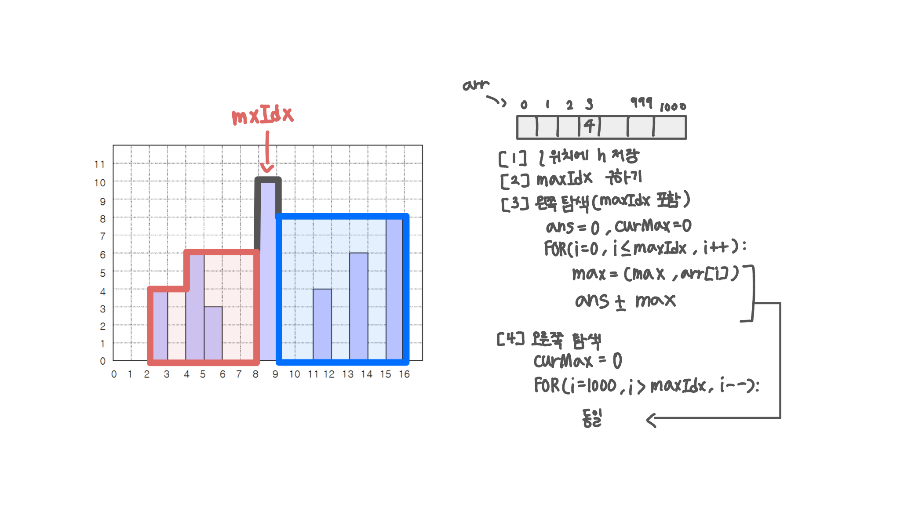

<br>

---

[https://www.acmicpc.net/problem/2304](https://www.acmicpc.net/problem/2304)

---

<br>

# 🔍 문제 풀이

## 문제 도식화

> maxIdx 찾고, 왼쪽/오른쪽에서 각각 현재까지의 최대 높이를 누적해 면적 합 구하기

풀이 과정이 쉽게 떠오르지 않았던 문제였다.



<br><br>

# 💻 전체 코드

```java
import java.io.*;
import java.util.*;

public class Main {
    public static void main(String[] args) throws IOException {
        BufferedReader br = new BufferedReader(new InputStreamReader(System.in));

        int n = Integer.parseInt(br.readLine());

        int[] arr = new int[1001];

        while (n-- > 0) {
            StringTokenizer st = new StringTokenizer(br.readLine());
            int l = Integer.parseInt(st.nextToken());
            int h = Integer.parseInt(st.nextToken());

            arr[l] = h;
        }

        int ans = 0;

        // maxIdx 찾기
        int maxIdx = 0;
        for(int i=0; i<1001; i++){
            if(arr[i] > arr[maxIdx]) maxIdx = i;
        }

        // 왼쪽 탐색 (maxIdx 포함)
        int curMax = 0;
        for(int i=0; i<=maxIdx; i++){
            curMax = Math.max(curMax, arr[i]);
            ans += curMax;
        }

        // 오른쪽 탐색 (역방향)
        curMax = 0;
        for(int i=1000; i>maxIdx; i--){
            curMax = Math.max(curMax, arr[i]);
            ans += curMax;
        }

        System.out.println(ans);
    }
}
```

<br>
