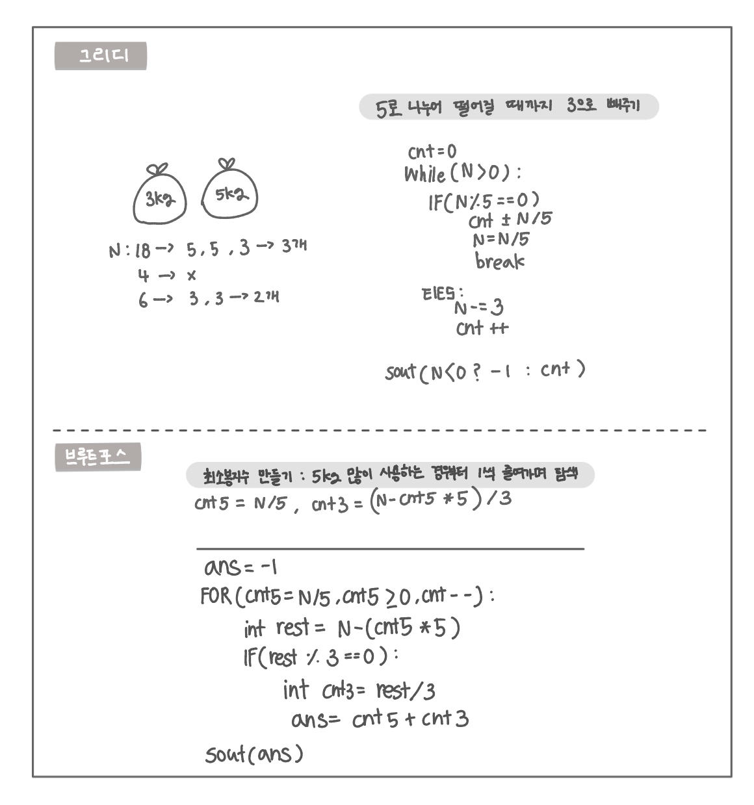

<br>

---

[https://www.acmicpc.net/problem/2839](https://www.acmicpc.net/problem/2839)

---

<br>

# 🔍 문제 풀이

## 알고리즘 선택

> 그리디

5kg 봉투로 최대한 채우고, 남으면 3kg 봉투로 채우기

<br>

> 브루트포스

5kg 봉투를 최대한 많이 쓰는 경우부터 0개까지 줄여가며 나머지가 3으로 나누어떨어지는지 확인하며 시도

<br>

## 문제 도식화



<br><br>

# 💻 전체 코드

## 그리디

```java
import java.io.*;
import java.util.*;

public class Main {
    public static void main(String[] args) throws IOException {
        BufferedReader br = new BufferedReader(new InputStreamReader(System.in));

        int n = Integer.parseInt(br.readLine());
        int cnt = 0;
        while(n > 0){
            if(n%5 == 0){ // 5로 나누어떨어지면 전부 5kg 봉투로 채움
                cnt += n/5;
                n/=5;
                break;
            }else{
                n-=3; // 아니면 3kg 봉투 하나 사용
                cnt++;
            }
        }
        System.out.println(n<0 ? -1 : cnt);

    }
}
```

<br>

## 브루트포스

5로 딱 떨어지는 경우에도 rest가 0이라 if가 실행됨 (rest는 항상 실행)

```java
import java.io.*;

public class Main {
    public static void main(String[] args) throws IOException {
        BufferedReader br = new BufferedReader(new InputStreamReader(System.in));

        int n = Integer.parseInt(br.readLine());

        int ans = -1;

        // 5kg 봉투 최대 개수부터 0까지 시도
        for (int cnt5 = n / 5; cnt5 >= 0; cnt5--) {
            int rest = n - cnt5 * 5; // 남은 무게
            if (rest % 3 == 0) {
                int cnt3 = rest / 3;
                ans = cnt5 + cnt3;
                break;
            }
        }
        System.out.println(ans);
    }
}
```

<br >
