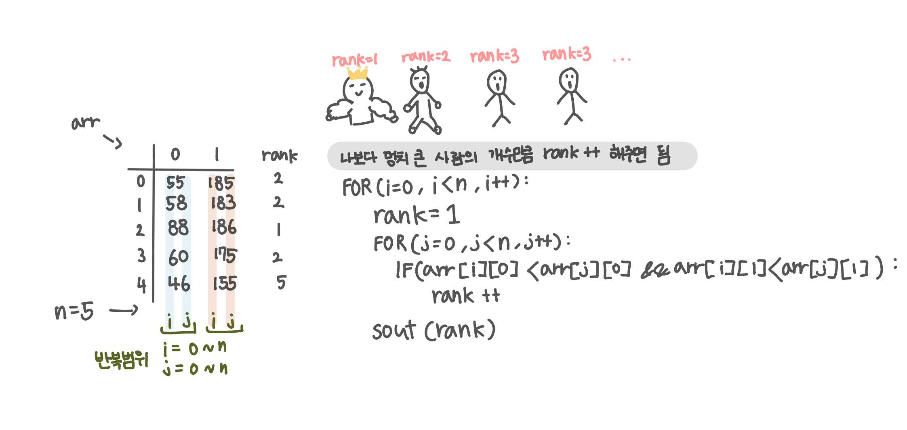

<br>

---

[https://www.acmicpc.net/problem/7568](https://www.acmicpc.net/problem/7568)

---

<br>

# 🔍 문제 풀이

## 문제 도식화



<br><br>

# 💻 전체 코드

```java
import java.io.*;
import java.util.*;

public class Main {
    public static void main(String[] args) throws IOException {
        BufferedReader br = new BufferedReader(new InputStreamReader(System.in));

        int n = Integer.parseInt(br.readLine());
        int[][] arr = new int[n][2];

        for(int i=0; i<n; i++){
            StringTokenizer st = new StringTokenizer(br.readLine());
            arr[i][0] = Integer.parseInt(st.nextToken()); // 몸무게
            arr[i][1] = Integer.parseInt(st.nextToken()); // 키
        }

        for(int i=0; i<n; i++){
            int rank = 1;
            for(int j=0; j<n; j++){
                if(arr[i][0] < arr[j][0] && arr[i][1] < arr[j][1]) rank ++;
            }
            System.out.print(rank + " ");
        }
    }
}
```

<br>
