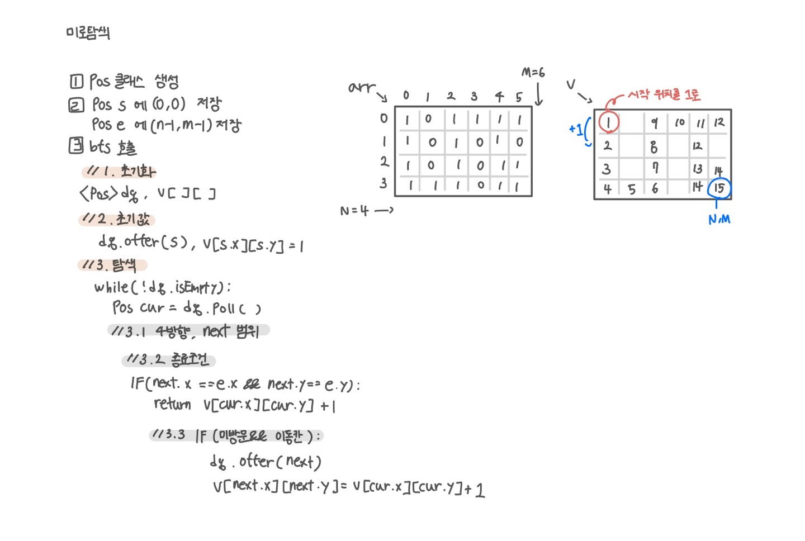

<br>

---

[https://www.acmicpc.net/problem/2178](https://www.acmicpc.net/problem/2178)

---

<br>

# 🔍 문제 풀이

## 문제 도식화



<br><br>

# 💻 코드

## 전체 코드

```java
import java.io.*;
import java.util.*;

public class Main {
    static int[][] graph;
    static int[][] visited;
    static int[] dx = {-1, 1, 0, 0};
    static int[] dy = {0, 0, -1, 1};

    static int n, m;

    public static void main(String[] args) throws IOException {
        BufferedReader br = new BufferedReader(new InputStreamReader(System.in));

        StringTokenizer st = new StringTokenizer(br.readLine());
        n = Integer.parseInt(st.nextToken());
        m = Integer.parseInt(st.nextToken());

        graph = new int[n][m];
        for(int i=0; i<n; i++) {
            String line = br.readLine();
            for (int j = 0; j < m; j++) {
                graph[i][j] = line.charAt(j) - '0';
            }
        }

        int ans = bfs();
        System.out.println(ans);
    }

    static int bfs(){
        // 1
        Deque<int[]> dq = new ArrayDeque<>();
        visited = new int[n][m];

        // 2
        dq.offer(new int[]{0, 0});
        visited[0][0] = 1;

        // 3
        while(!dq.isEmpty()){
            int[] cur = dq.poll();
            int cx = cur[0];
            int cy = cur[1];

            // 종료 조건 (항상 여기서 체크하자 -> 깔끔)
            if(cx == n-1 && cy == m-1){
                return visited[n-1][m-1];
            }

            // 4방향
            for(int d = 0; d<4; d++){
                int nx = cx + dx[d];
                int ny = cy + dy[d];

                // 범위 체크
                if(nx < 0 || nx >= n || ny < 0 || ny >= m) continue;

                if(graph[nx][ny] == 1 && visited[nx][ny] == 0){
                    visited[nx][ny] = visited[cx][cy] + 1;
                    dq.offer(new int[]{nx, ny});
                }
            }
        }

        return 0;
    }
}
```

<br>

## 스켈레톤 코드

```java
import java.io.*;
import java.util.*;

public class Main {
    static int[][] graph;
    static int[][] visited;
    static int[] dx = {-1, 1, 0, 0};
    static int[] dy = {0, 0, -1, 1};

    static int n, m;

    public static void main(String[] args) throws IOException {
        BufferedReader br = new BufferedReader(new InputStreamReader(System.in));

        StringTokenizer st = new StringTokenizer(br.readLine());
        n = Integer.parseInt(st.nextToken());
        m = Integer.parseInt(st.nextToken());

        graph = new int[n][m];
        for(int i=0; i<n; i++) {
            String line = br.readLine();
            for (int j = 0; j < m; j++) {
                graph[i][j] = line.charAt(j) - '0';
            }
        }

        int ans = bfs();
        System.out.println(ans);
    }

    static int bfs(){

        return 0;
    }
}
```

<br>
