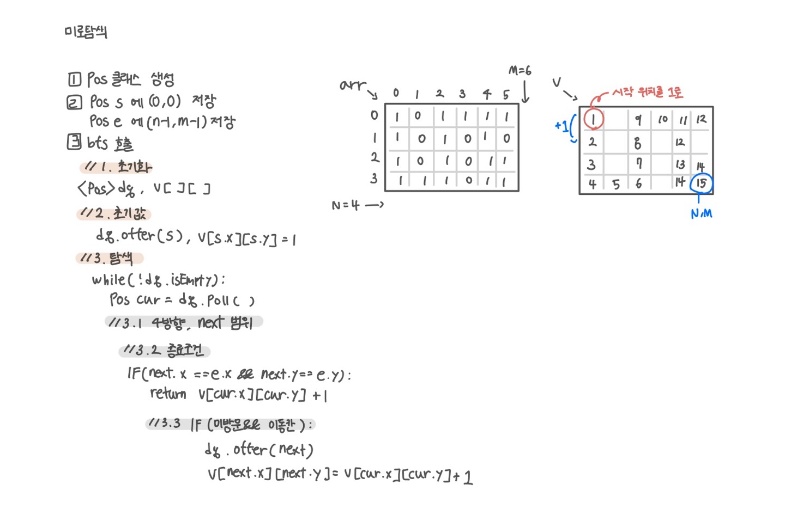

<br>

---

[https://www.acmicpc.net/problem/2178](https://www.acmicpc.net/problem/2178)

---

<br>

# 🔍 문제 풀이

## 문제 도식화



<br><br>

# 💻 코드

## 전체 코드

### 클래스 사용

```java
import java.io.*;
import java.util.*;

public class Main {
    static int[] dx = {-1, 1, 0, 0};
    static int[] dy = {0, 0, -1, 1};

    static int n, m;
    static int[][] arr;
    static int[][] v;
    static Pos s, e;

    public static void main(String[] args) throws IOException {
        BufferedReader br = new BufferedReader(new InputStreamReader(System.in));

        StringTokenizer st = new StringTokenizer(br.readLine());
        n = Integer.parseInt(st.nextToken());
        m = Integer.parseInt(st.nextToken());

        arr = new int[n][m];

        for (int i = 0; i < n; i++) {
            String line = br.readLine();
            for (int j = 0; j < m; j++) {
                arr[i][j] = line.charAt(j) - '0';
            }
        }
        s = new Pos(0, 0);
        e = new Pos(n-1, m-1);

        int ans = bfs();
        System.out.println(ans);

    }

    static int bfs() {
        // 1. 초기화
        Deque<Pos> dq = new ArrayDeque<>();
        v = new int[n][m];

        // 2. 초기값
        dq.offer(s);
        v[s.x][s.y] = 1;

        // 3. 탐색
        while(!dq.isEmpty()){
            Pos cur = dq.poll();

            // 3.1 4방향, next 범위
            for(int d=0; d<4; d++){
                Pos next = new Pos(cur.x + dx[d], cur.y + dy[d]);
                if(next.x < 0 || next.x >= n || next.y < 0 || next.y >= m) continue;

                // 3.2 종료 조건
                if(next.x == e.x && next.y == e.y) {
                    return v[cur.x][cur.y] + 1; // 도착 칸 포함
                }

                // 3.3 미방문 && 이동칸
                if(arr[next.x][next.y] == 1 && v[next.x][next.y] == 0){
                    dq.offer(next);
                    v[next.x][next.y] = v[cur.x][cur.y] + 1;
                }
            }
        }


        return 0;
    }

    static class Pos {
        int x, y;

        Pos(int x, int y) {
            this.x = x;
            this.y = y;
        }
    }
}
```

<br>

### 클래스 미사용

```java
import java.io.*;
import java.util.*;

public class Main {
    static int[][] arr;
    static int[][] v;
    static int[] dx = {-1, 1, 0, 0};
    static int[] dy = {0, 0, -1, 1};

    static int n, m;

    public static void main(String[] args) throws IOException {
        BufferedReader br = new BufferedReader(new InputStreamReader(System.in));

        StringTokenizer st = new StringTokenizer(br.readLine());
        n = Integer.parseInt(st.nextToken());
        m = Integer.parseInt(st.nextToken());

        arr = new int[n][m];
        for(int i=0; i<n; i++) {
            String line = br.readLine();
            for (int j = 0; j < m; j++) {
                arr[i][j] = line.charAt(j) - '0';
            }
        }

        int ans = bfs();
        System.out.println(ans);
    }

    static int bfs(){
        // 1. 초기화
        Deque<int[]> dq = new ArrayDeque<>();
        v = new int[n][m];

        // 2. 초기값
        dq.offer(new int[]{0, 0});
        v[0][0] = 1;

        // 3. 탐색
        while(!dq.isEmpty()){
            int[] cur = dq.poll();
            int cx = cur[0];
            int cy = cur[1];

            // 3.1 4방향, nx와 ny 범위
            for(int d=0; d<4; d++){
                int nx = cx + dx[d];
                int ny = cy + dy[d];

                if(nx < 0 || nx >= n || ny < 0 || ny >= m) continue;

                // 3.2 종료 조건
                if(nx == n-1 && ny == m-1){
                    return v[cx][cy] + 1;
                }

                // 3.3 미방문 && 이동칸
                if(arr[nx][ny] == 1 && v[nx][ny] == 0){
                    dq.offer(new int[]{nx, ny});
                    v[nx][ny] = v[cx][cy] + 1;
                }
            }
        }


        return 0;
    }
}
```

<br>

## 스켈레톤 코드

```java
import java.io.*;
import java.util.*;

public class Main {
    static int[][] arr;
    static int[][] v;
    static int[] dx = {-1, 1, 0, 0};
    static int[] dy = {0, 0, -1, 1};

    static int n, m;

    public static void main(String[] args) throws IOException {
        BufferedReader br = new BufferedReader(new InputStreamReader(System.in));

        StringTokenizer st = new StringTokenizer(br.readLine());
        n = Integer.parseInt(st.nextToken());
        m = Integer.parseInt(st.nextToken());

        arr = new int[n][m];
        for(int i=0; i<n; i++) {
            String line = br.readLine();
            for (int j = 0; j < m; j++) {
                arr[i][j] = line.charAt(j) - '0';
            }
        }

        int ans = bfs();
        System.out.println(ans);
    }

    static int bfs(){

        return 0;
    }
}
```

<br>
