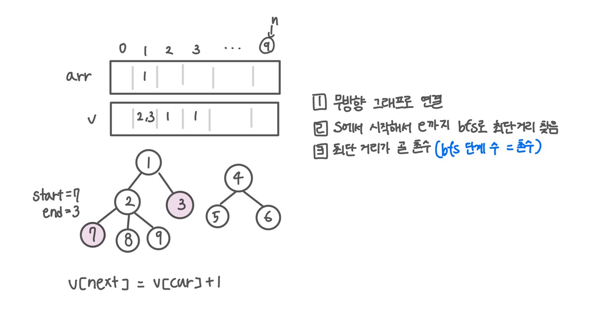

<br>

---

[https://www.acmicpc.net/problem/2644](https://www.acmicpc.net/problem/2644)

---

<br>

# 🔍 문제 풀이

## 문제 도식화

`visited` 배열은 방문 여부 체크, 시작점에서 그 노드까지 몇 번 거쳐왔는지 저장



<br><br>

# 💻 코드

## 전체 코드

```java
import java.io.*;
import java.util.*;

public class Main {
    static List<Integer>[] graph;
    static int[] visited;
    static int n;

    public static void main(String[] args) throws IOException {
        BufferedReader br = new BufferedReader(new InputStreamReader(System.in));

        // 인접 리스트 또는 인접 행렬 초기화 (무방향)
        n = Integer.parseInt(br.readLine()); // 노드 수
        graph = new ArrayList[n+1];
        for(int i=1; i<=n; i++) graph[i] = new ArrayList<>();

        StringTokenizer st = new StringTokenizer(br.readLine());
        int s = Integer.parseInt(st.nextToken());
        int e = Integer.parseInt(st.nextToken());

        int m = Integer.parseInt(br.readLine()); // 간선 수
        for(int i=0; i<m; i++){
            st = new StringTokenizer(br.readLine());
            int x = Integer.parseInt(st.nextToken());
            int y = Integer.parseInt(st.nextToken());

            graph[x].add(y);
            graph[y].add(x);
        }

        int ans = bfs(s, e);
        System.out.println(ans);
    }

    static int bfs(int s, int e){
        // 1
        Deque<Integer> dq = new ArrayDeque<>();
        visited = new int[n+1];

        // 2
        dq.offer(s);
        visited[s] = 1; // 시작 촌수 = 1

        // 3
        while(!dq.isEmpty()){
            int cur = dq.poll();

            // 종료조건
            if (cur == e) return visited[cur] - 1; // 촌수 반환 (시작 1에서 했으니 실제 촌수는 -1)

            for(int next:graph[cur]){
                if(visited[next] == 0){
                    dq.offer(next);
                    visited[next] = visited[cur] + 1;
                }
            }
        }

        return -1;
    }
}
```

<br>

## 스켈레톤 코드

```java
import java.io.*;
import java.util.*;

public class Main {
    static List<Integer>[] graph;
    static int[] visited;
    static int n;

    public static void main(String[] args) throws IOException {
        BufferedReader br = new BufferedReader(new InputStreamReader(System.in));
        n = Integer.parseInt(br.readLine());

        // 인접 리스트 또는 인접 행렬 초기화 (무방향)


        StringTokenizer st = new StringTokenizer(br.readLine());
        int s = Integer.parseInt(st.nextToken());
        int e = Integer.parseInt(st.nextToken());

        int m = Integer.parseInt(br.readLine()); // 간선 수
        for(int i=0; i<m; i++){
            st = new StringTokenizer(br.readLine());
            int x = Integer.parseInt(st.nextToken());
            int y = Integer.parseInt(st.nextToken());

            graph[x].add(y);
            graph[y].add(x);
        }

        int ans = bfs(s, e);
        System.out.println(ans);
    }

    static int bfs(int s, int e){

    }
}
```

<br>
