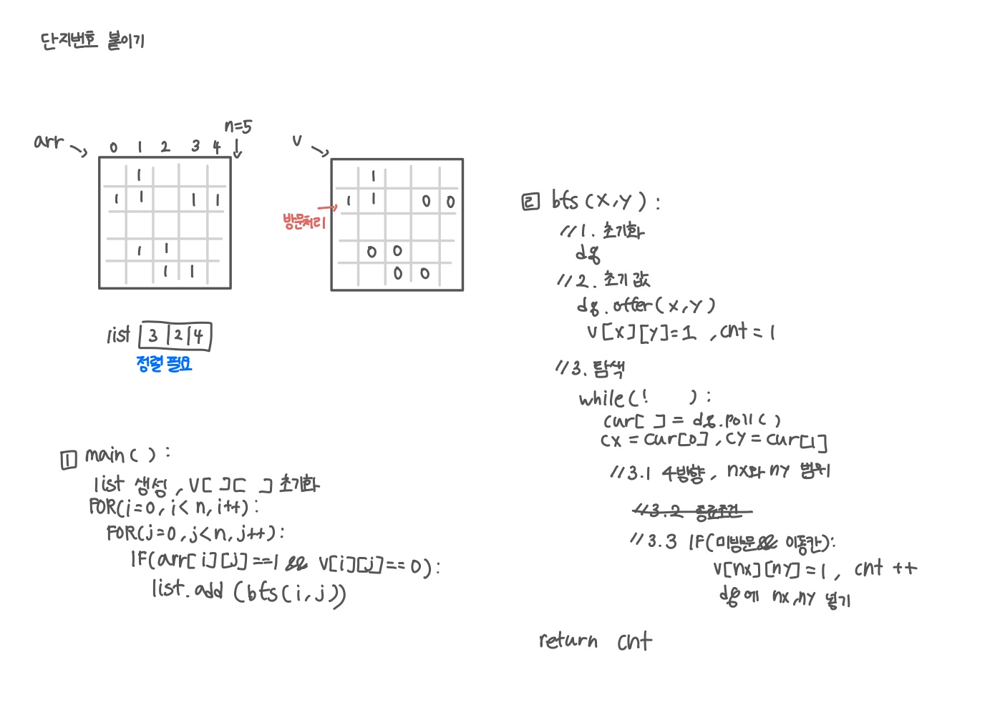

<br>

---

[https://www.acmicpc.net/problem/2667](https://www.acmicpc.net/problem/2667)

---

<br>

# 🔍 문제 풀이

## 문제 도식화

이 문제에서 `visited`는 안 써도 되지만, 원본을 유지하기 위해 따로 쓰는 게 좋다.



<br><br>

# 💻 코드

## 전체 코드

```java
import java.io.*;
import java.util.*;

public class Main {
    static int[][] graph;
    static int[][] visited;

    static int[] dx = {-1, 1, 0, 0};
    static int[] dy = {0, 0, -1, 1};

    static int n;

    public static void main(String[] args) throws IOException {
        BufferedReader br = new BufferedReader(new InputStreamReader(System.in));

        StringTokenizer st = new StringTokenizer(br.readLine());
        n = Integer.parseInt(st.nextToken());
        graph = new int[n][n];
        visited = new int[n][n];

        for(int i=0; i<n; i++){
            String line = br.readLine();
            for(int j=0; j<n; j++){
                graph[i][j] = line.charAt(j) - '0';
            }
        }

        List<Integer> list = new ArrayList<>();

        for(int i=0; i<n; i++){
            for(int j=0; j<n; j++){
                if(graph[i][j] == 1 && visited[i][j] == 0){
                    list.add(bfs(i, j));
                }
            }
        }

        Collections.sort(list);

        System.out.println(list.size());
        for(int val:list){
            System.out.println(val);
        }
    }

    static int bfs(int sx, int sy){
        // 1
        Deque<int[]> dq = new ArrayDeque<>();
        int cnt = 1;

        // 2
        dq.offer(new int[]{sx, sy});
        visited[sx][sy] = 1;

        while(!dq.isEmpty()){
            int[] cur = dq.poll();
            int cx = cur[0];
            int cy = cur[1];

            for(int d=0; d<4; d++){
                int nx = cx + dx[d];
                int ny = cy + dy[d];

                if(nx < 0 || nx >= n || ny < 0 || ny >= n) continue;

                if(graph[nx][ny] == 1 && visited[nx][ny] == 0){
                    visited[nx][ny] = 1;
                    dq.offer(new int[]{nx, ny});
                    cnt ++;
                }
            }
        }
        return cnt;
    }
}
```

<br>

## 스켈레톤 코드

```java
import java.io.*;
import java.util.*;

public class Main {
    static int[][] graph;
    static int[][] visited;

    static int[] dx = {-1, 1, 0, 0};
    static int[] dy = {0, 0, -1, 1};

    static int n;

    public static void main(String[] args) throws IOException {
        BufferedReader br = new BufferedReader(new InputStreamReader(System.in));

        StringTokenizer st = new StringTokenizer(br.readLine());
        n = Integer.parseInt(st.nextToken());
        graph = new int[n][n];
        visited = new int[n][n];

        for(int i=0; i<n; i++){
            String line = br.readLine();
            for(int j=0; j<n; j++){
                graph[i][j] = line.charAt(j) - '0';
            }
        }

        List<Integer> list = new ArrayList<>();


        Collections.sort(list);
        System.out.println(list.size());
        for(int val:list){
            System.out.println(val);
        }
    }

    static int bfs(int sx, int sy){

    }
}
```

<br>
