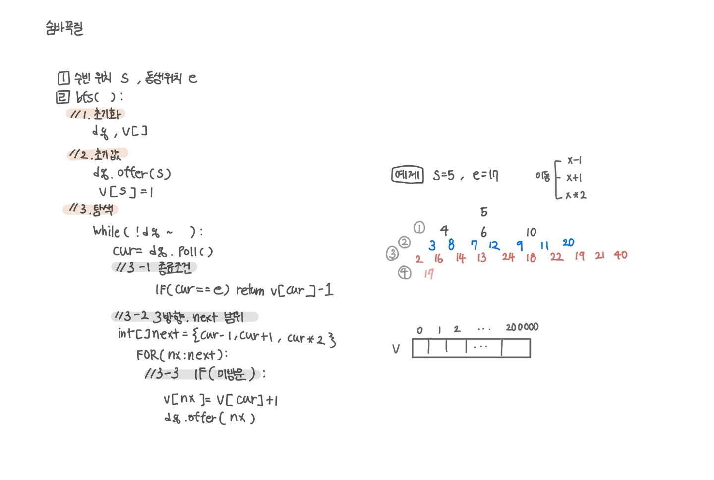

<br>

---

[https://www.acmicpc.net/problem/1697](https://www.acmicpc.net/problem/1697)

---

<br>

# 🔍 문제 풀이

## 문제 도식화

`cur = 100000`일 때 순간이동하면 `200_000`까지 갈 수 있으므로, 배열 크기를 `200_001`로 잡았다



<br><br>

# 💻 코드

## 전체 코드

문제를 정확히 파악하고, s, e처럼 내가 자주 쓰는 변수명으로 변환하여 접근하자!

```java
import java.io.*;
import java.util.*;

public class Main {
    static int s, e;
    static int[] arr;
    static int[] visited;

    public static void main(String[] args) throws IOException {
        BufferedReader br = new BufferedReader(new InputStreamReader(System.in));

        StringTokenizer st = new StringTokenizer(br.readLine());
        s = Integer.parseInt(st.nextToken()); // 수빈 위치
        e = Integer.parseInt(st.nextToken()); // 동생 위치

        arr = new int[200_001];

        int ans = bfs();
        System.out.println(ans);
    }

    static int bfs() {
        // 1. 초기화
        Deque<Integer> dq = new ArrayDeque<>();
        visited = new int[200_001];

        // 2. 시작점 세팅
        dq.offer(s);
        visited[s] = 1;

        // 3. 탐색 루프
        while(!dq.isEmpty()){
            int cur = dq.poll();

            // 3-1. 종료 조건
            if(cur == e) return visited[e]-1;

            // 3-2. 3방향 탐색
            int[] next = {cur - 1, cur + 1, cur * 2};
            for(int nx : next){
                // 3-3. 범위내, 미방문
                if(nx >= 0 && nx <=200_000 && visited[nx] == 0){
                    dq.offer(nx);
                    visited[nx] = visited[cur] + 1;
                }
            }
        }
        return 0; // 도달 불가
    }
}
```

<br>

## 스켈레톤 코드

```java
import java.io.*;
import java.util.*;

public class Main {
    static int s, e;
    static int[] arr;
    static int[] visited;

    public static void main(String[] args) throws IOException {
        BufferedReader br = new BufferedReader(new InputStreamReader(System.in));

        StringTokenizer st = new StringTokenizer(br.readLine());
        s = Integer.parseInt(st.nextToken()); // 수빈 위치
        e = Integer.parseInt(st.nextToken()); // 동생 위치

        arr = new int[200_001];

        int ans = bfs();
        System.out.println(ans);
    }

    static int bfs() {


    }
}
```

<br>
