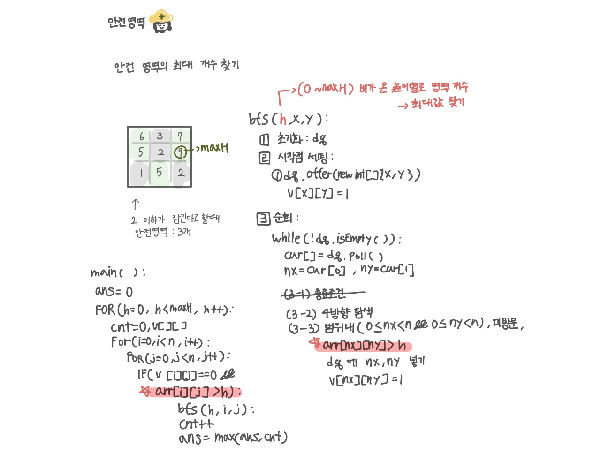

<br>

---

[https://www.acmicpc.net/problem/2468](https://www.acmicpc.net/problem/2468)

---

<br>

# 🔍 문제 풀이

## 문제 도식화

1. 비가 아예 안 오는 경우를 포함해야 하므로 h는 0부터 시작하기
2. 불필요한 상한 100 대신 입력의 최대 높이까지만 돌기
3. `v[][]`, `cnt` 초기화 위치 주의



<br><br>

# 💻 코드

## 전체 코드

```java
import java.io.*;
import java.util.*;

public class Main {
    static int n;
    static int[][] arr;
    static int[][] v;
    static int[] dx = {-1, 1, 0, 0};
    static int[] dy = {0, 0, -1, 1};

    public static void main(String[] args) throws IOException {
        BufferedReader br = new BufferedReader(new InputStreamReader(System.in));

        n = Integer.parseInt(br.readLine());
        arr = new int[n][n];

        int maxH = 0;
        for(int i=0; i<n; i++){
            StringTokenizer st = new StringTokenizer(br.readLine());
            for(int j=0; j<n; j++){
                arr[i][j] = Integer.parseInt(st.nextToken());
                maxH = Math.max(maxH, arr[i][j]);
            }
        }

        int ans = 0;
        for(int h = 0; h<=maxH; h++){
            // 높이 h마다 cnt , v 배열 리셋되야함!
            int cnt = 0;
            v = new int[n][n];

            for(int i = 0; i<n; i++){
                for(int j=0; j<n; j++){
                    if(v[i][j] == 0 && arr[i][j] > h){
                        bfs(h, i, j);
                        cnt++;
                    }
                }
            }
            ans = Math.max(ans, cnt);

        }

        System.out.println(ans);
    }

    static void bfs(int h, int x, int y) {
        // 1. 초기화
        Deque<int[]> dq = new ArrayDeque<>();

        // 2. 시작점 세팅
        dq.offer(new int[]{x, y});
        v[x][y] = 1;

        // 3. 순회
        while(!dq.isEmpty()){
            int[] cur = dq.poll();
            int cx = cur[0];
            int cy = cur[1];

            // 3-1 4방향 탐색
            for(int d = 0; d<4; d++){
                int nx = cx + dx[d];
                int ny = cy + dy[d];

                // 3-2 범위내, 미방문, > h
                if(0 <= nx && nx < n && 0<=ny && ny<n && v[nx][ny] == 0 && arr[nx][ny] > h){
                    dq.offer(new int[]{nx, ny});
                    v[nx][ny] = 1;
                }
            }

        }


    }
}
```

<br>

## 스켈레톤 코드

```java
import java.io.*;
import java.util.*;

public class Main {
    static int n;
    static int[][] arr;
    static int[][] v;
    static int[] dx = {-1, 1, 0, 0};
    static int[] dy = {0, 0, -1, 1};

    public static void main(String[] args) throws IOException {
        BufferedReader br = new BufferedReader(new InputStreamReader(System.in));

        n = Integer.parseInt(br.readLine());
        arr = new int[n][n];

        int maxH = 0;
        for(int i=0; i<n; i++){
            StringTokenizer st = new StringTokenizer(br.readLine());
            for(int j=0; j<n; j++){
                arr[i][j] = Integer.parseInt(st.nextToken());
                maxH = Math.max(maxH, arr[i][j]);
            }
        }

        int ans = 0;


        System.out.println(ans);
    }

    static void bfs(int h, int x, int y) {


    }
}
```

<br>
