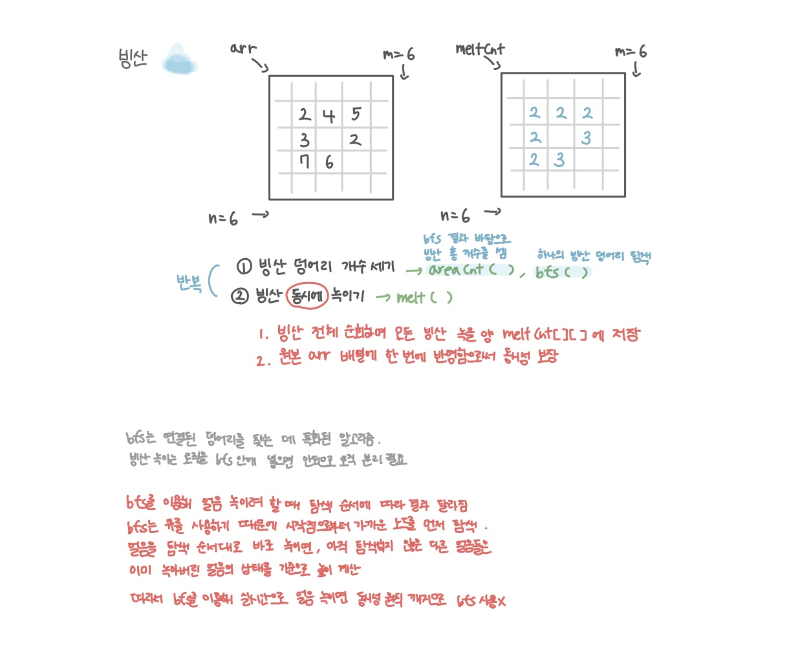

<br>

---

[https://www.acmicpc.net/problem/2573](https://www.acmicpc.net/problem/2573)

---

<br>

# 🔍 문제 풀이

## 문제 도식화



<br><br>

# 💻 코드

⭐ 순차적으로 처리하면서 녹이는게 아닌 한번에 녹여야 한다.<br>
(순차적으로 녹이면 앞에서 줄어든 값이 뒤 계산에 반영돼 결과가 달라지기 때문)

따라서 `meltCnt[][]`배열을 사용하여 **일괄 반영**하는 식으로 처리하였다.

## 전체 코드

```java
import java.io.*;
import java.util.*;

public class Main {
    static int n, m;
    static int[][] arr;
    static int[][] v;

    static int[] dx = {-1, 1, 0, 0};
    static int[] dy = {0, 0, -1, 1};

    public static void main(String[] args) throws IOException {
        // input
        BufferedReader br = new BufferedReader(new InputStreamReader(System.in));

        StringTokenizer st = new StringTokenizer(br.readLine());
        n = Integer.parseInt(st.nextToken());
        m = Integer.parseInt(st.nextToken());
        arr = new int[n][m];

        for(int i=0; i<n; i++) {
            st = new StringTokenizer(br.readLine());
            for(int j=0; j<m; j++){
                arr[i][j] = Integer.parseInt(st.nextToken());
            }
        }

        // solve
        process();
    }

    static void process() {
        int year = 0;
        while (true) {
            int cnt = areaCnt(); // 덩어리 개수 세기

            if (cnt >= 2) { // 두 덩어리 이상으로 분리된 경우
                System.out.println(year);
                return;
            }
            if (cnt == 0) { // 빙산이 모두 녹은 경우
                System.out.println(0);
                return;
            }

            melt(); // 빙산 녹이기
            year++; // 다음 연도로
        }
    }

    // 빙산 덩어리 개수 세기
    static int areaCnt() {
        int cnt = 0;
        v = new int[n][m]; // 1년 동안 빙산 전체 방문여부 기록

        for(int i=0; i<n; i++){
            for(int j=0; j<m; j++){
                if(arr[i][j] > 0 && v[i][j] == 0){
                    bfs(i, j);
                    cnt ++;
                }
            }
        }

        return cnt;
    }

    // BFS로 한 덩어리 방문
    static void bfs(int x, int y) {
        // 1. 초기화
        Deque<int[]> dq = new ArrayDeque<>();

        // 2. 초기값
        dq.offer(new int[]{x, y});
        v[x][y] = 1;

        // 3. 탐색
        while(!dq.isEmpty()) {
            int[] cur = dq.poll();
            int cx = cur[0];
            int cy = cur[1];

            // 3-1. 4방향, 범위내
            for(int d = 0; d<4; d++){
                int nx = cx + dx[d];
                int ny = cy + dy[d];

                if(nx < 0 || nx >= n || ny < 0 || ny >= m) continue;

                // 3-2. 다음위치 !=0, 미방문
                if(arr[nx][ny] != 0 && v[nx][ny] == 0) {
                    dq.offer(new int[]{nx, ny});
                    v[nx][ny] = 1;
                }
            }
        }
    }

    // 빙산 녹이기 (일괄 반영 중요)
    static void melt() {
        // 1. 인접 바다 개수 세어 meltCnt에 저장
        int[][] meltCnt = new int[n][m];

        for(int i=0; i<n; i++){
            for(int j=0; j<m; j++){

                int cnt = 0; // 빙산 하나에 대한 녹을 양 계산
                for(int d = 0; d<4; d++){
                    int nx = i + dx[d];
                    int ny = j + dy[d];

                    if(nx < 0 || nx >= n || ny < 0 || ny >= m) continue;
                    if(arr[nx][ny] == 0) cnt ++;
                }
                meltCnt[i][j] = cnt;
            }
        }

        // 2. 일괄 적용
        for(int i=0; i<n; i++) {
            for (int j = 0; j < m; j++) {
                arr[i][j] -= meltCnt[i][j];

                if(arr[i][j] < 0) {
                    arr[i][j] = 0;
                }
            }
        }
    }
}
```

<br>

## 스켈레톤 코드

```java
import java.io.*;
import java.util.*;

public class Main {
    static int n, m;
    static int[][] arr;
    static int[][] v;

    static int[] dx = {-1, 1, 0, 0};
    static int[] dy = {0, 0, -1, 1};

    public static void main(String[] args) throws IOException {
        BufferedReader br = new BufferedReader(new InputStreamReader(System.in));

        StringTokenizer st = new StringTokenizer(br.readLine());
        n = Integer.parseInt(st.nextToken());
        m = Integer.parseInt(st.nextToken());

        arr = new int[n][m];
        for(int i=0; i<n; i++){
            st = new StringTokenizer(br.readLine());
            for(int j=0; j<m; j++){
                arr[i][j] = Integer.parseInt(st.nextToken());
            }
        }


    }


}
```

<br>
