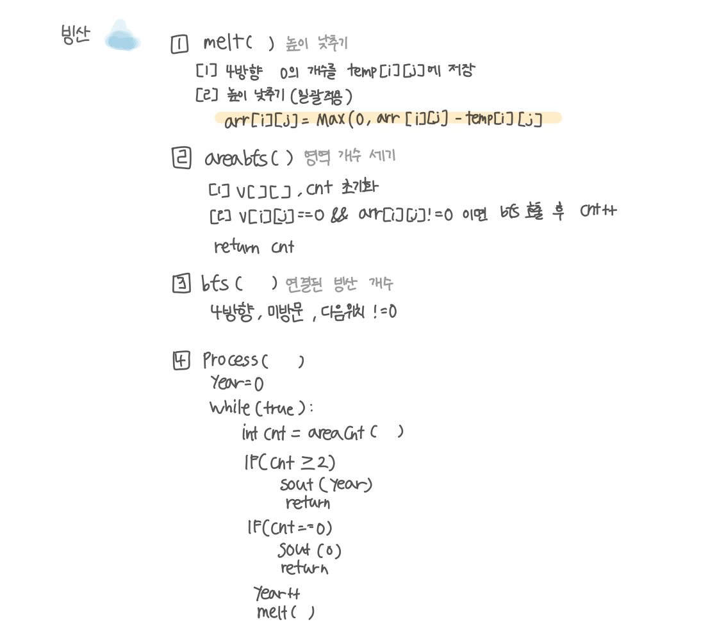

<br>

---

[https://www.acmicpc.net/problem/2573](https://www.acmicpc.net/problem/2573)

---

<br>

# 🔍 문제 풀이

## 문제 도식화



<br><br>

# 💻 코드

⭐ 순차적으로 처리하면서 녹이는게 아닌 한번에 녹여야 한다.<br>
(순차적으로 녹이면 앞에서 줄어든 값이 뒤 계산에 반영돼 결과가 달라지기 때문)

따라서 `temp[][]`배열을 사용하여 **일괄 반영**하는 식으로 처리하였다.

## 전체 코드

```java
import java.io.*;
import java.util.*;

public class Main {
    static int n, m;
    static int[][] arr;
    static int[][] v;
    static int[] dx = {-1, 1, 0, 0};
    static int[] dy = {0, 0, -1, 1};

    public static void main(String[] args) throws IOException {
        BufferedReader br = new BufferedReader(new InputStreamReader(System.in));

        StringTokenizer st = new StringTokenizer(br.readLine());
        n = Integer.parseInt(st.nextToken());
        m = Integer.parseInt(st.nextToken());

        arr = new int[n][m];
        for(int i=0; i<n; i++){
            st = new StringTokenizer(br.readLine());
            for(int j=0; j<m; j++){
                arr[i][j] = Integer.parseInt(st.nextToken());
            }
        }

        process();
    }

    // 시뮬레이션 실행
    static void process(){
        int year = 0;
        while(true){
            int cnt = areaCnt();
            if(cnt >= 2){
                System.out.println(year);
                return;
            }
            if(cnt == 0){
                System.out.println(0);
                return;
            }
            melt();
            year ++;
        }

    }

    // 빙산 녹이기 (일괄 반영 중요)
    static void melt(){
        int[][] temp = new int[n][m]; // 일괄 반영 위함

        // 4방향, 범위, x,y를 개수만큼 -, -<0이라면 0으로

        // 1. 인접 바다 개수 세어 temp에 저장
        for(int i=0; i<n; i++){
            for(int j=0; j<m; j++){
                if(arr[i][j] != 0){
                    for(int d=0; d<4; d++){
                        int nx = i + dx[d];
                        int ny = j + dy[d];
                        if (nx >= 0 && nx < n && ny >= 0 && ny < m && arr[nx][ny] == 0) temp[i][j] ++;
                    }
                }
            }
        }

        // 2. 일괄 적용
        for (int i = 0; i < n; i++) {
            for (int j = 0; j < m; j++) {
                if (arr[i][j] > 0) arr[i][j] = Math.max(0, arr[i][j] - temp[i][j]);
            }
        }
    }

    // 빙산 덩어리 개수 세기
    static int areaCnt(){
        int cnt = 0;
        v = new int[n][m];

        for (int i = 0; i < n; i++) {
            for (int j = 0; j < m; j++) {
                if(arr[i][j] != 0 && v[i][j] == 0){
                    bfs(i, j);
                    cnt ++;
                    if(cnt >= 2) return cnt;
                }
            }
        }

        return cnt;
    }

    // BFS로 한 덩어리 방문
    static void bfs(int sx, int sy){
        // 1. 초기화
        Deque<int[]> dq = new ArrayDeque<>();

        // 2. 시작점 세팅
        dq.offer(new int[]{sx, sy});
        v[sx][sy] = 1;

        // 3. 순회
        while(!dq.isEmpty()){
            int[] cur = dq.poll();
            int cx = cur[0];
            int cy = cur[1];

            // 3-1. 4방향
            for(int d = 0; d<4; d++){
                int nx = cx + dx[d];
                int ny = cy + dy[d];

                // 3-2. 범위내, 미방문, 다음위치!0
                if(nx >= 0 && nx < n && ny >= 0 && ny < m && v[nx][ny] == 0 && arr[nx][ny] != 0){
                    v[nx][ny] = 1;
                    dq.offer(new int[]{nx, ny});
                }
            }
        }

    }
}
```

<br>

## 스켈레톤 코드

```java
import java.io.*;
import java.util.*;

public class Main {
    static int n, m;
    static int[][] arr;
    static int[][] v;
    static int[] dx = {-1, 1, 0, 0};
    static int[] dy = {0, 0, -1, 1};

    public static void main(String[] args) throws IOException {
        BufferedReader br = new BufferedReader(new InputStreamReader(System.in));

        StringTokenizer st = new StringTokenizer(br.readLine());
        n = Integer.parseInt(st.nextToken());
        m = Integer.parseInt(st.nextToken());

        arr = new int[n][m];
        for(int i=0; i<n; i++){
            st = new StringTokenizer(br.readLine());
            for(int j=0; j<m; j++){
                arr[i][j] = Integer.parseInt(st.nextToken());
            }
        }


    }


}
```

<br>
