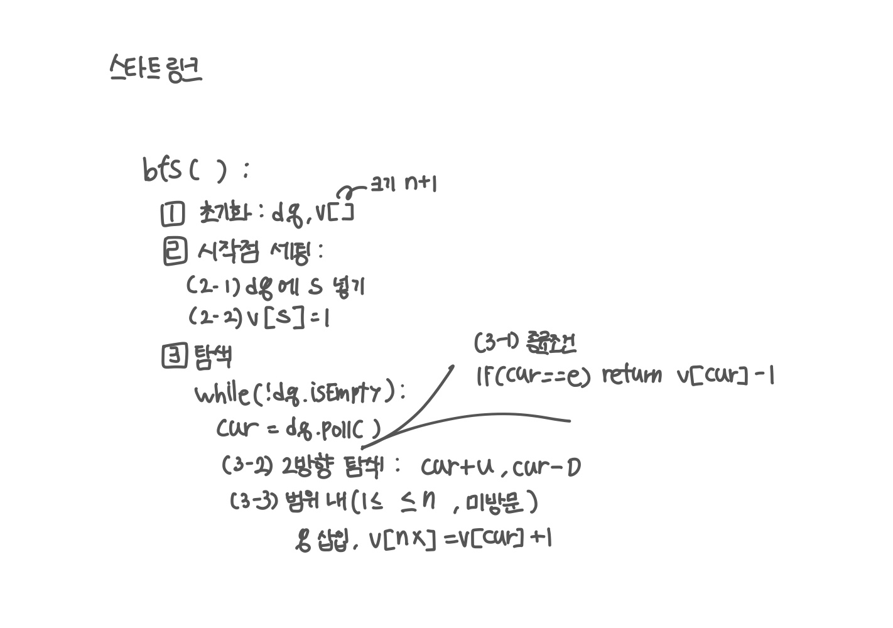

<br>

---

[https://www.acmicpc.net/problem/1697](https://www.acmicpc.net/problem/1697)

---

<br>

# 🔍 문제 풀이

## 문제 도식화

이전에 풀었던 "숨바꼭질" 문제와 굉장히 유사하다.



<br><br>

# 💻 코드

## 전체 코드

정답이 `0`일 수 있으니 `-1`을 리턴하자

```java
import java.io.*;
import java.util.*;

public class Main {
    static int n, s, e, u, d;
    static int[] arr;
    static int[] v;

    public static void main(String[] args) throws IOException {
        BufferedReader br = new BufferedReader(new InputStreamReader(System.in));

        StringTokenizer st = new StringTokenizer(br.readLine());
        n = Integer.parseInt(st.nextToken()); // 건물 높이
        s = Integer.parseInt(st.nextToken()); // 시작점
        e = Integer.parseInt(st.nextToken()); // 도착점
        u = Integer.parseInt(st.nextToken()); // 위
        d = Integer.parseInt(st.nextToken()); // 아래

        arr = new int[n+1];

        int ans = bfs();
        System.out.println(ans == -1 ? "use the stairs":ans);
    }

    static int bfs() {
        // 1. 초기화
        Deque<Integer> dq = new ArrayDeque<>();
        v = new int[n+1];

        // 2. 시작점 세팅
        dq.offer(s);
        v[s] = 1;

        // 3. 탐색
        while(!dq.isEmpty()){
            int cur = dq.poll();

            // 3-1. 종료 조건
            if(cur == e) return v[cur] - 1;

            // 3-2. 2방향 탐색
            int[] next = {cur + u, cur - d};
            for(int nx : next){
                // 3-3. 범위 내, 미방문
                if(nx >= 1 && nx <= n && v[nx] == 0){
                    v[nx] = v[cur] + 1;
                    dq.offer(nx);
                }
            }
        }
        return -1;
    }
}
```

<br>

## 스켈레톤 코드

```java
import java.io.*;
import java.util.*;

public class Main {
    static int n, s, e, u, d;
    static int[] arr;
    static int[] v;

    public static void main(String[] args) throws IOException {
        BufferedReader br = new BufferedReader(new InputStreamReader(System.in));

        StringTokenizer st = new StringTokenizer(br.readLine());
        n = Integer.parseInt(st.nextToken()); // 건물 높이
        s = Integer.parseInt(st.nextToken()); // 시작점
        e = Integer.parseInt(st.nextToken()); // 도착점
        u = Integer.parseInt(st.nextToken()); // 위
        d = Integer.parseInt(st.nextToken()); // 아래

        arr = new int[n+1];

        int ans = bfs();
        System.out.println(ans == -1 ? "use the stairs":ans);
    }

    static int bfs() {


    }
}
```

<br>
